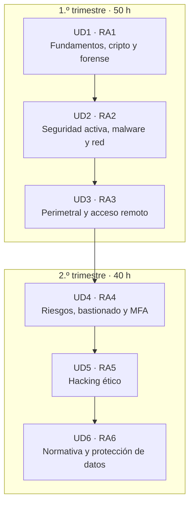

# El curso de un vistazo

> Esta página responde de una vez a **qué vas a aprender, cómo se trabaja y cómo se aprueba**. Si te pierdes en algún momento del curso, vuelve aquí.

## ¿De qué va este módulo?

**Ciberseguridad (CMO-314)** son **90 horas** en las que aprendes a **proteger sistemas y datos**, y a hacerlo **programando**. La herramienta principal es **Python 3** (con tipos), y nos apoyamos en **Docker** para montar laboratorios reproducibles y en las herramientas que usa la industria (`requests`, `BeautifulSoup`, `hashlib`, `re`, `socket`…). No se trata de memorizar amenazas, sino de **construir** las defensas y entender por dentro cómo funcionan los ataques para poder pararlos.

El curso está **guiado por retos**: cada unidad es una **misión** que resuelves programando, y los ejercicios y laboratorios son tu **entrenamiento** para lograrla.

!!! info "Idea central"
    Cada unidad termina con **algo que tú programas y se corrige solo**: un pequeño proyecto en Python. La teoría está al servicio de ese proyecto, no al revés.

## Cómo está organizado: dos trimestres, seis unidades

El curso se reparte en **dos trimestres**. Cada unidad es un **Resultado de Aprendizaje (RA)** completo, con su proyecto y su examen.



| Trimestre | Unidades | Horas | Proyecto principal |
|:---:|---|:---:|---|
| **1.º** | UD1 · UD2 · UD3 | 50 h | integridad · detección en logs · cortafuegos |
| **2.º** | UD4 · UD5 · UD6 | 40 h | riesgo/contraseñas · escáner · RGPD/anonimizado |

## Cómo se trabaja: aula invertida

Este módulo funciona con **aula invertida**: la teoría **se lee antes** de clase (poco rato, con ejemplos que puedes ejecutar) y **la clase es para programar**. Así aprovechas el aula para lo que de verdad cuesta —hacer y equivocarte— con el profesor y tu pareja al lado.

<div class="annotate" markdown>

1. **Antes de clase** · lees la sección del día y traes resuelto el **billete de entrada** (el reto rápido o las preguntas cortas que abren cada apartado). (1)
2. **Al empezar** · repaso relámpago de dudas y una demo corta. Nada de clase magistral. (2)
3. **El grueso de la clase** · practicas: ejercicios, **laboratorio en Docker** y el **proyecto**, casi siempre **en parejas**. (3)
4. **Al terminar** · puesta en común y **billete de salida** (qué logré, qué se me atascó). (4)
5. **Fuera de clase** · acabas lo que quede del proyecto o el **reto de ampliación**. (5)

</div>

1.  Llegar con la lectura hecha es lo que hace que la clase cunda. El material está pensado para leerse solo.
2.  Es el momento de preguntar lo que no entendiste en casa: se resuelve entre todos.
3.  *Pair programming*: turnaos quien escribe y quien revisa cada 15–20 min. Se aprende el triple.
4.  Un minuto de balance. No puntúa: sirve para ajustar la clase siguiente.
5.  El **proyecto y el examen son individuales**; las parejas son solo para practicar.

!!! reto "Tu parte del trato"
    El aula invertida solo funciona si llegas con la **lectura hecha**. Es poco rato y te ahorra encallarte en clase. Trae el billete de entrada intentado, aunque no te salga: para eso está la clase.

!!! tip "Y además: Retos de programación"
    Aparte de las unidades, tienes una colección de [**Retos de programación**](retos/index.md): problemas de ciberseguridad de hoy (comprobar si tu contraseña está filtrada, 2FA, auditar cabeceras, phishing, JWT…), pensados para pasarlo bien programando.

## Cómo se aprueba

Cada RA se supera con una **prueba práctica** (*test práctico*): resuelves un **reto** en Python y se corrige **solo con su batería de tests**. Sin interpretaciones ni sorpresas. De forma complementaria puede pedirse algún **ejercicio práctico** suelto, pero el peso está en el test.

!!! reto "La regla de la nota"
    **Nota del examen = (tests superados ÷ total) × 10.**  Se aprueba con **5**.
    Ejemplo: si tu solución pasa **8 de 10** tests, tu nota es **8**.

Recibes un **informe** con la salida real de `pytest` (qué pasó y qué no) y, **sin que puntúe**, un recordatorio de tres buenas prácticas que conviene cuidar: usar la técnica propia del RA (p. ej. `hashlib`, `re`, clases, `socket`…), pasar `mypy src` y documentar el código.

!!! warning "La regla que hay que tener clarísima"
    Para superar el módulo necesitas **todos los RA con nota ≥ 5**. **No hay compensación**: un RA suspenso no se salva con otro muy alto. Si al final del curso queda alguno por debajo de 5, el módulo no está superado.

La nota final del módulo combina los seis RA (90 %) con la **FFE** —Formación y Fomento del Emprendimiento—, que es **una única nota (0–10)** evaluada en la **última unidad (RA6)** y aporta el **10 %** restante. Si suspendes algún RA en la evaluación continua, tienes las convocatorias **ordinaria** y **extraordinaria**, donde te examinas **solo de los RA pendientes**.

!!! tip "Cómo llegar con ventaja"
    El examen usa el **mismo mecanismo** que el reto de la unidad. Si tu proyecto pasa `pytest` y `mypy src` sin errores, ya sabes exactamente cómo se verá tu examen. Practica ejecutando esos comandos hasta dejarlo en verde.
## Qué necesitas para empezar

=== "Software"

    - **Python 3.11+** con `pip` y un editor (VS Code recomendado).
    - **Docker** y **Docker Compose** para los laboratorios.
    - Comprueba que todo está listo con:

    ```bash title="Comprobación del entorno"
    python3 --version      # (1)!
    docker --version       # (2)!
    docker compose version # (3)!
    ```

    1. Debe ser 3.11 o superior.
    2. Si falla, instala Docker Desktop (Windows/Mac) o Docker Engine (Linux).
    3. En instalaciones nuevas es `docker compose` (con espacio), no `docker-compose`.

=== "Actitud"

    - **Uso ético**: todo lo ofensivo, solo en el laboratorio o sobre tus datos. Fuera de ahí es delito (arts. 197 y 264 del Código Penal).
    - **Constancia**: 15 minutos de práctica diaria valen más que 3 horas la víspera del examen.
    - **Preguntar pronto**: si un test se te resiste, lee el mensaje de error; casi siempre dice exactamente qué falla.

## El mapa del repositorio

- **1.º y 2.º trimestre** → las seis unidades, con teoría, ejercicios, proyecto y laboratorio.
- **Recursos** → [entorno y laboratorio](recursos/entorno.md), [uso ético y legal](recursos/uso-etico.md) y [Python para ciberseguridad](recursos/python-ciberseguridad.md).
- **Proyectos** → [índice de los seis proyectos](proyectos/index.md) con su plantilla y sus tests.
- **Retos de programación** → [la colección extra](retos/index.md).
- **Todo el material (PDF)** → una página con todo junto, lista para imprimir o guardar.

!!! note "Cómo leer las cajas de color"
    A lo largo del curso verás cajas como estas: una **diana** marca un *reto rápido*, una **bombilla** una *analogía* que ayuda a entenderlo, y las cajas de **aviso** señalan errores típicos o cuestiones legales. Presta atención a estas últimas.
