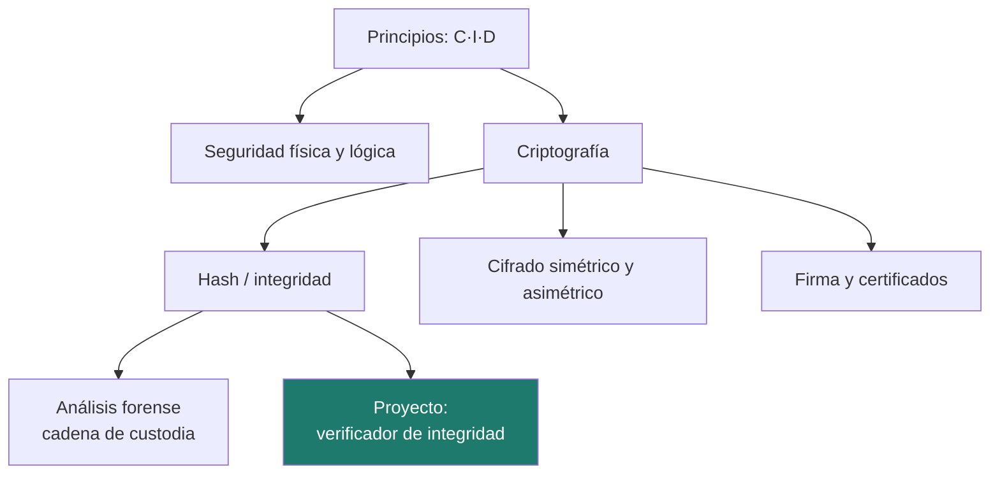
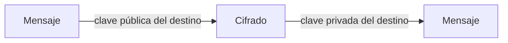
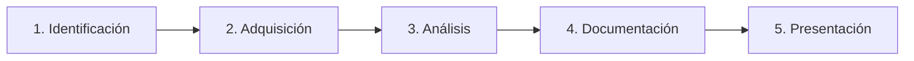

# Unidad 1 · Fundamentos de seguridad, criptografía y forense

> **Módulo:** CMO-314 · Ciberseguridad · **Resultado de aprendizaje:** RA1 · **Duración:** 20 h · **Peso:** 15 %
> **Herramienta principal:** Python 3 (con **anotaciones de tipo**) · **Nivel:** ciclo superior

Esta es la unidad de cimientos. Aquí entiendes **qué protege la ciberseguridad y con qué principios**, cómo se defiende un sistema en el plano físico y lógico, y las dos herramientas que sostienen casi todo lo demás: la **criptografía** (hash, cifrado y firma) y el **análisis forense**. Y lo haces del modo en que trabaja un profesional hoy: **escribiendo Python**. Al terminar habrás construido un **verificador de integridad de ficheros** que detecta manipulaciones igual que lo hace un perito forense o un gestor de descargas.

---

## Mapa de la unidad



### Qué vas a saber hacer al terminar

- [ ] Explicar los principios **confidencialidad, integridad y disponibilidad** (C·I·D) y ampliarlos con autenticidad y trazabilidad.
- [ ] Distinguir seguridad **física, ambiental y lógica** y dar ejemplos de cada una.
- [ ] Calcular **hashes** con Python y usarlos para comprobar la integridad de un fichero.
- [ ] Diferenciar cifrado **simétrico** y **asimétrico** y saber para qué sirve cada uno.
- [ ] Entender qué es una **firma electrónica** y un **certificado digital**.
- [ ] Aplicar las fases del **análisis forense** y el concepto de **cadena de custodia**.
- [ ] Escribir funciones Python **tipadas** y comprobarlas con `mypy` y `pytest`.

### Cómo se trabaja esta unidad

| | Paso | Dónde |
|:---:|---|---|
| **1** | El profesor **explica** el concepto y ejecuta los ejemplos. | secciones 1–8 |
| **2** | Tú **lees** el apartado y **ejecutas los ejemplos** en tu equipo. | tu editor |
| **3** | Haces los **retos rápidos** que aparecen entre la teoría. | en el texto |
| **4** | Practicas con **ejercicios que tienen la solución desplegable**. | sección 9 |
| **5** | Trabajas el **proyecto** y ejecutas sus tests hasta tenerlo en verde. | `proyectos/ud1/` |
| **6** | Examen práctico, con la misma mecánica del paso 5. | convocatoria |

!!! danger "Antes de nada: uso ético y legal"
    En este módulo vas a manejar herramientas y técnicas de seguridad. Se usan **solo** sobre tus propios sistemas o sobre el laboratorio autorizado. Acceder o manipular sistemas ajenos sin permiso es delito (arts. 197 y 264 del Código Penal). Lee la página [Uso ético y legal](../recursos/uso-etico.md) antes de continuar.

---

## 1. ¿Qué es la seguridad de la información?

La seguridad de la información es el conjunto de medidas para proteger los datos y los servicios frente a accesos, alteraciones o interrupciones no autorizados. No es un producto que se compra, sino una propiedad que se diseña y se mantiene.

!!! analogia "Analogía"
    Proteger la información es como proteger una casa: no basta una puerta buena (un antivirus). Hacen falta cerraduras, alarma, buenos hábitos de quien vive dentro y un seguro por si algo falla. La seguridad es **por capas**.

### 1.1 Los tres pilares: C·I·D

| Pilar | Qué garantiza | Se rompe cuando… |
|---|---|---|
| **Confidencialidad** | Solo accede quien está autorizado | Se filtra una base de datos |
| **Integridad** | La información no se altera sin autorización | Alguien modifica una factura |
| **Disponibilidad** | El servicio está accesible cuando se necesita | Un ataque tumba la web |

Se amplían con **autenticidad** (el origen es quien dice ser) y **trazabilidad** (queda registro de quién hizo qué). En este módulo verás cómo la **criptografía** ataca directamente la confidencialidad (cifrado), la integridad (hash) y la autenticidad (firma).

!!! reto "Reto rápido 1"
    Clasifica cada incidente en C, I o D: (a) un ransomware cifra los ficheros del servidor; (b) un empleado copia la lista de clientes a un USB; (c) alguien cambia el número de cuenta en un albarán.

### 1.2 Amenaza, vulnerabilidad y riesgo

- **Amenaza:** lo que puede pasar (un incendio, un atacante). Existe fuera de tu control.
- **Vulnerabilidad:** la debilidad que lo permite (un servidor sin actualizar). Sí depende de ti.
- **Riesgo:** la combinación de ambos con su impacto. Es lo que se gestiona (lo verás a fondo en la UD4).

---

## 2. Seguridad física, ambiental y lógica

No toda la seguridad es software. Un atacante que entra físicamente a la sala de servidores no necesita romper ningún cifrado.

| Tipo | Protege frente a | Ejemplos |
|---|---|---|
| **Física** | Acceso físico no autorizado | Control de acceso al CPD, cerraduras, cámaras, armarios con llave |
| **Ambiental** | El entorno | SAI (batería), climatización, detección de incendios, control de humedad |
| **Lógica** | Accesos y usos indebidos del sistema | Contraseñas, permisos, cifrado, cortafuegos, copias de seguridad |

!!! analogia "Analogía"
    La seguridad física es el muro y la puerta; la ambiental, que no se inunde ni se queme; la lógica, quién tiene la llave de cada habitación una vez dentro.

### 2.1 Copias de seguridad: la última línea

La regla **3-2-1**: al menos **3** copias, en **2** soportes distintos, con **1** fuera del sitio. Y la copia que nunca se ha restaurado no cuenta como copia: hay que probar la restauración.

!!! reto "Reto rápido 2"
    El gerente de una empresa se lleva un USB con la copia los viernes. ¿Qué parte de la regla 3-2-1 cumple y cuál no?

---

## 3. Python como herramienta de seguridad

Durante todo el módulo Python es tu herramienta de trabajo. En esta unidad usamos la librería estándar `hashlib`. Recuerda montar tu **entorno de trabajo** (ver [Entorno y laboratorio](../recursos/entorno.md)):

```bash
python -m venv .venv
source .venv/bin/activate        # Windows: .venv\Scripts\Activate.ps1
pip install pytest mypy
```

Escribimos **Python tipado**: las anotaciones documentan y permiten que `mypy` detecte errores sin ejecutar.

```python title="Tu primera huella digital"
def hash_de_texto(texto: str) -> str:  # (1)!
    """Devuelve el hash SHA-256 de un texto, en hexadecimal."""
    import hashlib
    return hashlib.sha256(texto.encode("utf-8")).hexdigest()  # (2)!

print(hash_de_texto("hola"))   # (3)!
```

1.  Las **anotaciones de tipo** (`str -> str`) documentan la función y permiten que `mypy` cace errores sin ejecutar el programa. Las usarás en todo el módulo.
2.  `.encode("utf-8")` convierte el texto en **bytes**: es lo que aceptan las funciones de `hashlib`. Olvidarlo es el error clásico de principiante.
3.  El mismo texto produce **siempre** el mismo hash (`b221d9db…`). Esa es la propiedad *determinista*: la base de toda comprobación de integridad.

!!! warning "Atención"
    `input()` y muchas funciones devuelven **texto**; para hashear hace falta convertir a **bytes** con `.encode()`. Es un error clásico de principiante.

---

## 4. Criptografía I: funciones hash e integridad

Una **función hash** transforma cualquier dato en una huella de longitud fija. Propiedades:

- **Determinista:** el mismo dato da siempre el mismo hash.
- **Efecto avalancha:** cambiar un bit cambia por completo el resultado.
- **Unidireccional:** no se puede volver del hash al dato.
- **Resistente a colisiones:** es inviable encontrar dos datos con el mismo hash.

| Algoritmo | Estado | Uso |
|---|---|---|
| MD5 | **Roto** | Solo sumas de comprobación no críticas |
| SHA-1 | **Roto** | En desuso |
| **SHA-256** | Vigente | Integridad, firma, certificados |
| **SHA-3 / BLAKE2** | Vigente | Alternativas modernas |

```python
import hashlib

# Hash de un fichero, leyéndolo por bloques (no cargarlo entero en memoria)
def hash_fichero(ruta: str) -> str:
    h = hashlib.sha256()
    with open(ruta, "rb") as f:
        for bloque in iter(lambda: f.read(8192), b""):
            h.update(bloque)
    return h.hexdigest()
```

!!! analogia "Analogía"
    El hash es como el **número de precinto** de una caja de pruebas: no dice qué hay dentro, pero si el precinto coincide, nadie ha abierto la caja.

!!! warning "Hash ≠ cifrado"
    El hash **no se puede deshacer**: no sirve para guardar algo que luego haya que recuperar. Sirve para **comprobar** que algo no ha cambiado. Para contraseñas se usa hash **con sal** y funciones lentas (bcrypt, Argon2), que verás en la UD4.

!!! reto "Reto rápido 3"
    Calcula en Python el SHA-256 de `"seguridad"` y de `"Seguridad"`. ¿Se parecen? ¿Qué propiedad lo explica?

---

## 5. Criptografía II: cifrado simétrico y asimétrico

Cifrar es transformar un mensaje para que solo lo lea quien tenga la clave.

| | **Simétrico** | **Asimétrico** |
|---|---|---|
| Claves | Una sola, compartida | Par: pública + privada |
| Ejemplos | AES, ChaCha20 | RSA, curvas elípticas (ECC) |
| Ventaja | Muy rápido | No hay que compartir secreto |
| Problema | ¿Cómo comparto la clave? | Lento para grandes volúmenes |

En la práctica se combinan (**cifrado híbrido**): se cifra el mensaje con una clave simétrica rápida, y esa clave se cifra con la pública del destinatario. Es lo que hace HTTPS.



!!! analogia "Analogía"
    La clave **pública** es un candado abierto que repartes a todos; la **privada**, la única llave que lo abre y que guardas tú. Cualquiera puede cerrarte un mensaje con tu candado; solo tú lo abres.

!!! reto "Reto rápido 4"
    Quieres enviar un fichero secreto a una compañera. ¿Con qué clave lo cifras: tu pública, tu privada, su pública o su privada?

---

## 6. Criptografía III: firma electrónica y certificados

La **firma electrónica** invierte el uso del par de claves para garantizar **autenticidad, integridad y no repudio**:

1. Se calcula el **hash** del documento.
2. Se cifra ese hash con la **clave privada** del firmante → esa es la firma.
3. Cualquiera descifra la firma con la **clave pública** y compara el hash: si coincide, el documento es auténtico y no se ha alterado.

Un **certificado digital** es un documento que vincula una clave pública con una identidad, firmado por una **Autoridad de Certificación (CA)** de confianza. Es lo que permite que tu navegador confíe en una web (el candado de HTTPS). La estructura completa (CA, certificados, revocación) se llama **PKI**.

!!! reto "Reto rápido 5"
    Si firmo con mi clave **privada**, ¿por qué eso demuestra que fui yo y no otra persona?

---

## 7. Análisis forense digital

El análisis forense investiga un incidente para responder **qué pasó, cómo, cuándo y con qué alcance**, preservando las evidencias para que tengan validez.

### 7.1 Fases



### 7.2 Cadena de custodia

Cada evidencia debe poder demostrar que **no se ha alterado** desde su recogida. Se consigue así:

- Se trabaja **sobre una copia** bit a bit, nunca sobre el original.
- Se calcula el **hash** del original y de la copia: deben coincidir.
- Se registra quién la tuvo, cuándo y por qué, en todo momento.

!!! analogia "Analogía"
    Es la misma lógica del precinto: el hash de la evidencia es su precinto digital. Aquí conectas forense con lo que hará tu proyecto.

!!! example "Ejemplo: verificar una evidencia"
    ```python
    original = hash_fichero("evidencia.dd")
    copia    = hash_fichero("copia_de_trabajo.dd")
    print("Íntegra" if original == copia else "¡ALTERADA!")
    ```

!!! reto "Reto rápido 6"
    ¿Por qué el forense calcula el hash **antes** de empezar a analizar y no después?

---

## 8. Errores frecuentes (para tener a mano)

| Error | Causa | Solución |
|---|---|---|
| `TypeError: ... bytes-like` | Pasar `str` a `hashlib` | `.encode("utf-8")` primero |
| Hashes que "no coinciden" | Espacios o mayúsculas | Normaliza con `.strip().lower()` |
| Comparar ficheros grandes lento | Leerlos enteros | Leer por bloques con `update()` |
| Usar MD5 para integridad seria | Algoritmo roto | Usar SHA-256 |

---

## 9. Practica **con** solución a la vista

> Intenta cada ejercicio y, cuando lo tengas (o te atasques de verdad), despliega la solución y compárala.

#### Actividad 1 — Huella de un texto
Escribe `huella(texto: str) -> str` que devuelva el SHA-256 en hexadecimal.
<details class="sol"><summary>Solución</summary>

```python
import hashlib

def huella(texto: str) -> str:
    return hashlib.sha256(texto.encode("utf-8")).hexdigest()
```
</details>

#### Actividad 2 — ¿Han cambiado los datos?
Escribe `sin_cambios(a: str, b: str) -> bool` que diga si dos textos tienen el mismo hash.
<details class="sol"><summary>Solución</summary>

```python
def sin_cambios(a: str, b: str) -> bool:
    return huella(a) == huella(b)
```
</details>

#### Actividad 3 — Clasificar un incidente
Escribe `pilar(incidente: str) -> str` que, dado `"filtracion"`, `"alteracion"` o `"caida"`, devuelva `"Confidencialidad"`, `"Integridad"` o `"Disponibilidad"`.
<details class="sol"><summary>Solución</summary>

```python
def pilar(incidente: str) -> str:
    mapa = {"filtracion": "Confidencialidad",
            "alteracion": "Integridad",
            "caida": "Disponibilidad"}
    return mapa.get(incidente, "Desconocido")
```
</details>

#### Actividad 4 — Manifiesto de integridad
Dado un diccionario `{fichero: hash}`, escribe `alterados(esperados, actuales)` que devuelva la lista de ficheros cuyo hash no coincide.
<details class="sol"><summary>Solución</summary>

```python
def alterados(esperados: dict[str, str],
              actuales: dict[str, str]) -> list[str]:
    return [f for f, h in esperados.items()
            if actuales.get(f) != h]
```
</details>

#### Actividad 5 — Seguridad por capas
Escribe `clasifica_medida(medida: str) -> str` que devuelva `"física"`, `"ambiental"` o `"lógica"` para `"camara"`, `"sai"`, `"cortafuegos"`.
<details class="sol"><summary>Solución</summary>

```python
def clasifica_medida(medida: str) -> str:
    fisica = {"camara", "cerradura", "armario"}
    ambiental = {"sai", "climatizacion", "incendios"}
    if medida in fisica:
        return "física"
    if medida in ambiental:
        return "ambiental"
    return "lógica"
```
</details>

---

## Proyecto de la unidad

Toda la práctica gruesa de la unidad se hace sobre un **proyecto real**: un **verificador de integridad de ficheros**. Detecta si algún fichero de un conjunto ha sido modificado, comparándolo con un **manifiesto** de hashes de referencia. Es la herramienta que usa un forense para la cadena de custodia y un administrador para vigilar ficheros críticos.

**[Proyecto Verificador de integridad →](../proyectos/ud1/README.md)**

```
proyecto-ud1/
├── src/integridad.py   ← tu código (funciones con TODO)
└── tests/              ← los tests que comprueban tu trabajo
```

```bash
pip install -r requirements.txt
pytest        # al principio falla casi todo: aún no has escrito nada
mypy src      # cuando todo esté en verde, debe decir Success
```

!!! warning "Los tests son la especificación"
    No los modifiques para que pasen: describen exactamente lo que tu código debe hacer, y el examen usará una batería equivalente.

---

## Retos de ampliación

- **R1.** Amplía el verificador para que lea el manifiesto de un fichero de texto real (`hashes.txt`).
- **R2.** Añade una opción que **genere** el manifiesto a partir de una carpeta.
- **R3.** Investiga `hashlib.blake2b` y ofrece elegir el algoritmo.
- **R4.** Escribe una función que, dada una contraseña, devuelva su hash **con sal** aleatoria (adelanto de la UD4).

---

## Más práctica

#### Actividad 6 — Sal aleatoria
Escribe `con_sal(contrasena: str) -> tuple[str, str]` que devuelva `(sal, hash)` usando `secrets.token_hex(16)` como sal y SHA-256 de `sal+contraseña`.
<details class="sol"><summary>Solución</summary>

```python
import hashlib, secrets
def con_sal(contrasena: str) -> tuple[str, str]:
    sal = secrets.token_hex(16)
    h = hashlib.sha256((sal + contrasena).encode()).hexdigest()
    return sal, h
```
</details>

#### Actividad 7 — Comparar algoritmos
Escribe `huellas(texto)` que devuelva un dict con el hash del texto en `md5`, `sha1` y `sha256`. Comenta cuál usarías para integridad.
<details class="sol"><summary>Solución</summary>

```python
import hashlib
def huellas(texto: str) -> dict[str, str]:
    b = texto.encode()
    return {a: hashlib.new(a, b).hexdigest() for a in ("md5", "sha1", "sha256")}
# Para integridad seria: sha256 (md5 y sha1 están rotos).
```
</details>

---

## Laboratorio

> Todo el laboratorio se ejecuta en **contenedores Docker**, así no tocas tu sistema ni ningún sistema real. Necesitas Docker y Docker Compose (ver [Entorno y laboratorio](../recursos/entorno.md)).

### Laboratorio guiado (resuelto) — Cadena de custodia con Docker

Un contenedor **publica** unos ficheros y su manifiesto de hashes; después alteramos uno y comprobamos que tu verificador lo detecta. Es la cadena de custodia en pequeño.

**1) `docker-compose.yml`**

```yaml
services:
  publicador:
    image: python:3.12-alpine
    volumes: ["./datos:/datos"]
    working_dir: /datos
    command: >
      sh -c "echo 'binario de la app' > app.bin;
             echo 'config=1'          > app.conf;
             sha256sum app.bin app.conf > MANIFEST.sha256;
             echo 'Manifiesto generado'"
```

**2) Genera los ficheros y el manifiesto, y altera uno a propósito**

```bash
mkdir -p datos && docker compose run --rm publicador
echo 'config=MODIFICADA' > datos/app.conf     # simulamos manipulación
```

**3) Verifica con lo que sabes de la unidad**

```bash
cd datos && python3 - << 'PY'
import hashlib
esperado = {}
for ln in open("MANIFEST.sha256"):
    h, f = ln.split(); esperado[f] = h
for f, h in esperado.items():
    actual = hashlib.sha256(open(f, "rb").read()).hexdigest()
    print(f"[{'OK' if actual == h else '⚠️ MODIFICADO'}] {f}")
PY
```

<details class="sol"><summary>Qué debe salir y por qué</summary>

```
[OK] app.bin
[⚠️ MODIFICADO] app.conf
```
`app.conf` cambió **después** de generar el manifiesto, así que su hash ya no coincide. Es lo que hacen herramientas reales como `debsums`, `rpm -V` o un HIDS (AIDE, Tripwire). El contenedor es efímero (`--rm`); el estado vive en `./datos`.
</details>

### Laboratorio propuesto (entregable) — Vigilante de directorio

Amplía el anterior con **Docker Compose**: un contenedor que cada 10 s modifica al azar algún fichero de un directorio compartido, y **otro contenedor Python** (el tuyo) que genera el manifiesto **una sola vez** y luego, en bucle, **reverifica cada 10 s** e imprime una alerta con marca de tiempo cuando algo cambia.

**Criterios de aceptación**
- Usa `hashlib` y funciones **tipadas** (`mypy` limpio).
- El vigilante **no** reescribe el manifiesto tras detectar cambios (si lo hiciera, nunca alertaría).
- Salida tipo: `2026-05-01 10:00:10  [MODIFICADO] app.conf`.
- Todo dentro de `docker compose up`, sin tocar el host.

---

## Autoevaluación rápida

<details><summary>1. ¿Qué garantiza la <b>integridad</b>?</summary>Que la información no se altera sin autorización.</details>
<details><summary>2. ¿Se puede recuperar un dato a partir de su hash?</summary>No: la función hash es unidireccional.</details>
<details><summary>3. ¿Con qué clave cifras un mensaje para que solo lo lea Ana?</summary>Con la clave <b>pública</b> de Ana.</details>
<details><summary>4. ¿Qué demuestra una firma electrónica?</summary>Autenticidad, integridad y no repudio del documento.</details>
<details><summary>5. ¿Por qué se trabaja sobre una copia en forense?</summary>Para no alterar el original y preservar la cadena de custodia.</details>
<details><summary>6. ¿Por qué MD5 no sirve para integridad seria?</summary>Está roto: se pueden encontrar colisiones.</details>
<details><summary>7. ¿Qué hace <code>.encode("utf-8")</code> antes de hashear?</summary>Convierte el texto (str) en bytes, que es lo que acepta hashlib.</details>

---

## Glosario

| Término | Definición |
|---|---|
| **C·I·D** | Confidencialidad, integridad y disponibilidad. |
| **Hash** | Huella de longitud fija de un dato; unidireccional. |
| **Cifrado simétrico / asimétrico** | Una clave compartida / par pública-privada. |
| **Firma electrónica** | Hash cifrado con la clave privada; prueba autoría e integridad. |
| **Certificado / CA / PKI** | Vínculo clave-identidad / quien lo firma / la infraestructura completa. |
| **Cadena de custodia** | Garantía de que una evidencia no se ha alterado. |
| **SHA-256** | Algoritmo de hash vigente y recomendado. |

---

## Cómo se evalúa esta unidad (RA1)

Se evalúa con un **examen 100 % práctico**: escribir en Python un programa que cumpla una especificación, corregido de forma **automática**.

| # | Qué se valora | Cómo se mide | Puntos |
|:---:|---|---|:---:|
| 1 | **Que el programa funcione** | `(casos superados ÷ total) × 7` | **7,0** |
| 2 | **Criptografía** | Usa `hashlib` para el hash | **1,0** |
| 3 | **Tipado** | Anotaciones y `mypy` sin errores | **1,0** |
| 4 | **Documentación** | Docstrings/comentarios con contenido | **1,0** |
| | | **TOTAL** | **10** |

**Se supera con 5.** Los criterios 2–4 son **todo o nada** y se comprueban por programa. La rúbrica no cambia: la conoces desde el primer día.
