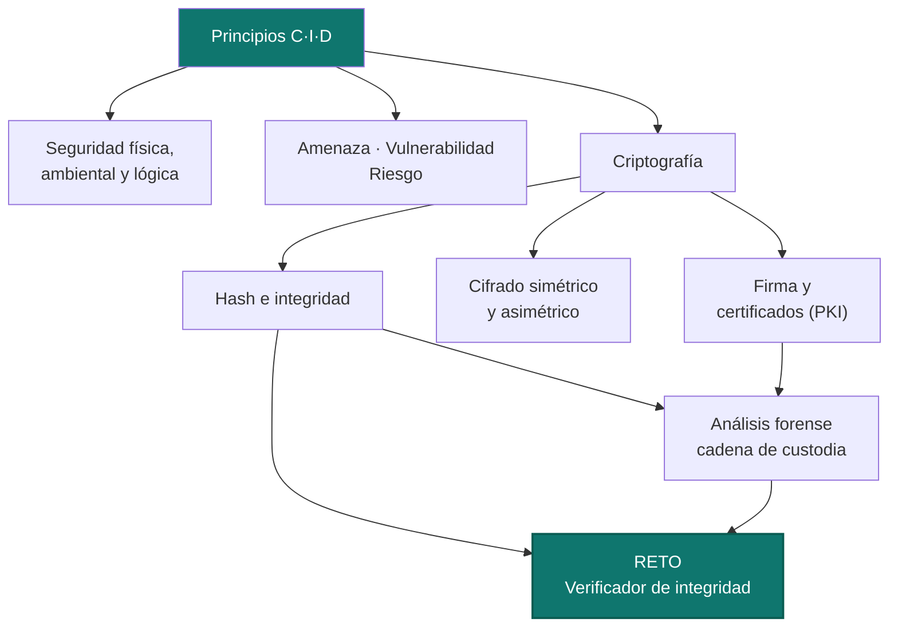
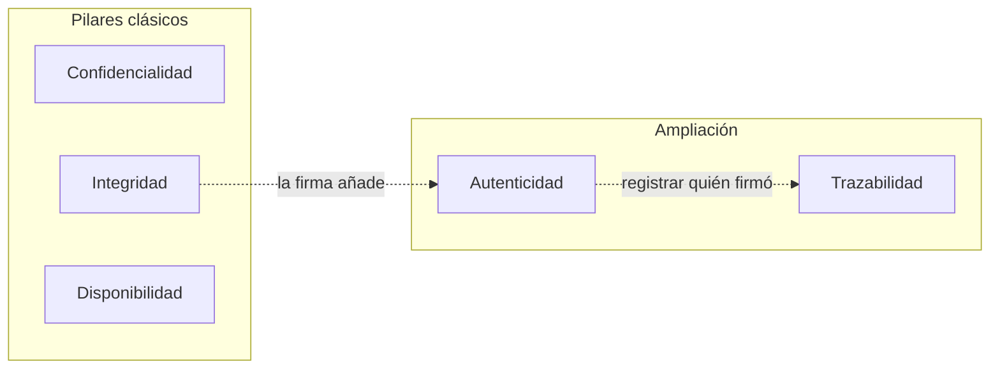
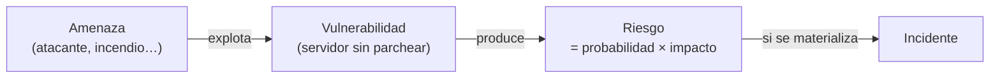
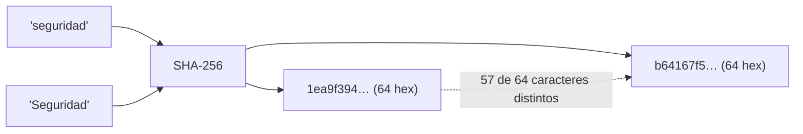
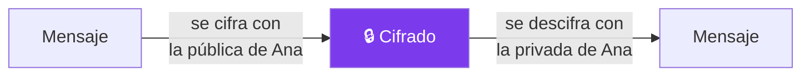
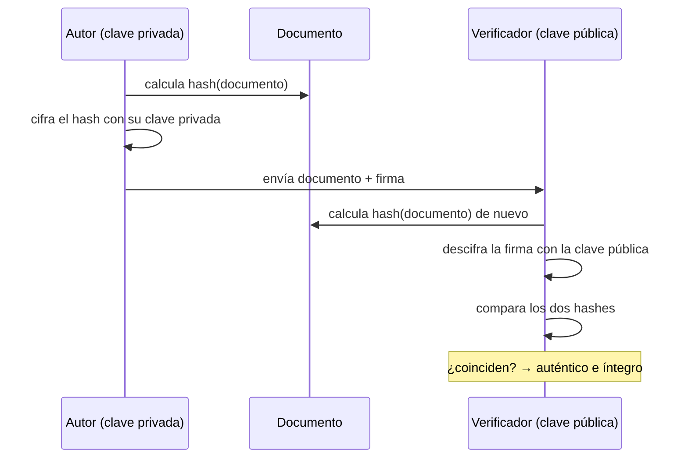
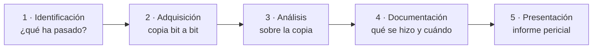
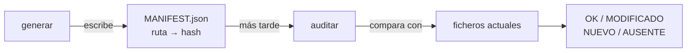
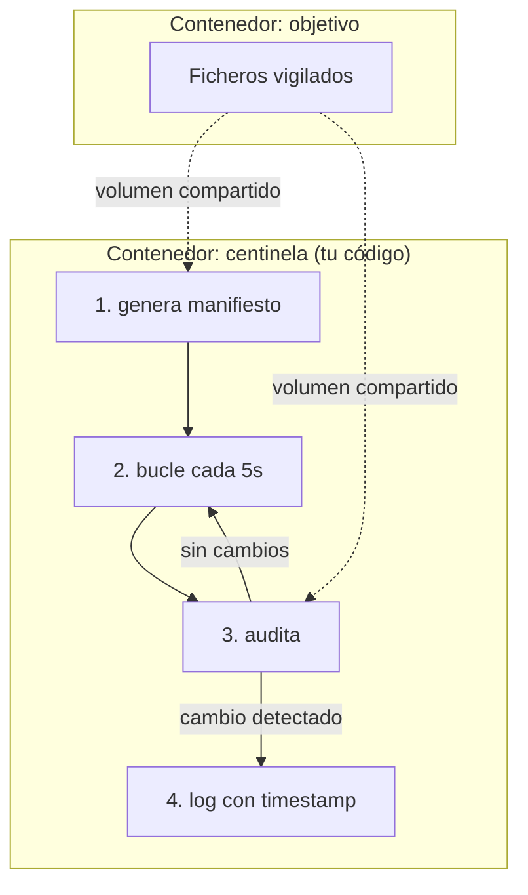

# Unidad 1 · Fundamentos de seguridad, criptografía y forense

> **Módulo:** CMO-314 · Ciberseguridad · **RA1** · **Duración:** 20 h · **Peso:** 15 % · **Herramienta:** Python 3 (tipado) + `cryptography`

Esta es la unidad de **cimientos**. Aquí sale por primera vez el patrón que vas a repetir seis veces este curso: **entender el problema → resolverlo con código real → medir que funciona**. Vas a tocar los tres pilares de la seguridad, y las dos disciplinas que sostienen casi todo lo demás: **criptografía** (hash, cifrado, firma, certificados) y **análisis forense**. Al terminar habrás construido, línea a línea, un **verificador de integridad** de nivel profesional — el mismo principio que usan `sha256sum`, `debsums`, AIDE o Tripwire.

!!! reto "El reto de la unidad"
    **Detecta si unos ficheros han sido manipulados.** Vas a construir un verificador de integridad con manifiesto, auditoría y CLI. Todo lo de abajo es tu **entrenamiento** para llegar a resolverlo tú solo y demostrarlo en el examen.



**Qué sabrás hacer al terminar:** explicar C·I·D y ampliarlo con autenticidad/trazabilidad · calcular y comparar hashes con criterio · cifrar y descifrar de verdad (simétrico y asimétrico) con `cryptography` · firmar un documento y generar un certificado X.509 · aplicar las fases del análisis forense y la cadena de custodia · escribir Python tipado con CLI profesional, comprobado con `mypy` y `pytest`.

**Cómo se trabaja (aula invertida):** lees la sección y ejecutas los ejemplos antes de clase, con el *reto rápido* intentado → en clase resuelves las actividades y avanzas el reto en parejas, con ayuda al lado.

!!! danger "Antes de nada: uso ético y legal"
    Vas a manejar herramientas y técnicas de seguridad. Se usan **solo** sobre tus propios sistemas o el laboratorio autorizado. Manipular sistemas ajenos sin permiso es delito (arts. 197 y 264 del Código Penal). Lee [Uso ético y legal](../recursos/uso-etico.md).

---

## 1. ¿Qué es la seguridad de la información?

Es el conjunto de medidas para proteger datos y servicios frente a accesos, alteraciones o interrupciones no autorizados. No es un producto que se compra: es una propiedad que se **diseña por capas** y se mantiene en el tiempo.

### 1.1 Los tres pilares: C·I·D

| Pilar                      | Qué garantiza                                 | Se rompe cuando…            | La cripto que ayuda     |
| -------------------------- | ---------------------------------------------- | ---------------------------- | ----------------------- |
| **Confidencialidad** | Solo accede quien está autorizado             | Se filtra una base de datos  | Cifrado (§5)           |
| **Integridad**       | La información no se altera sin permiso       | Alguien modifica una factura | Hash / firma (§4, §6) |
| **Disponibilidad**   | El servicio está accesible cuando se necesita | Un ataque tumba la web       | Copias, redundancia     |

Se amplían con **autenticidad** (el origen es quien dice ser) y **trazabilidad** (queda registro de quién hizo qué):



Lo modelamos ya con código — nada de listas en abstracto:

```python
from dataclasses import dataclass
from enum import Enum

class Pilar(Enum):
    CONFIDENCIALIDAD = "C"
    INTEGRIDAD = "I"
    DISPONIBILIDAD = "D"

@dataclass
class Incidente:
    descripcion: str
    pilar: Pilar

INCIDENTES = [
    Incidente("Ransomware cifra los ficheros del servidor", Pilar.DISPONIBILIDAD),
    Incidente("Un empleado copia la lista de clientes a un USB", Pilar.CONFIDENCIALIDAD),
    Incidente("Cambian el número de cuenta en un albarán", Pilar.INTEGRIDAD),
    Incidente("Un ataque DDoS satura el servidor web", Pilar.DISPONIBILIDAD),
]

for i in INCIDENTES:
    print(f"[{i.pilar.name:16}] {i.descripcion}")
```

```text
[DISPONIBILIDAD ] Ransomware cifra los ficheros del servidor
[CONFIDENCIALIDAD] Un empleado copia la lista de clientes a un USB
[INTEGRIDAD      ] Cambian el número de cuenta en un albarán
[DISPONIBILIDAD  ] Un ataque DDoS satura el servidor web
```

> Usamos `Enum` en vez de cadenas sueltas: así `mypy` **impide** escribir `Pilar.CONFIDENCIALIDA` mal por error. Es una técnica profesional habitual.

!!! reto "Reto rápido 1"
    Un ransomware que además **exfiltra** los datos antes de cifrarlos (doble extorsión, muy habitual en 2025-2026) rompe dos pilares a la vez. ¿Cuáles? Añádelo a `INCIDENTES` con los dos.

### 1.2 Amenaza, vulnerabilidad y riesgo

- **Amenaza:** lo que puede pasar (un incendio, un atacante). Está fuera de tu control.
- **Vulnerabilidad:** la debilidad que lo permite (un servidor sin actualizar). Sí depende de ti.
- **Riesgo:** la combinación de ambos con su impacto. Es lo que se gestiona (a fondo en la UD4).



```python
def riesgo(probabilidad: float, impacto: float) -> float:
    """probabilidad en [0,1]; impacto en una escala (p. ej. euros o 1-10)."""
    return round(probabilidad * impacto, 2)

# Un servidor sin parchear (vulnerabilidad) frente a un exploit conocido (amenaza)
print(riesgo(probabilidad=0.7, impacto=10))   # alto: la amenaza es muy probable
print(riesgo(probabilidad=0.05, impacto=10))  # bajo: la amenaza es rara
```

```text
7.0
0.5
```

---

## 2. Seguridad física, ambiental y lógica

No toda la seguridad es software: quien entra físicamente a la sala de servidores no necesita romper ningún cifrado.

| Tipo                | Protege frente a             | Ejemplos                                                |
| ------------------- | ---------------------------- | ------------------------------------------------------- |
| **Física**   | Acceso físico no autorizado | Control de acceso al CPD, cerraduras, cámaras          |
| **Ambiental** | El entorno                   | SAI (batería), climatización, detección de incendios |
| **Lógica**   | Usos indebidos del sistema   | Contraseñas, permisos, cifrado, cortafuegos, copias    |

```python
FISICA = {"camara", "cerradura", "armario", "torniquete", "biometria_entrada"}
AMBIENTAL = {"sai", "climatizacion", "incendios", "humedad", "generador"}

def clasifica(medida: str) -> str:
    if medida in FISICA:
        return "física"
    if medida in AMBIENTAL:
        return "ambiental"
    return "lógica"          # todo lo demás: contraseñas, cifrado, cortafuegos...

for m in ["camara", "sai", "cortafuegos", "cifrado", "mfa"]:
    print(f"{m:12} -> {clasifica(m)}")
```

```text
camara       -> física
sai          -> ambiental
cortafuegos  -> lógica
cifrado      -> lógica
mfa          -> lógica
```

### 2.1 Copias de seguridad: la última línea

La regla **3-2-1**: al menos **3** copias, en **2** soportes distintos, con **1** fuera del sitio. Y **la copia que nunca se ha restaurado no cuenta como copia**: hay que probar la restauración.

```python
from dataclasses import dataclass

@dataclass
class Copia:
    soporte: str        # "disco_local", "nas", "cloud", "cinta"...
    ubicacion: str       # "sitio" o "externo"

def cumple_321(copias: list[Copia]) -> tuple[bool, list[str]]:
    fallos = []
    if len(copias) < 3:
        fallos.append(f"solo hay {len(copias)} copias, hacen falta 3")
    soportes = {c.soporte for c in copias}
    if len(soportes) < 2:
        fallos.append("todas las copias usan el mismo soporte")
    if not any(c.ubicacion == "externo" for c in copias):
        fallos.append("ninguna copia está fuera del sitio")
    return (not fallos, fallos)

copias = [Copia("disco_local", "sitio"), Copia("nas", "sitio")]
print(cumple_321(copias))
```

```text
(False, ['solo hay 2 copias, hacen falta 3', 'ninguna copia está fuera del sitio'])
```

!!! reto "Reto rápido 2"
    Un empleado se lleva un USB con la copia los viernes (soporte: `"usb"`, ubicación: `"externo"`). Añádelo a la lista de arriba junto con una copia en `"cloud"`. ¿Ahora `cumple_321` da `True`?

---

## 3. Python como herramienta de seguridad

Python es tu herramienta durante todo el módulo. Monta el entorno una vez:

```bash
python -m venv .venv
source .venv/bin/activate         # Windows: .venv\Scripts\Activate.ps1
pip install pytest mypy cryptography
```

Escribimos **Python tipado**: las anotaciones documentan y permiten que `mypy` cace errores sin ejecutar nada.

```python
import hashlib

def hash_de_texto(texto: str) -> str:      # (1)!
    """Devuelve el hash SHA-256 de un texto, en hexadecimal."""
    return hashlib.sha256(texto.encode("utf-8")).hexdigest()   # (2)!

print(hash_de_texto("hola"))                # (3)!
print(hash_de_texto("hola"))                # (4)!
```

1. Las **anotaciones de tipo** (`str -> str`) documentan y permiten que `mypy` detecte errores sin ejecutar.
2. `.encode("utf-8")` convierte el texto en **bytes**, que es lo que acepta `hashlib`. Olvidarlo es el error clásico.
3. Imprime `b221d9db…`: 64 caracteres hexadecimales (256 bits).
4. El mismo texto da **siempre** el mismo hash — lo comprobamos llamando dos veces.

```text
b221d9dbb083a7f33428d7c2a3c3198ae925614d70210e28716ccaa7cd4ddb79
b221d9dbb083a7f33428d7c2a3c3198ae925614d70210e28716ccaa7cd4ddb79
```

!!! warning "Atención"
    Muchas funciones devuelven **texto**; para hashear hay que pasar a **bytes** con `.encode()`. Si ves `TypeError: Strings must be encoded before hashing`, es justo esto.

---

## 4. Criptografía I — funciones hash e integridad

Una **función hash** transforma cualquier dato en una huella de longitud fija.

| Propiedad                         | Qué significa                                    |
| --------------------------------- | ------------------------------------------------- |
| **Determinista**            | El mismo dato da siempre el mismo hash            |
| **Efecto avalancha**        | Cambiar un bit cambia por completo la salida      |
| **Unidireccional**          | No se puede volver del hash al dato               |
| **Resistente a colisiones** | Es inviable encontrar dos datos con el mismo hash |



### 4.1 Efecto avalancha, medido con código

```python
import hashlib

def h(t: str) -> str:
    return hashlib.sha256(t.encode()).hexdigest()

def avalancha(a: str, b: str) -> int:
    ha, hb = h(a), h(b)
    return sum(1 for x, y in zip(ha, hb) if x != y)

a, b = "seguridad", "Seguridad"     # solo cambia una letra a mayúscula
print(h(a))
print(h(b))
print(f"Cambian {avalancha(a, b)} de 64 caracteres del hash")
```

```text
1ea9f394f510e2beb43cb0b317258b09bce9f4fccef69407360483690ac9b746
b64167f58e1cf0c322747fbe1a7361084a004ffb5c145fd64e5413ef11215965
Cambian 57 de 64 caracteres del hash
```

> Un cambio mínimo en la entrada altera casi todo el hash: por eso sirve para detectar la más pequeña manipulación.

### 4.2 Elegir el algoritmo (no todos valen)

```python
import hashlib

dato = b"documento importante"
for alg in ("md5", "sha1", "sha256", "sha3_256", "blake2b"):
    d = hashlib.new(alg, dato).hexdigest()
    print(f"{alg:9} {len(d)*4:4} bits   {d[:24]}...")
```

```text
md5        128 bits   73943af0696212b0ebfb60cf...
sha1       160 bits   3d8dd0ba48b54b431502c4f6...
sha256     256 bits   dd1cd769ac316412f9a0669e...
sha3_256   256 bits   ce5c2e89bddab0174ba19299...
blake2b    512 bits   e29f58fbe35b5357d889089c...
```

| Algoritmo                | Estado                      | Uso recomendado                                       |
| ------------------------ | --------------------------- | ----------------------------------------------------- |
| MD5 / SHA-1              | **Rotos**             | Nunca para integridad seria                           |
| **SHA-256**        | Vigente, estándar de facto | Integridad, firma, certificados TLS                   |
| **SHA-3 / BLAKE2** | Vigente, más modernos      | Alternativas cuando se busca velocidad o margen extra |

### 4.3 Hash de un fichero grande (por bloques) y comparación segura

```python
import hashlib, hmac
from pathlib import Path

def hash_fichero(ruta: Path, algoritmo: str = "sha256") -> str:
    """Hashea leyendo por bloques: funciona igual de bien con 1 KB que con 10 GB."""
    h = hashlib.new(algoritmo)
    with open(ruta, "rb") as f:
        for bloque in iter(lambda: f.read(8192), b""):   # 8 KiB por lectura
            h.update(bloque)
    return h.hexdigest()

def integro(esperado: str, actual: str) -> bool:
    """Comparación en tiempo constante: no filtra información por temporización."""
    return hmac.compare_digest(esperado, actual)
```

!!! analogia "Analogía"
    El hash es el **número de precinto** de una caja de pruebas: no dice qué hay dentro, pero si el precinto coincide, nadie la ha abierto.

!!! warning "Hash ≠ cifrado"
    El hash **no se deshace**: no sirve para guardar algo que luego haya que recuperar, sino para **comprobar** que no ha cambiado. Para contraseñas se usa hash **con sal** y funciones lentas (bcrypt, Argon2) — lo verás en la UD4.

!!! reto "Reto rápido 3"
    Ejecuta `avalancha("1234", "1235")`. ¿Cambia también casi todo el hash aunque solo varíe un dígito? ¿Y `avalancha("1234", "1234 ")` (con un espacio al final)?

---

## 5. Criptografía II — cifrado simétrico y asimétrico

Cifrar es transformar un mensaje para que solo lo lea quien tenga la clave.

|                     | **Simétrico**                      | **Asimétrico**           |
| ------------------- | ----------------------------------------- | ------------------------------- |
| Claves              | Una sola, compartida                      | Par: pública + privada         |
| Algoritmos típicos | AES, ChaCha20 (Fernet los usa por debajo) | RSA, curvas elípticas (ECC)    |
| Ventaja             | Muy rápido                               | No hay que compartir un secreto |
| Problema            | ¿Cómo comparto la clave con seguridad?  | Lento para grandes volúmenes   |

### 5.1 Simétrico de verdad: Fernet (AES) con `cryptography`

```python
from cryptography.fernet import Fernet, InvalidToken

clave = Fernet.generate_key()          # ⚠️ guárdala en secreto: cifra y descifra por igual
f = Fernet(clave)

token = f.encrypt(b"numero de cuenta: ES12 3456 7890")
print("Cifrado :", token[:50], b"...")
print("Descifrado:", f.decrypt(token))

# ¿Qué pasa si alguien manipula el mensaje cifrado?
try:
    manipulado = token[:-5] + b"XXXXX"
    f.decrypt(manipulado)
except InvalidToken:
    print("Detectado: el token manipulado NO se puede descifrar")
```

```text
Cifrado : b'gAAAAABo3k9f...' ...
Descifrado: b'numero de cuenta: ES12 3456 7890'
Detectado: el token manipulado NO se puede descifrar
```

> Fernet no solo cifra: también **autentica** el mensaje. Si alguien lo toca, `decrypt` lanza `InvalidToken` en vez de devolver basura silenciosamente. Es cifrado autenticado (AEAD), el estándar profesional.

### 5.2 Asimétrico: RSA (candado público, llave privada)

```python
from cryptography.hazmat.primitives.asymmetric import rsa, padding
from cryptography.hazmat.primitives import hashes

# Genera el par de claves (esto lo hace Ana, una sola vez)
privada_ana = rsa.generate_private_key(public_exponent=65537, key_size=2048)
publica_ana = privada_ana.public_key()

oaep = padding.OAEP(mgf=padding.MGF1(hashes.SHA256()), algorithm=hashes.SHA256(), label=None)

# Cualquiera (tú) cifra con la clave PÚBLICA de Ana
cifrado = publica_ana.encrypt(b"clave de sesion: 7f3a9c", oaep)
print("Cifrado (bytes):", cifrado[:20], "...")

# Solo Ana, con su clave PRIVADA, puede descifrarlo
print("Descifrado:", privada_ana.decrypt(cifrado, oaep))
```

```text
Cifrado (bytes): b'\x8f\x3a\x1c...' ...
Descifrado: b'clave de sesion: 7f3a9c'
```



!!! analogia "Analogía"
    La clave **pública** es un candado abierto que repartes a todo el mundo; la **privada**, la única llave que lo abre y que guardas tú. En la práctica se combinan (**cifrado híbrido**): el mensaje se cifra con una clave simétrica rápida, y esa clave se cifra con RSA. Así funciona HTTPS.

!!! reto "Reto rápido 4"
    Quieres enviar un fichero secreto a una compañera. ¿Con qué clave lo cifras: tu pública, tu privada, la suya pública o la suya privada? ¿Y si además quieres demostrar que lo enviaste tú?

---

## 6. Criptografía III — firma electrónica y certificados

La **firma** invierte el uso del par de claves para garantizar **autenticidad, integridad y no repudio**: se firma con la **privada** y cualquiera verifica con la **pública**.



```python
from cryptography.hazmat.primitives.asymmetric import rsa, padding
from cryptography.hazmat.primitives import hashes
from cryptography.exceptions import InvalidSignature

privada = rsa.generate_private_key(public_exponent=65537, key_size=2048)
publica = privada.public_key()
pss = padding.PSS(mgf=padding.MGF1(hashes.SHA256()), salt_length=padding.PSS.MAX_LENGTH)

documento = b"Transferir 100 EUR a la cuenta ES12-555"
firma = privada.sign(documento, pss, hashes.SHA256())

def verifica(doc: bytes, firma: bytes) -> bool:
    try:
        publica.verify(firma, doc, pss, hashes.SHA256())
        return True
    except InvalidSignature:
        return False

print("Documento original :", verifica(documento, firma))
print("Documento alterado :", verifica(b"Transferir 999 EUR a la ES12-555", firma))
```

```text
Documento original : True
Documento alterado : False
```

> Cambiar **un solo carácter** del documento rompe la verificación: integridad y autenticidad a la vez, en una sola operación.

### 6.1 Certificados digitales: generar uno de verdad

Un **certificado X.509** vincula una clave pública con una identidad. En producción lo firma una **CA** (Autoridad de Certificación); para practicar, generamos uno **autofirmado**:

```python
from cryptography import x509
from cryptography.x509.oid import NameOID
from cryptography.hazmat.primitives import hashes, serialization
from cryptography.hazmat.primitives.asymmetric import rsa
import datetime

clave = rsa.generate_private_key(public_exponent=65537, key_size=2048)
nombre = x509.Name([x509.NameAttribute(NameOID.COMMON_NAME, "cmo314.local")])
ahora = datetime.datetime.now(datetime.timezone.utc)

certificado = (
    x509.CertificateBuilder()
    .subject_name(nombre)
    .issuer_name(nombre)                         # autofirmado: emisor = sujeto
    .public_key(clave.public_key())
    .serial_number(x509.random_serial_number())
    .not_valid_before(ahora)
    .not_valid_after(ahora + datetime.timedelta(days=365))
    .sign(clave, hashes.SHA256())
)

print("Sujeto      :", certificado.subject.rfc4514_string())
print("Emisor      :", certificado.issuer.rfc4514_string())
print("Válido hasta:", certificado.not_valid_after_utc.date())
print("Autofirmado :", certificado.subject == certificado.issuer)

pem = certificado.public_bytes(serialization.Encoding.PEM)
print(pem.decode().splitlines()[0])
```

```text
Sujeto      : CN=cmo314.local
Emisor      : CN=cmo314.local
Válido hasta: 2027-09-14
Autofirmado : True
-----BEGIN CERTIFICATE-----
```

| Concepto                                   | Qué es                                                                                        |
| ------------------------------------------ | ---------------------------------------------------------------------------------------------- |
| **CA (Autoridad de Certificación)** | Entidad de confianza que firma certificados ajenos                                             |
| **Certificado autofirmado**          | El emisor y el sujeto son el mismo — vale para pruebas,**no** para producción pública |
| **PKI**                              | Toda la infraestructura: CAs, certificados, revocación, cadenas de confianza                  |

!!! reto "Reto rápido 5"
    Si tu navegador visita una web con un certificado **autofirmado**, avisa de "conexión no segura". ¿Por qué, si el cifrado funciona igual de bien?

---

## 7. Análisis forense digital

Investiga un incidente para responder **qué pasó, cómo, cuándo y con qué alcance**, preservando las evidencias para que tengan validez legal.



### 7.1 Cadena de custodia, con código

Cada evidencia debe demostrar que **no se ha alterado** desde su recogida: se trabaja sobre una **copia**, se calcula el **hash** del original y de la copia (deben coincidir), y se registra quién la tuvo y cuándo.

```python
import hmac
from dataclasses import dataclass, field
from datetime import datetime

@dataclass
class RegistroCustodia:
    responsable: str
    fecha: datetime = field(default_factory=datetime.now)
    accion: str = "acceso"

def verifica_integridad(hash_original: str, hash_copia: str) -> str:
    return "ÍNTEGRA" if hmac.compare_digest(hash_original, hash_copia) else "⚠️ ALTERADA"

registro = [
    RegistroCustodia("Agente López", accion="adquisición"),
    RegistroCustodia("Perito García", accion="análisis"),
]
for r in registro:
    print(f"{r.fecha:%Y-%m-%d %H:%M} · {r.responsable} · {r.accion}")

print(verifica_integridad("abc123", "abc123"))   # ÍNTEGRA
print(verifica_integridad("abc123", "abc999"))   # ⚠️ ALTERADA
```

!!! analogia "Analogía"
    El hash de la evidencia es su **precinto digital**. Por eso se calcula **antes** de tocar nada: si al terminar sigue igual, has demostrado que no la manipulaste.

!!! reto "Reto rápido 6"
    ¿Por qué el forense calcula el hash **antes** de empezar a analizar y no después? ¿Qué pasaría con una prueba en un juicio si no lo hiciera?

---

## 8. Errores frecuentes (ten esto a mano)

| Error                                      | Causa                                        | Solución                                           |
| ------------------------------------------ | -------------------------------------------- | --------------------------------------------------- |
| `Strings must be encoded before hashing` | Pasar`str` a `hashlib`                   | `.encode("utf-8")` primero                        |
| Hashes que "no coinciden"                  | Espacios, mayúsculas o saltos de línea     | Normaliza antes de comparar                         |
| Comparar hashes/secretos con`==`         | Filtra información por tiempos              | `hmac.compare_digest(a, b)`                       |
| Fichero grande lentísimo                  | Leerlo entero en memoria                     | Leer por bloques con`update()`                    |
| Usar MD5 para integridad                   | Algoritmo roto (colisiones conocidas)        | SHA-256 o BLAKE2                                    |
| `InvalidSignature` inesperado            | Verificar con datos distintos a los firmados | Comprueba que pasas el**mismo** `documento` |

---

## 9. Actividades: de lo más sencillo a preguntas tipo examen

> Una única escalera, sin saltos: empieza por el 🟢 1 y no mires la solución hasta intentarlo. Al final tienes preguntas del mismo estilo que el examen. Librerías reales: `hashlib`, `hmac`, `secrets`, `pathlib`, `re`, `cryptography`.

**1 · 🟢 Huella de un texto** — `sha256_hex(texto: str) -> str`.

<details class="sol"><summary>Solución</summary>

```python
import hashlib
def sha256_hex(texto: str) -> str:
    return hashlib.sha256(texto.encode("utf-8")).hexdigest()
```

</details>

**2 · 🟢 ¿Mismo contenido?** — `mismo_contenido(a: str, b: str) -> bool`: ¿tienen el mismo hash?

<details class="sol"><summary>Solución</summary>

```python
import hashlib, hmac
def _h(t: str) -> str: return hashlib.sha256(t.encode()).hexdigest()
def mismo_contenido(a: str, b: str) -> bool:
    return hmac.compare_digest(_h(a), _h(b))
```

</details>

**3 · 🟢 Clasificar incidente** — `pilar(x)` para `"filtracion"/"alteracion"/"caida"` → `"C"`/`"I"`/`"D"`.

<details class="sol"><summary>Solución</summary>

```python
def pilar(x: str) -> str:
    return {"filtracion": "C", "alteracion": "I", "caida": "D"}.get(x, "?")
```

</details>

**4 · 🟢 ¿Formato de hash válido?** — `es_sha256(cadena: str) -> bool` con una expresión regular (64 hex).

<details class="sol"><summary>Solución</summary>

```python
import re
def es_sha256(cadena: str) -> bool:
    return bool(re.fullmatch(r"[0-9a-f]{64}", cadena.strip().lower()))
```

</details>

**5 · 🟡 Hash de bytes por bloques** — `hash_bloques(datos: bytes, n: int = 1024) -> str`.

<details class="sol"><summary>Solución</summary>

```python
import hashlib
def hash_bloques(datos: bytes, n: int = 1024) -> str:
    h = hashlib.sha256()
    for i in range(0, len(datos), n):
        h.update(datos[i:i + n])
    return h.hexdigest()
```

</details>

**6 · 🟡 Contar cambios (avalancha)** — `avalancha(a: str, b: str) -> int`: caracteres hex distintos entre sus SHA-256.

<details class="sol"><summary>Solución</summary>

```python
import hashlib
def avalancha(a: str, b: str) -> int:
    ha = hashlib.sha256(a.encode()).hexdigest()
    hb = hashlib.sha256(b.encode()).hexdigest()
    return sum(1 for x, y in zip(ha, hb) if x != y)
```

</details>

**7 · 🟡 Sal aleatoria** — `con_sal(pwd: str) -> tuple[str, str]` con `secrets` (no `random`).

<details class="sol"><summary>Solución</summary>

```python
import hashlib, secrets
def con_sal(pwd: str) -> tuple[str, str]:
    sal = secrets.token_hex(16)
    return sal, hashlib.sha256((sal + pwd).encode()).hexdigest()
```

</details>

**8 · 🟡 Detectar el algoritmo por longitud** — `adivina(hash_hex: str) -> str`: `"md5"` (32), `"sha1"` (40), `"sha256"` (64) o `"desconocido"`.

<details class="sol"><summary>Solución</summary>

```python
def adivina(hash_hex: str) -> str:
    return {32: "md5", 40: "sha1", 64: "sha256"}.get(len(hash_hex.strip()), "desconocido")
```

</details>

**9 · 🟠 Manifiesto: ficheros alterados** — `alterados(esperados, actuales) -> list[str]`.

<details class="sol"><summary>Solución</summary>

```python
def alterados(esperados: dict[str, str], actuales: dict[str, str]) -> list[str]:
    return [f for f, h in esperados.items() if actuales.get(f) != h]
```

</details>

**10 · 🟠 Auditoría completa** — `audita(man, ahora) -> dict[str,str]` con estados `OK`/`MODIFICADO`/`NUEVO`/`AUSENTE`.

<details class="sol"><summary>Solución</summary>

```python
def audita(man: dict[str, str], ahora: dict[str, str]) -> dict[str, str]:
    r: dict[str, str] = {}
    for f, h in man.items():
        r[f] = "AUSENTE" if f not in ahora else ("OK" if ahora[f] == h else "MODIFICADO")
    for f in ahora:
        if f not in man:
            r[f] = "NUEVO"
    return r
```

</details>

**11 · 🟠 Detectar ficheros duplicados** — `duplicados(archivos: dict[str,str]) -> dict[str, list[str]]`: agrupa nombres que comparten el mismo hash.

<details class="sol"><summary>Solución</summary>

```python
from collections import defaultdict
def duplicados(archivos: dict[str, str]) -> dict[str, list[str]]:
    por_hash: dict[str, list[str]] = defaultdict(list)
    for nombre, h in archivos.items():
        por_hash[h].append(nombre)
    return {h: n for h, n in por_hash.items() if len(n) > 1}
```

</details>

**12 · 🔴 Autenticar un mensaje (HMAC)** — `firma(clave, msg) -> str` y `valida(clave, msg, f) -> bool`. Así se firman webhooks y APIs reales.

<details class="sol"><summary>Solución</summary>

```python
import hmac, hashlib
def firma(clave: str, msg: str) -> str:
    return hmac.new(clave.encode(), msg.encode(), hashlib.sha256).hexdigest()
def valida(clave: str, msg: str, f: str) -> bool:
    return hmac.compare_digest(firma(clave, msg), f)
```

</details>

**13 · 🔴 Cadena de hashes (mini-blockchain)** — `cadena(bloques: list[str]) -> list[str]`: cada hash depende del anterior; `cadena_valida(bloques, hashes) -> bool` detecta si algo se alteró.

<details class="sol"><summary>Solución</summary>

```python
import hashlib
def cadena(bloques: list[str]) -> list[str]:
    hashes, anterior = [], "0" * 64
    for b in bloques:
        h = hashlib.sha256((anterior + b).encode()).hexdigest()
        hashes.append(h)
        anterior = h
    return hashes

def cadena_valida(bloques: list[str], hashes: list[str]) -> bool:
    return cadena(bloques) == hashes
```

</details>

**14 · 🔴 Firma RSA con `cryptography`** — dados `privada`/`publica`, `firma_rsa(privada, doc: bytes) -> bytes` y `verifica_rsa(publica, doc, firma) -> bool`.

<details class="sol"><summary>Solución</summary>

```python
from cryptography.hazmat.primitives.asymmetric import padding
from cryptography.hazmat.primitives import hashes
from cryptography.exceptions import InvalidSignature
_PSS = padding.PSS(mgf=padding.MGF1(hashes.SHA256()), salt_length=padding.PSS.MAX_LENGTH)

def firma_rsa(privada, doc: bytes) -> bytes:
    return privada.sign(doc, _PSS, hashes.SHA256())

def verifica_rsa(publica, doc: bytes, firma: bytes) -> bool:
    try:
        publica.verify(firma, doc, _PSS, hashes.SHA256()); return True
    except InvalidSignature:
        return False
```

</details>

**15 · 🔴 ¿Cuánto le queda al certificado?** — `dias_restantes(fecha_expiracion: datetime) -> int`, usando `datetime.now(timezone.utc)`.

<details class="sol"><summary>Solución</summary>

```python
from datetime import datetime, timezone

def dias_restantes(fecha_expiracion: datetime) -> int:
    return (fecha_expiracion - datetime.now(timezone.utc)).days
```

</details>

**16 · 🔴 Manifiesto en dos formatos** — `a_texto(man: dict[str,str]) -> str` en formato `sha256sum` (`hash  nombre` por línea) y `de_texto(s: str) -> dict[str,str]` que lo lee de vuelta.

<details class="sol"><summary>Solución</summary>

```python
def a_texto(man: dict[str, str]) -> str:
    return "\n".join(f"{h}  {n}" for n, h in man.items())

def de_texto(s: str) -> dict[str, str]:
    m: dict[str, str] = {}
    for ln in s.splitlines():
        if ln.strip():
            h, _, n = ln.partition("  ")
            m[n.strip()] = h.strip().lower()
    return m
```

</details>

### Preguntas tipo test práctico

> Mismo estilo que el examen: sobre **código y retos**, no sobre definiciones sueltas. Respóndelas sin mirar atrás.

**P1.** Si llamas `hash_fichero()` dos veces seguidas sobre el **mismo** fichero sin tocarlo, ¿qué devuelve?

<details class="sol"><summary>Respuesta</summary>El mismo hash las dos veces — es <b>determinista</b>. Si diera algo distinto, no serviría para detectar cambios.</details>

**P2.** ¿Qué imprime este fragmento?

```python
import hashlib
a = hashlib.sha256(b"CMO314").hexdigest()
b = hashlib.sha256(b"CMO314").hexdigest()
print(a == b)
```

<details class="sol"><summary>Respuesta</summary><code>True</code>. Mismo dato de entrada, misma salida.</details>

**P3.** En el ejercicio 12 (HMAC), ¿por qué `valida()` no compara las firmas con `==`?

<details class="sol"><summary>Respuesta</summary>Porque <code>==</code> se detiene en el primer carácter distinto y filtra información por el tiempo de respuesta (ataque de temporización). <code>hmac.compare_digest</code> siempre tarda lo mismo.</details>

**P4.** En `audita()` (ejercicio 10), un fichero que estaba en el manifiesto y ya no existe, ¿qué estado recibe?

<details class="sol"><summary>Respuesta</summary><code>"AUSENTE"</code>: está en <code>man</code> pero no en <code>ahora</code>.</details>

**P5.** En el ejercicio 13 (cadena de hashes), si alteras el bloque `"tx1"`, ¿qué hashes de la cadena cambian: solo el de ese bloque, o también los siguientes?

<details class="sol"><summary>Respuesta</summary>Ese y <b>todos los posteriores</b>, porque cada hash incorpora el anterior. Es la base de cómo una blockchain detecta manipulaciones retroactivas.</details>

**P6.** ¿Por qué `simetrico_fernet.py` lanza `InvalidToken` con un mensaje manipulado en vez de devolver datos corruptos?

<details class="sol"><summary>Respuesta</summary>Porque Fernet es cifrado <b>autenticado</b>: verifica integridad además de cifrar. Si el texto cifrado cambió, rechaza explícitamente en vez de "descifrar basura".</details>

**P7.** ¿Con qué clave firmas un documento para demostrar que lo firmaste tú, y con cuál lo verifica cualquiera?

<details class="sol"><summary>Respuesta</summary>Firmas con tu clave <b>privada</b>; cualquiera verifica con tu clave <b>pública</b>.</details>

**P8.** Un certificado X.509 tiene `subject == issuer`. ¿Qué tipo de certificado es?

<details class="sol"><summary>Respuesta</summary><b>Autofirmado</b>: nadie de confianza (una CA reconocida) lo ha avalado.</details>

**P9.** ¿Qué pasa si ejecutas dos veces seguidas un `generar` de manifiesto sobre la misma carpeta sin cambiar nada?

<details class="sol"><summary>Respuesta</summary>Se sobrescribe con los mismos hashes (nada cambió), así que una auditoría posterior daría todo <code>OK</code>. Es idempotente.</details>

**P10.** ¿Por qué en forense se calcula el hash de la evidencia **antes** de analizarla?

<details class="sol"><summary>Respuesta</summary>Para poder demostrar después que el análisis no la alteró — es el precinto digital de la cadena de custodia.</details>

---

## 10. Reto resuelto, paso a paso — Verificador de integridad profesional

Te acaban de contratar como técnico junior en una consultora de ciberseguridad. Tu primer encargo: **una herramienta de línea de comandos** que genere un manifiesto de una carpeta y audite si algo cambió — el mismo principio que `sha256sum --check`, `debsums` o un HIDS como **AIDE**/**Tripwire**. La construimos contigo, de principio a fin.



**Paso 1 — Hash de un fichero.** La pieza más pequeña: hashear leyendo por bloques, para que funcione igual con 1 KB que con 10 GB.

```python
import hashlib
from pathlib import Path

def hash_fichero(ruta: Path, algoritmo: str = "sha256") -> str:
    h = hashlib.new(algoritmo)
    with open(ruta, "rb") as f:
        for bloque in iter(lambda: f.read(8192), b""):
            h.update(bloque)
    return h.hexdigest()
```

**Paso 2 — Manifiesto de una carpeta entera.** Recorremos con `pathlib.rglob` y hasheamos cada fichero, saltando el propio manifiesto para no auto-referenciarnos:

```python
def generar_manifiesto(carpeta: Path, algoritmo: str = "sha256") -> dict[str, str]:
    manifiesto: dict[str, str] = {}
    for ruta in sorted(carpeta.rglob("*")):
        if ruta.is_file() and ruta.name != "MANIFEST.json":
            manifiesto[str(ruta.relative_to(carpeta))] = hash_fichero(ruta, algoritmo)
    return manifiesto
```

**Paso 3 — Persistir en JSON.** Un manifiesto real se guarda estructurado, no como texto suelto: así es fácil de extender (algoritmo, fecha…).

```python
import json
from datetime import datetime, timezone

def guardar(manifiesto: dict[str, str], destino: Path, algoritmo: str) -> None:
    datos = {"generado": datetime.now(timezone.utc).isoformat(timespec="seconds"),
             "algoritmo": algoritmo, "ficheros": manifiesto}
    destino.write_text(json.dumps(datos, indent=2, ensure_ascii=False), encoding="utf-8")

def cargar(origen: Path) -> dict[str, str]:
    return dict(json.loads(origen.read_text(encoding="utf-8"))["ficheros"])
```

**Paso 4 — Auditar.** El corazón de la herramienta: comparar lo guardado con lo actual, en tiempo constante.

```python
import hmac

def auditar(previo: dict[str, str], actual: dict[str, str]) -> dict[str, str]:
    resultado: dict[str, str] = {}
    for nombre, h in previo.items():
        if nombre not in actual:
            resultado[nombre] = "AUSENTE"
        elif hmac.compare_digest(h, actual[nombre]):
            resultado[nombre] = "OK"
        else:
            resultado[nombre] = "MODIFICADO"
    for nombre in actual:
        if nombre not in previo:
            resultado[nombre] = "NUEVO"
    return resultado
```

**Paso 5 — CLI profesional con `argparse`.** Nada de leer `sys.argv` a mano: `argparse` da ayuda automática (`-h`), validación de opciones y aspecto de herramienta real.

```python
import argparse

def main() -> None:
    ap = argparse.ArgumentParser(
        prog="verificador",
        description="Genera y audita un manifiesto de integridad de una carpeta.")
    ap.add_argument("accion", choices=["generar", "auditar"])
    ap.add_argument("carpeta", type=Path, help="carpeta a proteger")
    ap.add_argument("--algoritmo", default="sha256",
                    choices=["sha256", "sha3_256", "blake2b"])
    args = ap.parse_args()

    manifiesto_path = args.carpeta / "MANIFEST.json"
    if args.accion == "generar":
        guardar(generar_manifiesto(args.carpeta, args.algoritmo), manifiesto_path, args.algoritmo)
        print(f"Manifiesto creado en {manifiesto_path}")
    else:
        previo = cargar(manifiesto_path)
        actual = generar_manifiesto(args.carpeta, args.algoritmo)
        for nombre, estado in sorted(auditar(previo, actual).items()):
            print(f"[{estado:10}] {nombre}")

if __name__ == "__main__":
    main()
```

**Paso 6 — Pruébalo como cadena de custodia (Docker, sin `sudo`).**

```yaml
services:
  demo:
    image: python:3.12-alpine
    volumes: ["./datos:/datos", "./verificador.py:/verificador.py"]
    working_dir: /datos
    command: >
      sh -c "echo 'binario de la app'     > app.bin;
             echo 'config=produccion'     > app.conf;
             python /verificador.py generar .;
             echo '--- alguien altera config.conf ---';
             echo 'config=HACKEADA'        > app.conf;
             echo 'malware.sh'             > intruso.sh;
             python /verificador.py auditar ."
```

```bash
mkdir -p datos && docker compose run --rm demo
```

```text
Manifiesto creado en datos/MANIFEST.json
--- alguien altera config.conf ---
[MODIFICADO] app.conf
[NUEVO     ] intruso.sh
[OK        ] app.bin
```

<details class="sol"><summary>📄 verificador.py completo (los 5 pasos juntos, para comparar)</summary>

```python
import argparse, hashlib, hmac, json
from pathlib import Path
from datetime import datetime, timezone

def hash_fichero(ruta: Path, algoritmo: str = "sha256") -> str:
    h = hashlib.new(algoritmo)
    with open(ruta, "rb") as f:
        for bloque in iter(lambda: f.read(8192), b""):
            h.update(bloque)
    return h.hexdigest()

def generar_manifiesto(carpeta: Path, algoritmo: str = "sha256") -> dict[str, str]:
    m: dict[str, str] = {}
    for ruta in sorted(carpeta.rglob("*")):
        if ruta.is_file() and ruta.name != "MANIFEST.json":
            m[str(ruta.relative_to(carpeta))] = hash_fichero(ruta, algoritmo)
    return m

def guardar(manifiesto: dict[str, str], destino: Path, algoritmo: str) -> None:
    datos = {"generado": datetime.now(timezone.utc).isoformat(timespec="seconds"),
             "algoritmo": algoritmo, "ficheros": manifiesto}
    destino.write_text(json.dumps(datos, indent=2, ensure_ascii=False), encoding="utf-8")

def cargar(origen: Path) -> dict[str, str]:
    return dict(json.loads(origen.read_text(encoding="utf-8"))["ficheros"])

def auditar(previo: dict[str, str], actual: dict[str, str]) -> dict[str, str]:
    r: dict[str, str] = {}
    for n, h in previo.items():
        r[n] = "AUSENTE" if n not in actual else ("OK" if hmac.compare_digest(h, actual[n]) else "MODIFICADO")
    for n in actual:
        if n not in previo:
            r[n] = "NUEVO"
    return r

def main() -> None:
    ap = argparse.ArgumentParser(prog="verificador", description="Manifiesto de integridad")
    ap.add_argument("accion", choices=["generar", "auditar"])
    ap.add_argument("carpeta", type=Path)
    ap.add_argument("--algoritmo", default="sha256", choices=["sha256", "sha3_256", "blake2b"])
    args = ap.parse_args()
    ruta_man = args.carpeta / "MANIFEST.json"
    if args.accion == "generar":
        guardar(generar_manifiesto(args.carpeta, args.algoritmo), ruta_man, args.algoritmo)
        print(f"Manifiesto creado en {ruta_man}")
    else:
        previo = cargar(ruta_man)
        actual = generar_manifiesto(args.carpeta, args.algoritmo)
        for n, e in sorted(auditar(previo, actual).items()):
            print(f"[{e:10}] {n}")

if __name__ == "__main__":
    main()
```

</details>

---

## 11. Reto para ti (propuesto, sin solución)

### 🛡️ Centinela de integridad — un HIDS mínimo en Docker

Un **HIDS** (*Host Intrusion Detection System*) vigila que los ficheros de un sistema no cambien sin permiso. Constrúyelo **partiendo de tu `verificador.py`**.



**Objetivo.** Un contenedor "objetivo" tiene una carpeta con ficheros. Tu **centinela** (otro contenedor con tu Python) genera el manifiesto **una vez** y luego, **en bucle cada 5 segundos**, reaudita y **registra en un log** cualquier cambio con marca de tiempo, distinguiendo `MODIFICADO`, `NUEVO` y `AUSENTE`.

**Requisitos**

- `docker-compose.yml` con dos servicios que comparten un volumen: uno que va tocando ficheros (simula cambios con un `sh` que escribe de vez en cuando) y el **centinela** (tu programa).
- El centinela **no** reescribe el manifiesto tras detectar un cambio (si lo hiciera, no volvería a alertar de lo mismo).
- CLI con `argparse`: `python centinela.py <carpeta> --intervalo 5`.
- Log con formato `2026-05-01T10:00:05+00:00  [MODIFICADO] app.conf`.
- Código **tipado** (`mypy` limpio), reutilizando funciones de tu `verificador.py`.
- Nada de `sudo`: todo dentro de `docker compose up`.

**Criterios de aceptación**

1. Al arrancar, crea el manifiesto y no alerta de nada.
2. Cuando un fichero cambia, aparece **una sola** línea de alerta con su marca de tiempo (no se repite en cada vuelta del bucle).
3. Si se crea o se borra un fichero, lo marca como `NUEVO` o `AUSENTE`.
4. Se puede parar y volver a arrancar sin perder el manifiesto (persístelo en el volumen).

**Pistas** (no solución): reutiliza `generar_manifiesto`, `auditar`, `guardar` y `cargar` tal cual · para no repetir alertas, guarda en memoria el **último estado conocido** de cada fichero y compara antes de loguear · bucle `while True: ...; time.sleep(args.intervalo)` · para el log, `logging.basicConfig(filename=..., level=logging.INFO)`.

**Si te sobra tiempo:** añade un modo `--formato texto` que además escriba un `MANIFEST.sha256` estilo `sha256sum` · firma el `MANIFEST.json` con RSA (§6) para que nadie pueda falsificarlo sin que se note · investiga `Pillow` (`Image.open(ruta)._getexif()`) para extraer metadatos EXIF de una fotografía como evidencia forense.

> Entrega el `docker-compose.yml` y tu código. Esto es justo el tipo de reto que resolverás en el **test práctico**.

---

## Autoevaluación rápida (conceptos)

<details><summary>1. ¿Qué garantiza la <b>integridad</b>?</summary>Que la información no se altera sin autorización.</details>
<details><summary>2. ¿Se puede recuperar un dato a partir de su hash?</summary>No: la función hash es unidireccional.</details>
<details><summary>3. ¿Con qué clave cifras un mensaje para que solo lo lea Ana?</summary>Con la clave <b>pública</b> de Ana.</details>
<details><summary>4. ¿Por qué MD5 no sirve para integridad seria?</summary>Está roto: se pueden encontrar colisiones.</details>
<details><summary>5. ¿Por qué se trabaja sobre una copia en forense?</summary>Para no alterar el original y preservar la cadena de custodia.</details>

## Glosario

| Término                                   | Definición                                                              |
| ------------------------------------------ | ------------------------------------------------------------------------ |
| **C·I·D**                          | Confidencialidad, integridad y disponibilidad.                           |
| **Hash**                             | Huella de longitud fija de un dato; unidireccional y determinista.       |
| **Efecto avalancha**                 | Un cambio mínimo altera casi todo el hash.                              |
| **HMAC**                             | Hash con clave secreta: autentica un mensaje, no solo lo hashea.         |
| **Cifrado simétrico / asimétrico** | Una clave compartida / par pública-privada.                             |
| **Cifrado autenticado (AEAD)**       | Cifrado que además detecta si el texto cifrado fue manipulado.          |
| **Firma electrónica**               | Hash cifrado con la clave privada; prueba autoría e integridad.         |
| **Certificado / CA / PKI**           | Vínculo clave-identidad / quien lo firma / la infraestructura completa. |
| **Cadena de custodia**               | Garantía de que una evidencia no se ha alterado.                        |
| **HIDS**                             | Sistema que detecta cambios no autorizados en los ficheros de un host.   |

## Cómo se evalúa esta unidad (RA1)

El instrumento principal es un **test práctico**: resuelves en Python un reto parecido al de esta unidad y se corrige **solo con su batería de tests** (queda abierto, como complemento, algún ejercicio práctico).

!!! reto "La nota, sin sorpresas"
    **Nota = (tests superados ÷ total) × 10.** Se aprueba con 5. Es la misma mecánica del reto de esta unidad, así que llegas entrenado.

El informe además te marca, **sin puntuar**, tres buenas prácticas: usar la técnica del RA (aquí, `hashlib`), pasar `mypy` y documentar el código.
