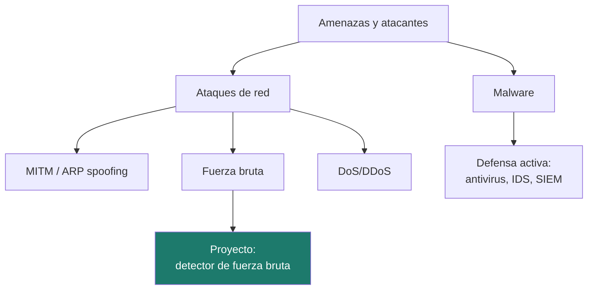
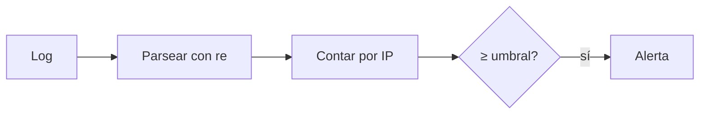

# Unidad 2 · Seguridad activa, malware y red

> **Módulo:** CMO-314 · Ciberseguridad · **Resultado de aprendizaje:** RA2 · **Duración:** 16 h · **Peso:** 20 %
> **Herramienta principal:** Python 3 (`re`, `collections`) · **Nivel:** ciclo superior

La seguridad **activa** es la que actúa mientras el sistema funciona: detectar y frenar amenazas, malware y ataques. En esta unidad conoces las familias de malware y los ataques más comunes en la red, y aprendes a **detectar un ataque leyendo logs con Python**. El proyecto es un **detector de fuerza bruta**: la misma lógica que una regla de `fail2ban` o un SIEM.

---

!!! reto "El reto de la unidad"
    Caza un **ataque de fuerza bruta** escondido en un registro de accesos. Los **ejercicios** y el **laboratorio** de más abajo son tu **entrenamiento**: cuando los domines, resuelve el reto (el proyecto) y demuéstralo en el examen.

## Mapa de la unidad



### Qué vas a saber hacer al terminar

- [ ] Clasificar los tipos de **malware** y sus mecanismos.
- [ ] Reconocer los ataques de red habituales y cómo se defienden.
- [ ] Entender qué es la **monitorización** y para qué sirve un **SIEM**.
- [ ] **Parsear logs con expresiones regulares** en Python.
- [ ] Detectar un patrón de ataque (fuerza bruta) a partir de eventos.
- [ ] Presentar hallazgos de forma clara y accionable.

### Cómo se trabaja esta unidad

Igual que la UD1: explicación → lectura y ejemplos → retos rápidos → ejercicios con solución → proyecto → examen.

!!! danger "Recordatorio ético"
    Las técnicas de ataque se estudian **para defender**. Se practican solo en el laboratorio. Ver [Uso ético y legal](../recursos/uso-etico.md).

---

## 1. Amenazas y tipos de atacante

Una amenaza se materializa cuando alguien (o algo) con **motivación** y **capacidad** encuentra una vulnerabilidad. Perfiles: *script kiddies*, ciberdelincuentes con ánimo de lucro, *hacktivistas*, amenazas internas (empleados) y APT (grupos sofisticados con recursos).

!!! analogia "Analogía"
    No es lo mismo un ladrón oportunista que prueba puertas que una banda que planifica un golpe durante meses (APT). La defensa se dimensiona según a quién esperas enfrentarte.

!!! reto "Reto rápido 1"
    ¿Qué tipo de atacante representa un empleado descontento que copia datos antes de irse?

---

## 2. Malware: el software malicioso

| Tipo | Qué hace | Rasgo |
|---|---|---|
| **Virus** | Se adjunta a un fichero y se propaga al ejecutarlo | Necesita anfitrión |
| **Gusano** | Se propaga solo por la red | No necesita anfitrión |
| **Troyano** | Se disfraza de software legítimo | Engaño |
| **Ransomware** | Cifra los datos y pide rescate | Extorsión |
| **Spyware / keylogger** | Espía la actividad | Sigilo |
| **Rootkit** | Se oculta en el sistema | Persistencia |
| **Botnet** | Convierte el equipo en "zombi" controlado | Control remoto |

La defensa activa combina **antivirus/EDR** (detección por firma y por comportamiento), actualizaciones, mínimo privilegio y formación de las personas.

!!! note "EICAR: probar el antivirus sin riesgo"
    Existe una cadena de prueba estándar (**EICAR**) que todos los antivirus detectan como si fuera un virus, pero es **totalmente inofensiva**. Sirve para comprobar que tu antivirus funciona sin usar malware real.

!!! reto "Reto rápido 2"
    ¿Qué diferencia a un gusano de un virus en cuanto a propagación?

---

## 3. Ataques de red habituales

| Ataque | Idea | Defensa |
|---|---|---|
| **Sniffing** | Capturar tráfico | Cifrado (HTTPS, VPN) |
| **MITM / ARP spoofing** | Colocarse en medio de una conversación | Cifrado, detección ARP, 802.1X |
| **Fuerza bruta** | Probar credenciales hasta acertar | Bloqueo tras N intentos, MFA |
| **Phishing** | Engañar para robar credenciales | Formación, filtros, MFA |
| **DoS / DDoS** | Saturar un servicio | Filtrado, CDN, limitación de tasa |
| **Inyección (SQLi)** | Colar código en una entrada | Consultas parametrizadas (UD6) |

!!! analogia "Analogía"
    El ataque de fuerza bruta es como probar todas las combinaciones de un candado. Si el candado se bloquea tras 3 intentos (o pide una segunda llave), la fuerza bruta deja de funcionar.

---

## 4. Monitorización y SIEM: ver para defender

No puedes proteger lo que no ves. La monitorización recoge **logs** de servidores, cortafuegos y aplicaciones, y un **SIEM** (Wazuh, Elastic, Graylog) los **correlaciona** para lanzar alertas. La detección de un ataque casi siempre empieza por **leer y agregar logs** — justo lo que harás con Python.

```python
# Un log de autenticación típico, línea a línea:
# 2026-05-01T10:00:00 sshd usuario=root ip=10.0.20.5 estado=FALLO
```

---

## 5. Detectar ataques con Python: expresiones regulares

Las **expresiones regulares** (`re`) extraen datos con formato de un texto. Son la navaja suiza del análisis de logs.

```python title="Extraer campos de un log con expresiones regulares"
import re

patron = re.compile(r"usuario=(?P<usuario>\S+)\s+ip=(?P<ip>\S+)\s+estado=(?P<estado>OK|FALLO)")  # (1)!
linea = "2026-05-01 sshd usuario=root ip=10.0.20.5 estado=FALLO"
m = patron.search(linea)  # (2)!
if m:
    print(m["usuario"], m["ip"], m["estado"])  # (3)!
```

1.  `(?P<nombre>...)` crea **grupos con nombre**: en vez de acordarte de que la IP es el grupo 2, la pides por su nombre. `\S+` = "uno o más caracteres que no son espacio".
2.  `search` busca el patrón en cualquier parte de la línea; devuelve `None` si no encaja (por eso el `if m:`).
3.  Accedes a cada campo por su nombre: `m["ip"]`. Salida: `root 10.0.20.5 FALLO`.

Para **contar** usamos `collections.Counter`:

```python
from collections import Counter
fallos = Counter()
fallos["10.0.20.5"] += 1
```

!!! warning "Atención"
    Cuidado con los grupos con nombre: `(?P<ip>...)` se lee luego con `m["ip"]`. Si el patrón no coincide, `search` devuelve `None`: hay que comprobarlo.

!!! reto "Reto rápido 3"
    Escribe una expresión regular que capture una dirección IPv4 sencilla (cuatro grupos de dígitos separados por puntos).

---

## 6. De los eventos al patrón de ataque

La receta del detector de fuerza bruta:

1. **Parsear** cada línea → eventos `{usuario, ip, estado}`.
2. **Contar** los `FALLO` por IP.
3. Marcar como sospechosa toda IP con fallos **≥ umbral**.
4. Señal grave: una IP con muchos fallos que **acaba en OK** (el ataque pudo tener éxito).



!!! reto "Reto rápido 4"
    Si el umbral es 5 y una IP tiene 4 fallos y luego 1 OK, ¿la marcas como sospechosa? ¿Y si tuviera 6 fallos?

---

## 7. Errores frecuentes

| Error | Causa | Solución |
|---|---|---|
| `TypeError: 'NoneType'` | No comprobar si `search` devolvió `None` | `if m is not None:` |
| El patrón no captura nada | Escapes o espacios | Prueba el patrón en trozos pequeños |
| Contar mal | Sumar OK como si fueran fallos | Filtra por `estado == "FALLO"` |

---

## 8. Practica **con** solución a la vista

#### Actividad 1 — Extraer la IP
Escribe `extraer_ip(linea: str) -> str | None` que devuelva la IP de una línea `... ip=X ...`.
<details class="sol"><summary>Solución</summary>

```python
import re
def extraer_ip(linea: str) -> str | None:
    m = re.search(r"ip=(\S+)", linea)
    return m.group(1) if m else None
```
</details>

#### Actividad 2 — Contar fallos
Dada una lista de estados `["FALLO","OK","FALLO"]`, cuenta los fallos.
<details class="sol"><summary>Solución</summary>

```python
def contar_fallos(estados: list[str]) -> int:
    return sum(1 for e in estados if e == "FALLO")
```
</details>

#### Actividad 3 — IP más activa
Dado `dict[str,int]` de fallos por IP, devuelve la IP con más fallos.
<details class="sol"><summary>Solución</summary>

```python
def ip_top(fallos: dict[str, int]) -> str:
    return max(fallos, key=lambda ip: fallos[ip])
```
</details>

#### Actividad 4 — ¿Es sospechosa?
Escribe `sospechosa(fallos: int, umbral: int = 5) -> bool`.
<details class="sol"><summary>Solución</summary>

```python
def sospechosa(fallos: int, umbral: int = 5) -> bool:
    return fallos >= umbral
```
</details>

#### Actividad 5 — Clasificar malware
Escribe `familia(nombre: str) -> str` que, dado `"cifra ficheros"`, `"se disfraza"`, devuelva `"ransomware"` o `"troyano"`.
<details class="sol"><summary>Solución</summary>

```python
def familia(desc: str) -> str:
    if "cifra" in desc:
        return "ransomware"
    if "disfraza" in desc:
        return "troyano"
    return "desconocido"
```
</details>

---

## Proyecto de la unidad

Construyes un **detector de fuerza bruta**: lee un log de autenticación, cuenta los fallos por IP, y lista las IP sospechosas señalando las que pudieron llegar a autenticarse.

**[Proyecto Detector de fuerza bruta →](../proyectos/ud2/README.md)**

```bash
pip install -r requirements.txt
pytest
mypy src
```

!!! warning "Los tests son la especificación"
    Describen exactamente el comportamiento esperado. El examen usará una batería equivalente.

---

## Retos de ampliación

- **R1.** Añade detección de fuerza bruta **por ventana de tiempo** (N fallos en M segundos).
- **R2.** Detecta *password spraying* (una contraseña contra muchos usuarios) en vez de fuerza bruta clásica.
- **R3.** Genera un informe ordenado por gravedad.

---

## Más práctica

#### Actividad 6 — Ventana temporal
Escribe `fallos_en_ventana(tiempos: list[int], ventana: int) -> int` que devuelva el máximo de intentos que caen en cualquier ventana de `ventana` segundos (los tiempos vienen en segundos, ordenados).
<details class="sol"><summary>Solución</summary>

```python
def fallos_en_ventana(tiempos: list[int], ventana: int) -> int:
    mejor = i = 0
    for j in range(len(tiempos)):
        while tiempos[j] - tiempos[i] > ventana:
            i += 1
        mejor = max(mejor, j - i + 1)
    return mejor
```
</details>

#### Actividad 7 — Password spraying
Escribe `spraying(eventos)` que detecte una IP que prueba **la misma** contraseña contra **muchos usuarios** (≥ 5 usuarios distintos con fallo).
<details class="sol"><summary>Solución</summary>

```python
from collections import defaultdict
def spraying(eventos: list[dict]) -> list[str]:
    usuarios = defaultdict(set)
    for e in eventos:
        if e["estado"] == "FALLO":
            usuarios[e["ip"]].add(e["usuario"])
    return [ip for ip, us in usuarios.items() if len(us) >= 5]
```
</details>

---

## Laboratorio

> En contenedores Docker: no hay ataque real, se **generan logs** y tú los analizas.

### Laboratorio guiado (resuelto) — Fábrica de logs de fuerza bruta

Un contenedor genera un log de autenticación con un ataque de fuerza bruta simulado; tú lo analizas con `deteccion.py`.

**`docker-compose.yml`**

```yaml
services:
  generador:
    image: python:3.12-alpine
    volumes: ["./datos:/datos"]
    command: >
      python3 -c "
      import random
      lineas=[]
      for i in range(60):
          lineas.append(f'ev sshd usuario=root ip=10.0.20.5 estado=FALLO')
      lineas.append('ev sshd usuario=root ip=10.0.20.5 estado=OK')
      lineas.append('ev sshd usuario=ana ip=10.0.20.9 estado=OK')
      open('/datos/auth.log','w').write(chr(10).join(lineas))
      print('log generado')"
```

```bash
mkdir -p datos && docker compose run --rm generador
python3 - << 'PY'
import re
from collections import Counter
texto = open("datos/auth.log").read()
fallos = Counter()
exito = set()
for l in texto.splitlines():
    m = re.search(r"usuario=(\S+) ip=(\S+) estado=(\S+)", l)
    if not m: continue
    if m.group(3) == "FALLO": fallos[m.group(2)] += 1
    else: exito.add(m.group(2))
for ip, n in fallos.items():
    if n >= 5:
        print(f"{ip}: {n} fallos", " [POSIBLE ACCESO]" if ip in exito else "")
PY
```

<details class="sol"><summary>Qué debe salir</summary>

```
10.0.20.5: 60 fallos  [POSIBLE ACCESO]
```
La IP `.5` supera el umbral **y** termina con un OK: el ataque pudo tener éxito. `.9` solo tiene un OK legítimo, no aparece. Esto es una regla de `fail2ban` en miniatura.
</details>

### Laboratorio propuesto (entregable) — Mini-SIEM en dos contenedores

Con Docker Compose: un contenedor **produce** un log de accesos web en streaming (una línea nueva cada segundo, con IPs y códigos 200/404) y **otro contenedor Python** (tuyo) lo **sigue en vivo** (`tail -f` sobre el volumen) y alerta cuando una IP supera **10 respuestas 404 en 60 s** (posible escaneo).

**Criterios de aceptación**
- `re` para parsear, ventana temporal de 60 s.
- Alerta con IP, nº de 404 y hora. Tipado y `mypy` limpio.
- Todo con `docker compose up`.

---

## Autoevaluación rápida

<details><summary>1. Diferencia entre virus y gusano.</summary>El virus necesita un fichero anfitrión; el gusano se propaga solo.</details>
<details><summary>2. ¿Qué defensa corta la fuerza bruta?</summary>Bloqueo tras N intentos y MFA.</details>
<details><summary>3. ¿Para qué sirve un SIEM?</summary>Correlacionar logs de muchas fuentes y lanzar alertas.</details>
<details><summary>4. ¿Qué devuelve <code>re.search</code> si no encuentra nada?</summary><code>None</code>.</details>
<details><summary>5. ¿Qué señal indica que la fuerza bruta pudo tener éxito?</summary>Muchos FALLO seguidos de un OK desde la misma IP.</details>
<details><summary>6. ¿Qué es EICAR?</summary>Una cadena de prueba inofensiva para comprobar el antivirus.</details>

---

## Glosario

| Término | Definición |
|---|---|
| **Malware** | Software malicioso (virus, gusano, troyano, ransomware…). |
| **MITM** | Ataque de intermediario. |
| **Fuerza bruta** | Probar credenciales hasta acertar. |
| **SIEM** | Correlación centralizada de logs y alertas. |
| **Expresión regular** | Patrón para extraer datos de un texto (`re`). |
| **Botnet** | Red de equipos comprometidos controlados remotamente. |

---

## Cómo se evalúa esta unidad (RA2)


Se evalúa con un **examen por retos 100 % práctico**: resuelves en Python un reto parecido al de clase y se corrige **solo con su batería de tests**.

!!! reto "La nota, sin sorpresas"
    **Nota = (tests superados ÷ total) × 10.** Se aprueba con 5. Es la misma mecánica del reto de esta unidad, así que llegas entrenado.

El informe además te marca, **sin puntuar**, tres buenas prácticas que conviene cuidar: usar la técnica del RA (aquí, `re`), pasar `mypy` y documentar el código.