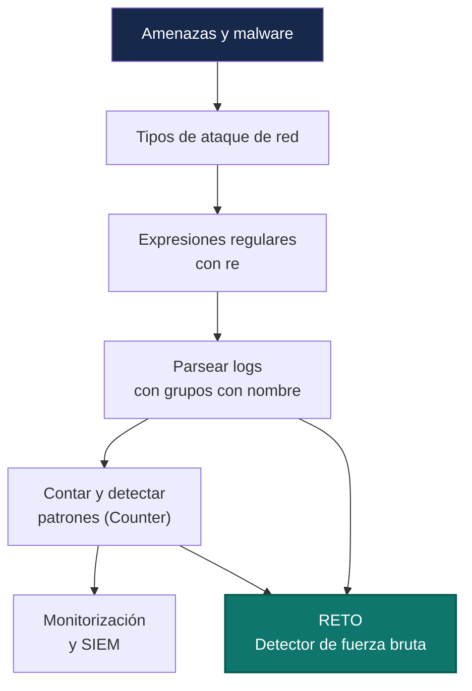
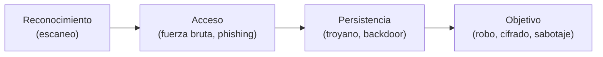
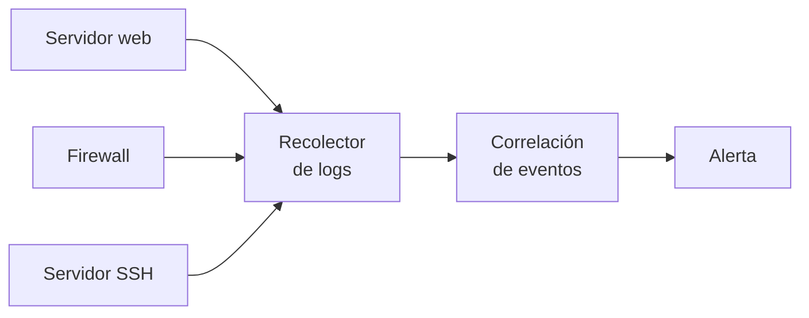
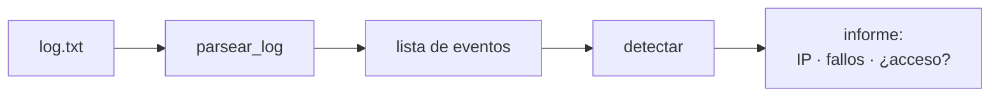
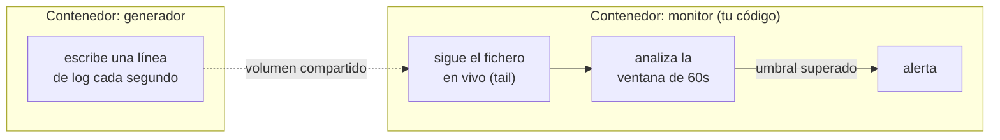

# Unidad 2 · Seguridad activa, malware y red

> **Módulo:** CMO-314 · Ciberseguridad · **RA2** · **Duración:** 16 h · **Peso:** 20 % · **Herramienta:** Python 3 (tipado) + `re`

Si la UT1 iba de **proteger datos en reposo**, esta va de **vigilar lo que se mueve**: tráfico, sesiones, intentos de acceso. La herramienta que vas a dominar es `re` (expresiones regulares) — la navaja suiza para convertir un log en bruto, ilegible, en datos que puedes analizar. Al terminar habrás construido un **detector de fuerza bruta** capaz de leer un registro de autenticación y señalar, con criterio, qué IP está atacando.

!!! reto "El reto de la unidad"
    **Caza un ataque de fuerza bruta escondido en un registro de accesos.** Vas a construir un detector que lea un log y señale las IP sospechosas. Todo lo de abajo es tu entrenamiento para resolverlo tú solo.



**Qué sabrás hacer al terminar:** distinguir los tipos de malware y de ataque de red más comunes · escribir expresiones regulares con grupos con nombre · parsear un log línea a línea y extraer campos estructurados · contar y detectar patrones con `collections.Counter` · explicar qué hace un SIEM y por qué existe · construir una CLI de detección con `argparse`, tipada y probada.

**Cómo se trabaja (aula invertida):** lees la sección y ejecutas los ejemplos antes de clase → en clase resuelves las actividades y avanzas el reto en parejas.

!!! danger "Recordatorio de uso ético"
    Analizarás logs y patrones de ataque **con fines defensivos**, sobre datos de laboratorio o tuyos. Nunca contra sistemas ajenos. Ver [Uso ético y legal](../recursos/uso-etico.md).

---

## 1. Amenazas y malware

**Malware** es cualquier software diseñado para dañar, robar o tomar el control sin permiso. No es un tipo, es una familia:

| Tipo | Cómo actúa | Ejemplo de objetivo |
|---|---|---|
| **Virus** | Necesita un fichero "hospedador" para propagarse | Infecta ejecutables |
| **Gusano (worm)** | Se replica solo, sin hospedador, viaja por red | Satura redes enteras |
| **Troyano** | Se disfraza de software legítimo | Abre una puerta trasera |
| **Ransomware** | Cifra los datos y pide un rescate | Extorsión (§UT1 tenía el hash del lado defensivo) |
| **Spyware** | Roba información en silencio | Contraseñas, pulsaciones de teclado |

```python title="clasificar_malware.py"
COMPORTAMIENTO_A_TIPO = {
    "autorreplica_por_red": "gusano",
    "requiere_archivo_hospedador": "virus",
    "cifra_y_pide_rescate": "ransomware",
    "se_oculta_en_utilidad_legitima": "troyano",
    "roba_datos_en_silencio": "spyware",
}

def clasifica(comportamiento: str) -> str:
    return COMPORTAMIENTO_A_TIPO.get(comportamiento, "desconocido")

for c in ["cifra_y_pide_rescate", "autorreplica_por_red", "algo_nuevo"]:
    print(f"{c:32} -> {clasifica(c)}")
```

```text title="Salida"
cifra_y_pide_rescate            -> ransomware
autorreplica_por_red            -> gusano
algo_nuevo                      -> desconocido
```

!!! reto "Reto rápido 1"
    Un ransomware moderno a menudo **también** exfiltra datos antes de cifrar (doble extorsión — lo viste en la UT1). ¿Debería `clasifica()` devolver dos etiquetas en ese caso? ¿Cómo cambiarías la función para permitirlo?

---

## 2. Ataques de red más comunes

| Ataque | Qué hace | Pista típica en el log |
|---|---|---|
| **Fuerza bruta** | Prueba contraseñas hasta acertar | Muchos `FALLO` seguidos, misma IP |
| **DoS / DDoS** | Satura un servicio hasta tumbarlo | Picos enormes de peticiones |
| **Phishing** | Engaña para robar credenciales | (no deja huella en logs de servidor) |
| **Escaneo de puertos** | Reconocimiento previo a un ataque | Muchas IP-destino distintas en poco tiempo desde una IP |
| **Man-in-the-middle** | Se interpone en una comunicación | Certificados TLS inesperados |



!!! analogia "Analogía"
    Un atacante de fuerza bruta es como alguien probando llaves en una cerradura, una tras otra, toda la noche. No hace ruido de cristal roto — pero deja **huellas**: la misma persona, la misma puerta, muchas veces seguidas. Eso es justo lo que vas a detectar.

---

## 3. Expresiones regulares con `re`: la herramienta de esta unidad

Una expresión regular describe un **patrón** de texto. `re` es el módulo de Python para buscarlo, extraerlo o sustituirlo.

```python title="regex_basico.py"
import re

texto = "Conexión desde 10.0.20.5 al puerto 22"

# search: busca el patrón en cualquier parte
m = re.search(r"\d{1,3}(?:\.\d{1,3}){3}", texto)   # una IPv4
print(m.group() if m else None)

# findall: todas las coincidencias
puertos = re.findall(r"puerto (\d+)", texto)
print(puertos)

# sub: sustituir
anonimizado = re.sub(r"\d{1,3}(?:\.\d{1,3}){3}", "[IP]", texto)
print(anonimizado)
```

```text title="Salida"
10.0.20.5
['22']
Conexión desde [IP] al puerto 22
```

### 3.1 Grupos con nombre: la técnica que más vas a usar

En vez de acordarte de que "la IP es el grupo 2", la pides **por su nombre**:

```python title="grupos_con_nombre.py"
import re

patron = re.compile(
    r"usuario=(?P<usuario>\S+)\s+ip=(?P<ip>\S+)\s+estado=(?P<estado>OK|FALLO)"
)
linea = "2026-05-01 10:00:01 sshd usuario=root ip=10.0.20.5 estado=FALLO"

m = patron.search(linea)
if m:
    print(m["usuario"], m["ip"], m["estado"])
    print(m.groupdict())    # los tres campos como diccionario, muy útil
```

```text title="Salida"
root 10.0.20.5 FALLO
{'usuario': 'root', 'ip': '10.0.20.5', 'estado': 'FALLO'}
```

| Símbolo | Significa |
|---|---|
| `\d` | Un dígito | `\S` | Un carácter que no es espacio |
| `+` | Uno o más | `*` | Cero o más |
| `(?P<nombre>...)` | Grupo con nombre | `\s+` | Uno o más espacios |
| `search()` | Busca en cualquier parte | `fullmatch()` | Debe encajar la cadena entera |

!!! warning "Atención"
    `re.search` devuelve `None` si no encuentra nada — **siempre** comprueba con `if m:` antes de usar `m["campo"]`, o tendrás un `TypeError: NoneType is not subscriptable`.

!!! reto "Reto rápido 2"
    Cambia el patrón para que también capture la **fecha** al principio de la línea (`2026-05-01`) en un grupo `fecha`. Pista: `\d{4}-\d{2}-\d{2}`.

---

## 4. Parsear un log completo

Un log real son muchas líneas. La estrategia: parsear cada línea, descartar las que no encajan, y quedarte con una lista de eventos estructurados.

```python title="parsear_log.py"
import re

PATRON = re.compile(r"usuario=(?P<usuario>\S+)\s+ip=(?P<ip>\S+)\s+estado=(?P<estado>OK|FALLO)")

def parsear_evento(linea: str) -> dict[str, str] | None:
    m = PATRON.search(linea)
    return m.groupdict() if m else None

def parsear_log(texto: str) -> list[dict[str, str]]:
    eventos = []
    for linea in texto.splitlines():
        evento = parsear_evento(linea)
        if evento is not None:
            eventos.append(evento)
    return eventos

LOG = """\
2026-05-01 10:00:01 sshd usuario=root ip=10.0.20.5 estado=FALLO
2026-05-01 10:00:02 sshd usuario=root ip=10.0.20.5 estado=FALLO
linea corrupta sin formato
2026-05-01 10:00:03 sshd usuario=ana ip=10.0.20.9 estado=OK
"""

eventos = parsear_log(LOG)
print(f"{len(eventos)} eventos válidos de {len(LOG.splitlines())} líneas")
for e in eventos:
    print(e)
```

```text title="Salida"
3 eventos válidos de 4 líneas
{'usuario': 'root', 'ip': '10.0.20.5', 'estado': 'FALLO'}
{'usuario': 'root', 'ip': '10.0.20.5', 'estado': 'FALLO'}
{'usuario': 'ana', 'ip': '10.0.20.9', 'estado': 'OK'}
```

> La línea corrupta se descarta sola, sin que el programa se caiga. Esto es clave: **un log real siempre tiene basura**, y tu parser tiene que sobrevivir a ella.

---

## 5. Contar y detectar: `collections.Counter`

Con los eventos parseados, contar fallos por IP es una línea:

```python title="detectar_umbral.py"
from collections import Counter

def contar_fallos_por_ip(eventos: list[dict[str, str]]) -> dict[str, int]:
    contador: Counter[str] = Counter()
    for e in eventos:
        if e["estado"] == "FALLO":
            contador[e["ip"]] += 1
    return dict(contador)

def ips_sospechosas(eventos: list[dict[str, str]], umbral: int = 5) -> list[str]:
    fallos = contar_fallos_por_ip(eventos)
    return sorted([ip for ip, n in fallos.items() if n >= umbral],
                  key=lambda ip: -fallos[ip])

eventos = [{"usuario": "root", "ip": "10.0.20.5", "estado": "FALLO"}] * 5
eventos += [{"usuario": "ana", "ip": "10.0.20.9", "estado": "OK"}]
print(contar_fallos_por_ip(eventos))
print(ips_sospechosas(eventos, umbral=5))
```

```text title="Salida"
{'10.0.20.5': 5}
['10.0.20.5']
```

### 5.1 ¿Y si además tuvo éxito? Ahí está el peligro real

```python title="acceso_tras_fuerza_bruta.py"
def hubo_acceso_correcto(eventos: list[dict[str, str]], ip: str) -> bool:
    return any(e["ip"] == ip and e["estado"] == "OK" for e in eventos)

eventos = [
    {"ip": "10.0.20.5", "estado": "FALLO"}, {"ip": "10.0.20.5", "estado": "FALLO"},
    {"ip": "10.0.20.5", "estado": "OK"},     # ¡al final entró!
]
print(hubo_acceso_correcto(eventos, "10.0.20.5"))
```

```text title="Salida"
True
```

!!! analogia "Analogía"
    Una IP con 50 fallos y **sin ningún éxito** es ruidosa pero no crítica: el atacante no ha entrado (todavía). Una IP con 5 fallos **seguidos de un OK** es la alarma roja: probablemente acertó la contraseña. Ese matiz es lo que separa una alerta informativa de una crítica.

!!! reto "Reto rápido 3"
    Con los eventos de arriba, ¿cuántos fallos tuvo `10.0.20.5` antes del `OK`? Escribe una función `fallos_antes_de_ok(eventos, ip) -> int`.

---

## 6. Monitorización y SIEM

Un **SIEM** (*Security Information and Event Management*) centraliza los logs de toda una organización, los correla en tiempo real y dispara alertas — es, a escala industrial, exactamente lo que acabas de programar a mano: parsear, contar, detectar umbral.



| Herramienta real | Qué hace |
|---|---|
| Wazuh, Splunk, ELK | SIEM: centraliza, correla, alerta |
| `fail2ban` | Bloquea IPs tras N fallos (la misma lógica que tu detector) |
| Suricata | Detección de intrusiones por firma de tráfico |

---

## 7. Errores frecuentes (ten esto a mano)

| Error | Causa | Solución |
|---|---|---|
| `TypeError: 'NoneType' object is not subscriptable` | Usar `m["campo"]` sin comprobar `if m:` | Comprueba siempre antes |
| El patrón no encaja nunca | Espacios reales vs `\s`, o mayúsculas | Prueba con `re.search` en un REPL antes de automatizar |
| `re.match` no encuentra algo que sí está en la línea | `match` solo mira el **principio** de la cadena | Usa `search` salvo que quieras anclar al inicio |
| El contador da de más | Contar también los `OK` | Filtra por `estado == "FALLO"` antes de contar |
| Falsos positivos con IPs internas | No distinguir tráfico interno de externo | Usa `ipaddress.ip_address(ip).is_private` |

---

## 8. Actividades: de lo más sencillo a preguntas tipo examen

> Una única escalera. Intenta cada uno antes de mirar la solución. Librerías reales: `re`, `collections.Counter`, `ipaddress`.

**1 · 🟢 Extraer IPs de un texto** — `ips(texto: str) -> list[str]`.
<details class="sol"><summary>Solución</summary>

```python
import re
def ips(texto: str) -> list[str]:
    return re.findall(r"\b\d{1,3}(?:\.\d{1,3}){3}\b", texto)
```
</details>

**2 · 🟢 ¿Es una IP privada?** — `es_privada(ip: str) -> bool` con `ipaddress`.
<details class="sol"><summary>Solución</summary>

```python
import ipaddress
def es_privada(ip: str) -> bool:
    return ipaddress.ip_address(ip).is_private
```
</details>

**3 · 🟢 Parsear un evento** — `parsear_evento(linea) -> dict[str,str] | None` (usa el patrón de §3.1).
<details class="sol"><summary>Solución</summary>

```python
import re
_P = re.compile(r"usuario=(?P<usuario>\S+)\s+ip=(?P<ip>\S+)\s+estado=(?P<estado>OK|FALLO)")
def parsear_evento(linea: str) -> dict[str, str] | None:
    m = _P.search(linea)
    return m.groupdict() if m else None
```
</details>

**4 · 🟢 Clasificar malware** — `clasifica(comportamiento: str) -> str` (usa el diccionario de §1).
<details class="sol"><summary>Solución</summary>

```python
MAPA = {"autorreplica_por_red": "gusano", "cifra_y_pide_rescate": "ransomware"}
def clasifica(c: str) -> str:
    return MAPA.get(c, "desconocido")
```
</details>

**5 · 🟡 Contar códigos de estado HTTP** — `codigos(lineas: list[str]) -> Counter`.
<details class="sol"><summary>Solución</summary>

```python
import re
from collections import Counter
def codigos(lineas: list[str]) -> "Counter[str]":
    c: Counter[str] = Counter()
    for ln in lineas:
        m = re.search(r'"\s+(\d{3})\b', ln)
        if m:
            c[m.group(1)] += 1
    return c
```
</details>

**6 · 🟡 Parsear el log completo** — `parsear_log(texto: str) -> list[dict[str,str]]`, descartando líneas corruptas.
<details class="sol"><summary>Solución</summary>

```python
def parsear_log(texto: str) -> list[dict[str, str]]:
    eventos = []
    for ln in texto.splitlines():
        e = parsear_evento(ln)
        if e is not None:
            eventos.append(e)
    return eventos
```
</details>

**7 · 🟡 Fallos por IP** — `contar_fallos_por_ip(eventos) -> dict[str,int]`.
<details class="sol"><summary>Solución</summary>

```python
from collections import Counter
def contar_fallos_por_ip(eventos: list[dict[str, str]]) -> dict[str, int]:
    c: Counter[str] = Counter()
    for e in eventos:
        if e["estado"] == "FALLO":
            c[e["ip"]] += 1
    return dict(c)
```
</details>

**8 · 🟡 Top de IPs más ruidosas** — `top_ips(eventos, n=3) -> list[tuple[str,int]]`.
<details class="sol"><summary>Solución</summary>

```python
from collections import Counter
def top_ips(eventos: list[dict[str, str]], n: int = 3) -> list[tuple[str, int]]:
    c: Counter[str] = Counter(e["ip"] for e in eventos if e["estado"] == "FALLO")
    return c.most_common(n)
```
</details>

**9 · 🟠 IPs sospechosas por umbral** — `ips_sospechosas(eventos, umbral=5) -> list[str]`, ordenadas de más a menos fallos.
<details class="sol"><summary>Solución</summary>

```python
def ips_sospechosas(eventos: list[dict[str, str]], umbral: int = 5) -> list[str]:
    fallos = contar_fallos_por_ip(eventos)
    return sorted([ip for ip, n in fallos.items() if n >= umbral], key=lambda ip: -fallos[ip])
```
</details>

**10 · 🟠 ¿Hubo acceso tras los fallos?** — `hubo_acceso_correcto(eventos, ip) -> bool`.
<details class="sol"><summary>Solución</summary>

```python
def hubo_acceso_correcto(eventos: list[dict[str, str]], ip: str) -> bool:
    return any(e["ip"] == ip and e["estado"] == "OK" for e in eventos)
```
</details>

**11 · 🟠 Usuarios objetivo de una IP** — `usuarios_objetivo(eventos, ip) -> set[str]`: qué usuarios ha probado esa IP.
<details class="sol"><summary>Solución</summary>

```python
def usuarios_objetivo(eventos: list[dict[str, str]], ip: str) -> set[str]:
    return {e["usuario"] for e in eventos if e["ip"] == ip}
```
</details>

**12 · 🔴 Password spraying** — `spraying(eventos, min_usuarios=5) -> list[str]`: IPs que prueban **pocas** contraseñas contra **muchos** usuarios distintos (al revés que la fuerza bruta clásica).
<details class="sol"><summary>Solución</summary>

```python
from collections import defaultdict
def spraying(eventos: list[dict[str, str]], min_usuarios: int = 5) -> list[str]:
    usuarios_por_ip: dict[str, set[str]] = defaultdict(set)
    for e in eventos:
        if e["estado"] == "FALLO":
            usuarios_por_ip[e["ip"]].add(e["usuario"])
    return sorted(ip for ip, us in usuarios_por_ip.items() if len(us) >= min_usuarios)
```
</details>

**13 · 🔴 Ventana temporal** — `en_ventana(marcas: list[int], segundos: int) -> int`: el máximo de eventos que caen en cualquier ventana deslizante de `segundos` (marcas ordenadas, en segundos desde el inicio).
<details class="sol"><summary>Solución</summary>

```python
def en_ventana(marcas: list[int], segundos: int) -> int:
    mejor = i = 0
    for j in range(len(marcas)):
        while marcas[j] - marcas[i] > segundos:
            i += 1
        mejor = max(mejor, j - i + 1)
    return mejor
```
</details>

**14 · 🔴 Escaneo de rutas 404** — `escaneo_web(lineas, umbral=10) -> list[str]`: IP que pide muchas rutas **distintas** con 404 (fuzzing de directorios).
<details class="sol"><summary>Solución</summary>

```python
import re
from collections import defaultdict
def escaneo_web(lineas: list[str], umbral: int = 10) -> list[str]:
    rutas: dict[str, set[str]] = defaultdict(set)
    for ln in lineas:
        m = re.search(r'(\d{1,3}(?:\.\d{1,3}){3}).*"(?:GET|POST)\s+(\S+)[^"]*"\s+404', ln)
        if m:
            rutas[m.group(1)].add(m.group(2))
    return sorted(ip for ip, r in rutas.items() if len(r) >= umbral)
```
</details>

**15 · 🔴 Informe final** — `informe(eventos, umbral=5) -> list[str]`: una línea por IP sospechosa con fallos y si hubo acceso, ordenado por gravedad.
<details class="sol"><summary>Solución</summary>

```python
def informe(eventos: list[dict[str, str]], umbral: int = 5) -> list[str]:
    salida = []
    for ip in ips_sospechosas(eventos, umbral):
        fallos = contar_fallos_por_ip(eventos)[ip]
        critico = hubo_acceso_correcto(eventos, ip)
        etiqueta = "CRÍTICO" if critico else "alerta"
        salida.append(f"[{etiqueta}] {ip}: {fallos} fallos" + (" + ACCESO" if critico else ""))
    return sorted(salida, key=lambda s: "CRÍTICO" not in s)
```
</details>

### Preguntas tipo test práctico

**P1.** ¿Qué devuelve `re.search(patron, linea)` si la línea no encaja con el patrón?
<details class="sol"><summary>Respuesta</summary><code>None</code>. Por eso siempre hay que comprobar <code>if m:</code> antes de usar <code>m["campo"]</code>.</details>

**P2.** En `parsear_log`, ¿qué pasa con una línea corrupta que no encaja con el patrón?
<details class="sol"><summary>Respuesta</summary>Se descarta silenciosamente (<code>parsear_evento</code> devuelve <code>None</code> y no se añade a la lista) — el parser no se rompe.</details>

**P3.** ¿Cuál es la diferencia entre `re.match` y `re.search`?
<details class="sol"><summary>Respuesta</summary><code>match</code> solo comprueba si el patrón encaja al <b>principio</b> de la cadena; <code>search</code> lo busca en cualquier parte.</details>

**P4.** Si `Counter` cuenta también los eventos `OK`, ¿qué falta en el bucle?
<details class="sol"><summary>Respuesta</summary>El filtro <code>if e["estado"] == "FALLO":</code> antes de incrementar el contador.</details>

**P5.** En el ejercicio 12 (password spraying), ¿por qué se cuentan **usuarios distintos** en vez de fallos totales?
<details class="sol"><summary>Respuesta</summary>Porque el spraying prueba <b>pocas</b> contraseñas contra <b>muchos</b> usuarios — contar fallos totales no lo distinguiría de una fuerza bruta normal contra un solo usuario.</details>

**P6.** ¿Qué imprime esto?
```python
import re
m = re.search(r"ip=(?P<ip>\S+)", "estado=OK ip=10.0.0.1")
print(m["ip"] if m else "sin match")
```
<details class="sol"><summary>Respuesta</summary><code>10.0.0.1</code> — el grupo con nombre <code>ip</code> captura hasta el siguiente espacio (<code>\S+</code>).</details>

**P7.** ¿Por qué una IP con muchos fallos pero **sin ningún** `OK` es menos crítica que una con pocos fallos seguidos de un `OK`?
<details class="sol"><summary>Respuesta</summary>Porque sin <code>OK</code> el atacante no ha entrado; con un <code>OK</code> posterior, probablemente acertó la contraseña — es la diferencia entre ruido y una brecha real.</details>

**P8.** ¿Qué hace `ipaddress.ip_address("10.0.20.5").is_private`?
<details class="sol"><summary>Respuesta</summary>Devuelve <code>True</code>: <code>10.0.20.5</code> pertenece a un rango privado (RFC 1918), típico de una red local o de laboratorio.</details>

---

## 9. Reto resuelto, paso a paso — Detector de fuerza bruta profesional

Sigues en la consultora. Esta vez te llega un log de SSH de un cliente con la sospecha de que alguien está intentando entrar por fuerza bruta. Construyes la herramienta que lo confirma.



**Paso 1 — El patrón y el parseo de una línea.**

```python title="detector.py"
import re

PATRON = re.compile(
    r"usuario=(?P<usuario>\S+)\s+ip=(?P<ip>\S+)\s+estado=(?P<estado>OK|FALLO)"
)

def parsear_evento(linea: str) -> dict[str, str] | None:
    m = PATRON.search(linea)
    return m.groupdict() if m else None
```

**Paso 2 — Parsear el fichero completo, sobreviviendo a la basura.**

```python title="detector.py (continúa)"
def parsear_log(texto: str) -> list[dict[str, str]]:
    return [e for ln in texto.splitlines() if (e := parsear_evento(ln)) is not None]
```

**Paso 3 — Contar y detectar el umbral.**

```python title="detector.py (continúa)"
from collections import Counter

def contar_fallos_por_ip(eventos: list[dict[str, str]]) -> dict[str, int]:
    c: Counter[str] = Counter(e["ip"] for e in eventos if e["estado"] == "FALLO")
    return dict(c)

def ips_sospechosas(eventos: list[dict[str, str]], umbral: int) -> list[str]:
    fallos = contar_fallos_por_ip(eventos)
    return sorted([ip for ip, n in fallos.items() if n >= umbral], key=lambda ip: -fallos[ip])

def hubo_acceso_correcto(eventos: list[dict[str, str]], ip: str) -> bool:
    return any(e["ip"] == ip and e["estado"] == "OK" for e in eventos)
```

**Paso 4 — El informe, con severidad.**

```python title="detector.py (continúa)"
def generar_informe(eventos: list[dict[str, str]], umbral: int) -> list[str]:
    lineas = []
    fallos = contar_fallos_por_ip(eventos)
    for ip in ips_sospechosas(eventos, umbral):
        critico = hubo_acceso_correcto(eventos, ip)
        etiqueta = "CRÍTICO (acceso logrado)" if critico else "alerta"
        lineas.append(f"[{etiqueta:24}] {ip}  ({fallos[ip]} fallos)")
    return lineas
```

**Paso 5 — CLI con `argparse`.**

```python title="detector.py (continúa)"
import argparse
from pathlib import Path

def main() -> None:
    ap = argparse.ArgumentParser(prog="detector", description="Detector de fuerza bruta en logs SSH")
    ap.add_argument("log", type=Path, help="fichero de log a analizar")
    ap.add_argument("--umbral", type=int, default=5, help="fallos mínimos para alertar")
    args = ap.parse_args()

    eventos = parsear_log(args.log.read_text(encoding="utf-8"))
    print(f"{len(eventos)} eventos analizados")
    for linea in generar_informe(eventos, args.umbral):
        print(linea)

if __name__ == "__main__":
    main()
```

**Paso 6 — Pruébalo con Docker: genera el log y analízalo, sin `sudo`.**

```yaml title="docker-compose.yml"
services:
  demo:
    image: python:3.12-alpine
    volumes: ["./datos:/datos", "./detector.py:/detector.py"]
    working_dir: /datos
    command: >
      sh -c "python3 -c \"
      lineas = ['2026-05-01 sshd usuario=root ip=10.0.20.5 estado=FALLO'] * 6
      lineas += ['2026-05-01 sshd usuario=root ip=10.0.20.5 estado=OK']
      lineas += ['2026-05-01 sshd usuario=ana ip=10.0.20.9 estado=OK']
      open('log.txt','w').write(chr(10).join(lineas))
      \";
      python /detector.py log.txt --umbral 5"
```

```bash title="Ejecutar"
mkdir -p datos && docker compose run --rm demo
```

```text title="Salida esperada"
8 eventos analizados
[CRÍTICO (acceso logrado)] 10.0.20.5  (6 fallos)
```

<details class="sol"><summary>📄 detector.py completo</summary>

```python
import argparse, re
from collections import Counter
from pathlib import Path

PATRON = re.compile(r"usuario=(?P<usuario>\S+)\s+ip=(?P<ip>\S+)\s+estado=(?P<estado>OK|FALLO)")

def parsear_evento(linea: str) -> dict[str, str] | None:
    m = PATRON.search(linea)
    return m.groupdict() if m else None

def parsear_log(texto: str) -> list[dict[str, str]]:
    return [e for ln in texto.splitlines() if (e := parsear_evento(ln)) is not None]

def contar_fallos_por_ip(eventos: list[dict[str, str]]) -> dict[str, int]:
    return dict(Counter(e["ip"] for e in eventos if e["estado"] == "FALLO"))

def ips_sospechosas(eventos: list[dict[str, str]], umbral: int) -> list[str]:
    fallos = contar_fallos_por_ip(eventos)
    return sorted([ip for ip, n in fallos.items() if n >= umbral], key=lambda ip: -fallos[ip])

def hubo_acceso_correcto(eventos: list[dict[str, str]], ip: str) -> bool:
    return any(e["ip"] == ip and e["estado"] == "OK" for e in eventos)

def generar_informe(eventos: list[dict[str, str]], umbral: int) -> list[str]:
    fallos = contar_fallos_por_ip(eventos)
    out = []
    for ip in ips_sospechosas(eventos, umbral):
        etiqueta = "CRÍTICO (acceso logrado)" if hubo_acceso_correcto(eventos, ip) else "alerta"
        out.append(f"[{etiqueta:24}] {ip}  ({fallos[ip]} fallos)")
    return out

def main() -> None:
    ap = argparse.ArgumentParser(prog="detector", description="Detector de fuerza bruta en logs SSH")
    ap.add_argument("log", type=Path)
    ap.add_argument("--umbral", type=int, default=5)
    args = ap.parse_args()
    eventos = parsear_log(args.log.read_text(encoding="utf-8"))
    print(f"{len(eventos)} eventos analizados")
    for linea in generar_informe(eventos, args.umbral):
        print(linea)

if __name__ == "__main__":
    main()
```
</details>

---

## 10. Reto para ti (propuesto, sin solución)

### 📡 Mini-SIEM en dos contenedores

Un SIEM de verdad no analiza un fichero estático: vigila **en vivo**. Vas a montar una versión mínima.



**Objetivo.** Un contenedor **genera** un log de accesos web en streaming (una línea nueva cada segundo, con IPs variadas y códigos 200/404). **Otro contenedor** con tu Python **sigue el fichero en vivo** y alerta cuando una IP supera **10 respuestas 404 en una ventana de 60 segundos**.

**Requisitos**

- CLI con `argparse`: `python monitor.py <fichero> --ventana 60 --umbral 10`.
- "Seguir en vivo" un fichero que crece: abre el fichero, ve a leer lo que se añada (patrón `tail -f`: recuerda la posición leída y relee desde ahí).
- Reutiliza tus funciones de parseo y de ventana temporal (ejercicio 13) del apartado anterior.
- Código tipado, `mypy` limpio.
- Nada de `sudo`: todo en `docker compose up`.

**Criterios de aceptación**

1. El monitor no se bloquea esperando: lee lo nuevo y vuelve a dormir un poco si no hay líneas.
2. Alerta como máximo **una vez** por IP mientras siga en la ventana (no una alerta por cada línea nueva).
3. Si paras el generador, el monitor no falla: simplemente no hay líneas nuevas.

**Pistas** (no solución): para leer solo lo nuevo, guarda la posición con `f.tell()` tras cada lectura y reabre con `f.seek(posicion)` · para la ventana de 60 s reutiliza la idea de "ventana deslizante" del ejercicio 13, pero con marcas de tiempo reales (`time.time()`) en vez de índices.

**Si te sobra tiempo:** añade detección de **password spraying** (ejercicio 12) en el mismo monitor · exporta las alertas a un CSV con `csv.writer` · añade un modo `--formato json` que saque cada alerta como una línea JSON (`import json`).

> Esto es justo el tipo de reto que resolverás en el **test práctico**.

---

## Autoevaluación rápida (conceptos)

<details><summary>1. ¿Qué diferencia a un virus de un gusano?</summary>El virus necesita un fichero hospedador; el gusano se replica solo por la red.</details>
<details><summary>2. ¿Qué devuelve <code>re.search</code> si no encuentra el patrón?</summary><code>None</code>.</details>
<details><summary>3. ¿Cómo se accede a un grupo con nombre en un match?</summary>Con <code>m["nombre"]</code> o <code>m.group("nombre")</code>.</details>
<details><summary>4. ¿Qué hace un SIEM?</summary>Centraliza logs de muchas fuentes, los correla y dispara alertas.</details>
<details><summary>5. ¿Por qué es peligrosa una IP con fallos seguidos de un <code>OK</code>?</summary>Porque probablemente acertó la contraseña tras varios intentos.</details>

## Glosario

| Término | Definición |
|---|---|
| **Malware** | Software diseñado para dañar, robar o tomar el control sin permiso. |
| **Fuerza bruta** | Ataque que prueba credenciales de forma sistemática hasta acertar. |
| **Password spraying** | Variante: pocas contraseñas contra muchos usuarios, para evitar bloqueos. |
| **Grupo con nombre** | `(?P<nombre>...)` en una regex; se accede como diccionario. |
| **SIEM** | Sistema que centraliza y correla eventos de seguridad de toda una organización. |
| **`fail2ban`** | Herramienta real que bloquea IPs tras N fallos — la misma lógica que este reto. |

## Cómo se evalúa esta unidad (RA2)

El instrumento principal es un **test práctico**: resuelves en Python un reto parecido al de esta unidad y se corrige **solo con su batería de tests** (queda abierto, como complemento, algún ejercicio práctico).

!!! reto "La nota, sin sorpresas"
    **Nota = (tests superados ÷ total) × 10.** Se aprueba con 5.

El informe además te marca, **sin puntuar**, tres buenas prácticas: usar la técnica del RA (aquí, `re`), pasar `mypy` y documentar el código.
