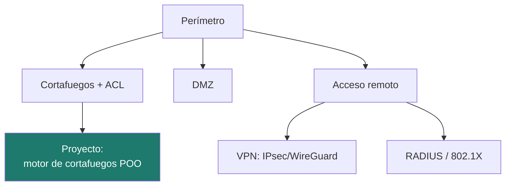
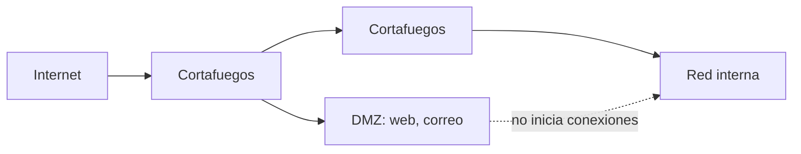

# Unidad 3 · Seguridad perimetral y acceso remoto

> **Módulo:** CMO-314 · Ciberseguridad · **Resultado de aprendizaje:** RA3 · **Duración:** 14 h · **Peso:** 15 %
> **Herramienta principal:** Python 3 (POO) · **Nivel:** ciclo superior

El **perímetro** es la frontera entre tu red y el mundo. Aquí aprendes a diseñarlo: cortafuegos, listas de control de acceso, **DMZ**, **VPN** y acceso remoto seguro. Y lo entiendes de verdad **programando el motor de un cortafuegos en Python**, con clases: dado un paquete, decidir si pasa según una lista ordenada de reglas.

---

!!! reto "El reto de la unidad"
    Levanta un **cortafuegos** que decida, regla a regla, qué tráfico pasa y cuál no. Los **ejercicios** y el **laboratorio** de más abajo son tu **entrenamiento**: cuando los domines, resuelve el reto (el proyecto) y demuéstralo en el examen.

## Mapa de la unidad



### Qué vas a saber hacer al terminar

- [ ] Explicar qué es un **cortafuegos** y cómo aplica una **ACL** (primera coincidencia, denegar por defecto).
- [ ] Diseñar una **DMZ** y justificar qué va en ella.
- [ ] Comparar tipos de **VPN** y su aportación.
- [ ] Entender el papel de un **servidor de autenticación** (RADIUS) y los métodos de acceso remoto.
- [ ] Modelar reglas y evaluar paquetes con **clases en Python**.

### Cómo se trabaja esta unidad

El ciclo habitual del módulo. Toda la práctica en el laboratorio ([Uso ético y legal](../recursos/uso-etico.md)).

---

## 1. El cortafuegos y las listas de control de acceso

Un **cortafuegos** filtra el tráfico según reglas. Cada regla dice: para un origen, destino y puerto, **permitir** o **denegar**. La clave está en dos ideas:

1. **Primera coincidencia gana:** las reglas se evalúan en orden; se aplica la primera que encaja.
2. **Denegar por defecto:** si ninguna regla coincide, se deniega. Un cortafuegos que permite por defecto no protege.

| Origen | Destino | Puerto | Acción |
|---|---|---|---|
| 10.0.20.0/24 | 10.0.30.10 | 443 | PERMITIR |
| 10.0.20.9 | * | * | DENEGAR |
| * | * | * | *(defecto: DENEGAR)* |

!!! analogia "Analogía"
    Es un portero con una lista: comprueba a cada persona contra la lista de arriba abajo y actúa con la **primera** norma que aplica. Si no está en la lista, no entra.

!!! reto "Reto rápido 1"
    Con la tabla de arriba, ¿pasa un paquete de `10.0.20.9` al puerto 443? ¿Por qué?

### 1.1 Tipos de cortafuegos

- **De filtrado de paquetes:** mira IP y puerto (rápido, básico).
- **De estado (*stateful*):** recuerda las conexiones establecidas.
- **De aplicación / WAF:** entiende el protocolo (HTTP) y filtra por contenido.
- **NGFW:** combina todo lo anterior con inspección profunda.

---

## 2. La zona desmilitarizada (DMZ)

La **DMZ** es un segmento intermedio donde se colocan los servicios accesibles desde Internet (web, correo). Si atacan uno de esos servicios, el atacante queda **aislado** en la DMZ y no salta directo a la red interna.



Regla de oro: **la DMZ no inicia conexiones hacia la LAN**. El tráfico va de dentro hacia fuera, no al revés.

!!! reto "Reto rápido 2"
    ¿Por qué es peligroso poner la base de datos de clientes en la DMZ?

---

## 3. VPN: extender la red con seguridad

Una **VPN** crea un túnel cifrado sobre una red no confiable (Internet), de modo que un equipo remoto trabaje como si estuviera en la red local.

| Tecnología | Rasgo |
|---|---|
| **IPsec** | Estándar, muy usado sede-a-sede |
| **OpenVPN** | Flexible, sobre TLS |
| **WireGuard** | Moderno, simple y rápido |

!!! analogia "Analogía"
    La VPN es un **túnel blindado** por una autopista pública: los demás ven que pasa algo, pero no lo que llevas dentro.

---

## 4. Acceso remoto y autenticación centralizada

Cuando muchos usuarios acceden desde fuera, la autenticación se centraliza en un **servidor RADIUS**: valida credenciales, autoriza y registra (AAA: *Authentication, Authorization, Accounting*). Se combina con **802.1X** en la red y con MFA (UD4).

Métodos de autenticación de usuarios remotos, de menos a más robusto: contraseña → contraseña + TOTP → certificado/tarjeta inteligente → **FIDO2**.

!!! reto "Reto rápido 3"
    ¿Qué ventaja tiene centralizar la autenticación en RADIUS frente a definir usuarios en cada dispositivo?

---

## 5. Programar el motor: clases en Python

Un cortafuegos es un caso perfecto de **orientación a objetos**: una `Regla` sabe si coincide con un paquete, y un `Cortafuegos` guarda una lista de reglas y las evalúa en orden.

```python title="Una regla de cortafuegos como objeto"
class Regla:
    def __init__(self, accion: str, origen: str = "*",
                 destino: str = "*", puerto: int = 0) -> None:  # (1)!
        self.accion = accion.upper()
        self.origen = origen
        self.destino = destino
        self.puerto = puerto

    def coincide(self, origen: str, destino: str, puerto: int) -> bool:  # (2)!
        def encaja(v: str, p: str) -> bool:
            return p == "*" or p == v  # (3)!
        return (encaja(origen, self.origen) and encaja(destino, self.destino)
                and (self.puerto == 0 or self.puerto == puerto))
```

1.  Los **valores por defecto** (`origen="*"`) permiten crear reglas amplias sin repetir el comodín. `"*"` significará "cualquiera".
2.  Un **método** encapsula el comportamiento junto a los datos: la regla sabe decidir por sí misma si se aplica a un paquete.
3.  Función interna reutilizable: un campo encaja si es comodín (`*`) o si coincide exactamente. El puerto `0` se trata como "cualquiera".

!!! warning "Atención"
    El orden importa: si pones la regla amplia `PERMITIR * * 443` **antes** que un `DENEGAR` específico, el denegar nunca se aplica. La primera coincidencia gana.

!!! reto "Reto rápido 4"
    Escribe una `Regla` que deniegue todo el tráfico de la IP `10.0.20.9` a cualquier destino y puerto.

---

## 6. Zero Trust: el perímetro ya no basta

Con teletrabajo y nube, la idea de "dentro = seguro" se rompe. **Zero Trust** parte de no confiar en ningún acceso por su ubicación: cada acceso se autentica, se autoriza por contexto y se limita al mínimo. El perímetro sigue existiendo, pero se complementa con verificación continua.

---

## 7. Errores frecuentes

| Error | Causa | Solución |
|---|---|---|
| Todo el tráfico pasa | Falta el "denegar por defecto" | Política por defecto DENEGAR |
| Una regla no se aplica nunca | Hay otra más amplia antes | Ordena de específica a general |
| DMZ que accede a la LAN | Reglas mal puestas | La DMZ no inicia hacia dentro |

---

## 8. Practica **con** solución a la vista

#### Actividad 1 — ¿Coincide el comodín?
Escribe `encaja(valor, patron)` donde `*` encaja con todo.
<details class="sol"><summary>Solución</summary>

```python
def encaja(valor: str, patron: str) -> bool:
    return patron == "*" or patron == valor
```
</details>

#### Actividad 2 — Evaluar en orden
Dada una lista de `(accion, coincide)`, devuelve la acción de la primera que coincide, o `"DENEGAR"`.
<details class="sol"><summary>Solución</summary>

```python
def evaluar(reglas: list[tuple[str, bool]]) -> str:
    for accion, coincide in reglas:
        if coincide:
            return accion
    return "DENEGAR"
```
</details>

#### Actividad 3 — ¿Va en la DMZ?
`en_dmz(servicio)` → True para `"web"`, `"correo"`; False para `"basedatos"`.
<details class="sol"><summary>Solución</summary>

```python
def en_dmz(servicio: str) -> bool:
    return servicio in {"web", "correo", "dns-publico"}
```
</details>

#### Actividad 4 — Robustez del método remoto
`nivel(metodo)` → devuelve un número: contraseña 1, totp 2, certificado 3, fido2 4.
<details class="sol"><summary>Solución</summary>

```python
def nivel(metodo: str) -> int:
    return {"contrasena": 1, "totp": 2,
            "certificado": 3, "fido2": 4}.get(metodo, 0)
```
</details>

---

## Proyecto de la unidad

Construyes el **motor de un cortafuegos** con clases `Regla` y `Cortafuegos`: carga una ACL de texto, evalúa paquetes por primera coincidencia y aplica denegar por defecto.

**[Proyecto Motor de cortafuegos →](../proyectos/ud3/README.md)**

```bash
pip install -r requirements.txt
pytest
mypy src
```

---

## Retos de ampliación

- **R1.** Soporta rangos de puertos (`80-443`).
- **R2.** Añade un contador de "aciertos" por regla, como los cortafuegos reales.
- **R3.** Detecta reglas **inalcanzables** (tapadas por otra anterior más amplia).

---

## Más práctica

#### Actividad 5 — Regla desde texto
Escribe `parsear_regla(linea: str)` que convierta `"PERMITIR 10.0.20.0/24 * 443"` en una tupla `(accion, origen, destino, puerto)`.
<details class="sol"><summary>Solución</summary>

```python
def parsear_regla(linea: str) -> tuple[str, str, str, int]:
    p = linea.split()
    return (p[0].upper(), p[1], p[2], int(p[3]) if len(p) > 3 else 0)
```
</details>

#### Actividad 6 — Regla inalcanzable
Dada una lista de reglas `(origen, puerto)` y una regla nueva, di si queda **tapada** por una anterior con comodín.
<details class="sol"><summary>Solución</summary>

```python
def tapada(previas: list[tuple[str, int]], nueva: tuple[str, int]) -> bool:
    o, p = nueva
    return any((po in ("*", o)) and (pp in (0, p)) for po, pp in previas)
```
</details>

---

## Laboratorio

> Levantamos una pequeña red con **Docker Compose** y aplicamos un cortafuegos escrito en Python. Nada de esto toca tu red real.

### Laboratorio guiado (resuelto) — ACL sobre una red Docker

Dos servicios en una red Docker (`web` en el 80, `db` en el 5432) y un evaluador de ACL en Python que decide qué tráfico se permite.

**`docker-compose.yml`**

```yaml
services:
  web:
    image: nginx:alpine
  db:
    image: postgres:16-alpine
    environment: { POSTGRES_PASSWORD: lab }
networks:
  default: { internal: true }   # la red no sale a Internet
```

```bash
docker compose up -d
# Regla de negocio: la LAN puede ir a web:80, pero NADIE a db:5432 desde fuera
python3 - << 'PY'
reglas = [("PERMITIR","lan","web",80), ("DENEGAR","*","db",5432)]
def evaluar(o,d,p):
    for acc,ro,rd,rp in reglas:
        if ro in ("*",o) and rd in ("*",d) and rp in (0,p):
            return acc
    return "DENEGAR"   # por defecto
for caso in [("lan","web",80),("lan","db",5432),("internet","web",80)]:
    print(caso, "->", evaluar(*caso))
PY
docker compose down
```

<details class="sol"><summary>Qué debe salir</summary>

```
('lan','web',80) -> PERMITIR
('lan','db',5432) -> DENEGAR
('internet','web',80) -> DENEGAR
```
La LAN llega a la web; nadie llega a la base de datos; e Internet no llega a la web porque no hay regla que lo permita y la política por defecto es **denegar**. `internal: true` refuerza lo mismo a nivel de Docker.
</details>

### Laboratorio propuesto (entregable) — DMZ de tres segmentos

Con Docker Compose define **tres redes** (`internet`, `dmz`, `lan`) y coloca un `web` en la DMZ y una `db` en la LAN. Escribe una ACL en Python (con tus clases `Regla`/`Cortafuegos`) que cumpla: Internet→DMZ:443 permitido, DMZ→LAN:5432 permitido solo para el `web`, LAN→Internet permitido, y **DMZ no inicia** hacia la LAN salvo esa excepción.

**Criterios de aceptación**
- Usa **clases** (POO), primera coincidencia y denegar por defecto.
- Una tabla de 6 casos de prueba con el resultado esperado. Tipado y `mypy` limpio.

---

## Autoevaluación rápida

<details><summary>1. ¿Qué regla se aplica si varias coinciden?</summary>La primera en el orden de la lista.</details>
<details><summary>2. ¿Cuál debe ser la política por defecto segura?</summary>Denegar.</details>
<details><summary>3. ¿Qué es una DMZ?</summary>Segmento intermedio para los servicios expuestos, aislado de la LAN.</details>
<details><summary>4. ¿Qué aporta una VPN?</summary>Un túnel cifrado sobre una red no confiable.</details>
<details><summary>5. ¿Qué hace un servidor RADIUS?</summary>Autenticación, autorización y registro centralizados (AAA).</details>
<details><summary>6. ¿Qué propone Zero Trust?</summary>No confiar en ningún acceso por su ubicación; verificar siempre.</details>

---

## Glosario

| Término | Definición |
|---|---|
| **Cortafuegos** | Filtra tráfico según reglas. |
| **ACL** | Lista ordenada de reglas permitir/denegar. |
| **DMZ** | Zona intermedia para servicios expuestos. |
| **VPN** | Túnel cifrado sobre red no confiable. |
| **RADIUS / AAA** | Autenticación, autorización y registro centralizados. |
| **Zero Trust** | No confiar por ubicación; verificar cada acceso. |

---

## Cómo se evalúa esta unidad (RA3)


Se evalúa con un **examen por retos 100 % práctico**: resuelves en Python un reto parecido al de clase y se corrige **solo con su batería de tests**.

!!! reto "La nota, sin sorpresas"
    **Nota = (tests superados ÷ total) × 10.** Se aprueba con 5. Es la misma mecánica del reto de esta unidad, así que llegas entrenado.

El informe además te marca, **sin puntuar**, tres buenas prácticas que conviene cuidar: usar la técnica del RA (aquí, clases (POO)), pasar `mypy` y documentar el código.