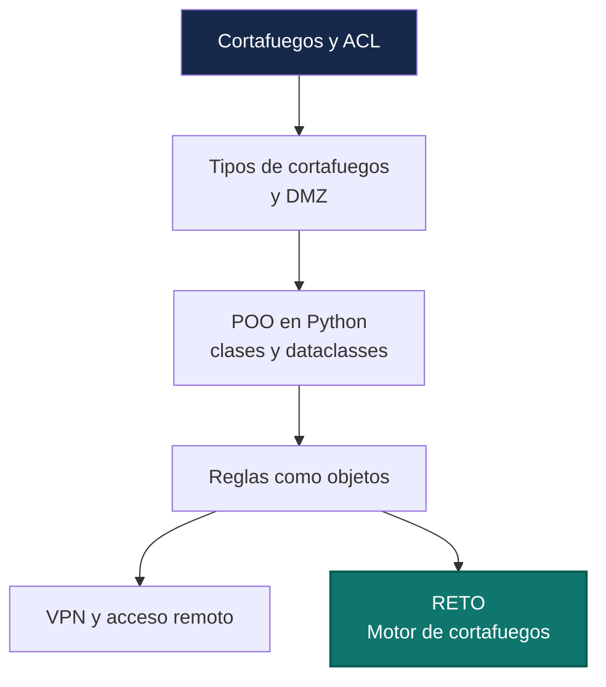
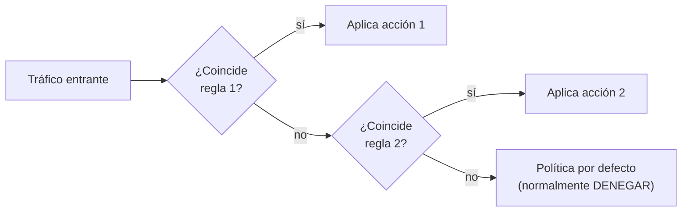
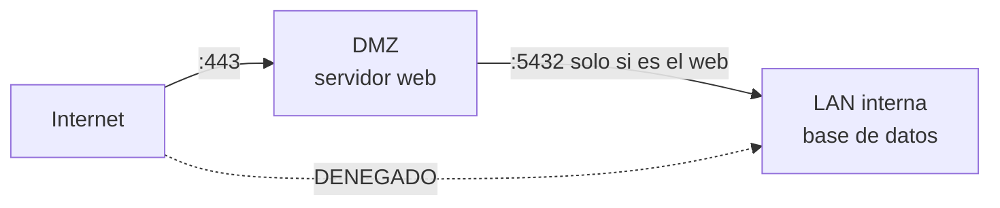
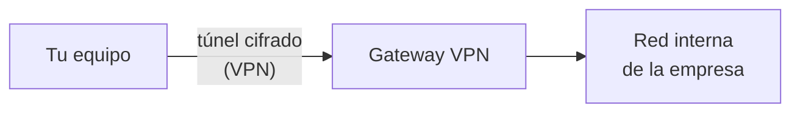
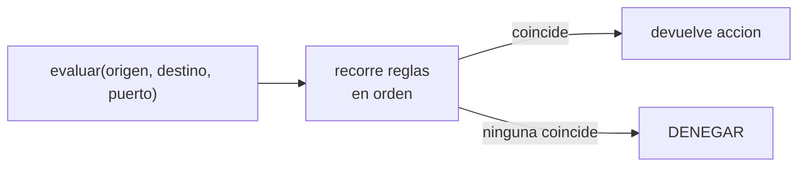
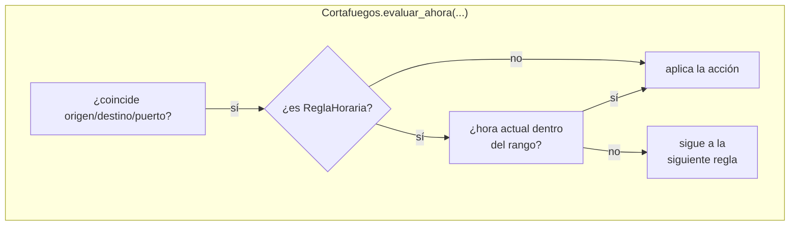

# Unidad 3 · Seguridad perimetral y acceso remoto

> **Módulo:** CMO-314 · Ciberseguridad · **RA3** · **Duración:** 14 h · **Peso:** 15 % · **Herramienta:** Python 3 (tipado) + POO

Hasta ahora has protegido datos (UT1) y detectado ataques leyendo logs (UT2). Esta unidad va de **decidir qué tráfico entra y cuál no** — el trabajo de un cortafuegos. Y aquí cambia la herramienta principal: en vez de funciones sueltas, vas a modelar el problema con **clases** (programación orientada a objetos). Un cortafuegos real *es* un objeto con estado (sus reglas) y comportamiento (evaluar tráfico) — es el caso de uso perfecto para aprender POO con sentido, no de memoria.

!!! reto "El reto de la unidad"
    **Construye un motor de cortafuegos.** Reglas, prioridad y una política por defecto que decide cuando nada coincide. Todo lo de abajo es tu entrenamiento.



**Qué sabrás hacer al terminar:** explicar qué es una ACL y la política "deny by default" · diseñar una DMZ · escribir clases en Python con `@dataclass`, métodos y herencia · modelar reglas de cortafuegos como objetos que se evalúan a sí mismos · explicar VPN y AAA (autenticación, autorización, auditoría) · construir un cortafuegos evaluable por CLI, tipado y probado.

**Cómo se trabaja (aula invertida):** lees la sección y ejecutas los ejemplos antes de clase → en clase resuelves las actividades y avanzas el reto en parejas.

---

## 1. Cortafuegos y listas de control de acceso (ACL)

Un **cortafuegos** filtra tráfico según reglas. Cada regla dice: si el tráfico coincide con esto, haz aquello (permitir o denegar). Las reglas se evalúan **en orden**, y la **primera que coincide gana**.



!!! warning "La regla que nunca debes olvidar: deny by default"
    Si el tráfico no coincide con **ninguna** regla, la política por defecto debe ser **denegar**. Un cortafuegos que "permite si no sabe qué hacer" es un cortafuegos roto — y es el error de configuración más común en el mundo real.

| Campo típico de una regla | Ejemplo |
|---|---|
| Acción | `PERMITIR` / `DENEGAR` |
| Origen | una IP, una red (`10.0.20.0/24`) o `*` (cualquiera) |
| Destino | igual que origen |
| Puerto | un número, o `0`/`*` (cualquiera) |

!!! reto "Reto rápido 1"
    Tienes dos reglas: 1) `PERMITIR` cualquier origen al puerto 443. 2) `DENEGAR` todo. Si llega tráfico al puerto 22, ¿qué pasa? ¿Y si llegara la regla del puerto 22 **antes** que la de "denegar todo"?

---

## 2. Tipos de cortafuegos y la DMZ

| Tipo | Dónde mira | Ejemplo |
|---|---|---|
| **Filtrado de paquetes** | Cabeceras IP/puerto | `iptables`, ACL de router |
| **Stateful** | Recuerda el estado de la conexión | La mayoría de cortafuegos actuales |
| **Proxy / aplicación** | El contenido, no solo la cabecera | WAF, proxy inverso |

Una **DMZ** (zona desmilitarizada) es una red intermedia para los servicios que deben ser accesibles desde Internet (un servidor web), **sin** exponer la red interna donde están los datos sensibles:



> Fíjate: Internet **nunca** llega directamente a la LAN. Y dentro de la DMZ solo el servidor web (no cualquier cosa) puede hablar con la base de datos.

---

## 3. POO en Python: modelar el problema con clases

Hasta ahora escribías funciones sueltas que reciben datos. Una **clase** agrupa **datos** (atributos) y **comportamiento** (métodos) en un mismo objeto. Para una regla de cortafuegos, esto encaja perfecto: la regla *tiene* unos campos y *sabe* decidir si se aplica.

```python title="clase_basica.py"
class Regla:
    def __init__(self, accion: str, puerto: int) -> None:   # (1)!
        self.accion = accion                                  # (2)!
        self.puerto = puerto

    def permite(self, puerto: int) -> bool:                   # (3)!
        return self.puerto == puerto and self.accion.upper() == "PERMITIR"

r = Regla("permitir", 443)
print(r.permite(443))   # (4)!
print(r.permite(22))
```

1.  `__init__` es el **constructor**: se ejecuta al crear el objeto y recibe los datos iniciales.
2.  `self` es el propio objeto: `self.accion` guarda el dato **en** ese objeto concreto.
3.  Un **método**: una función que vive dentro de la clase y actúa sobre `self`.
4.  `r.permite(443)` — le preguntas al objeto, no calculas tú por fuera.

```text title="Salida"
True
False
```

### 3.1 `@dataclass`: la misma clase, con menos código repetitivo

Escribir `__init__` a mano para cada atributo es tedioso. `@dataclass` lo genera automáticamente:

```python title="dataclass_regla.py"
from dataclasses import dataclass

@dataclass
class Regla:
    accion: str
    puerto: int = 0             # valor por defecto: 0 = "cualquier puerto"

    def permite(self, puerto: int) -> bool:
        return (self.puerto == 0 or self.puerto == puerto) and self.accion.upper() == "PERMITIR"

r1 = Regla("PERMITIR", 443)
r2 = Regla("DENEGAR")           # puerto usa el valor por defecto (0)
print(r1)          # dataclass genera un __repr__ legible solo
print(r1.permite(443), r2.permite(443))
```

```text title="Salida"
Regla(accion='PERMITIR', puerto=443)
True False
```

> `@dataclass` genera gratis `__init__`, `__repr__` (para que `print()` sea legible) y `__eq__` (para comparar dos reglas con `==`). Es el estándar profesional para clases que son, sobre todo, contenedores de datos.

!!! reto "Reto rápido 2"
    Añade un campo `origen: str = "*"` a `Regla` y amplía `permite` para que también lo compruebe (comodín `"*"` = cualquiera).

---

## 4. Reglas con comodín y coincidencia por prioridad

```python title="regla_comodin.py"
from dataclasses import dataclass

@dataclass
class Regla:
    accion: str
    origen: str = "*"
    destino: str = "*"
    puerto: int = 0

    def coincide(self, origen: str, destino: str, puerto: int) -> bool:
        def encaja(valor: str, patron: str) -> bool:
            return patron == "*" or patron == valor
        return (encaja(origen, self.origen) and encaja(destino, self.destino)
                and (self.puerto == 0 or self.puerto == puerto))

r = Regla("PERMITIR", origen="lan", destino="web", puerto=80)
print(r.coincide("lan", "web", 80))    # todo coincide
print(r.coincide("wan", "web", 80))    # origen no coincide
```

```text title="Salida"
True
False
```

### 4.1 El cortafuegos: una clase que contiene reglas

Una segunda clase que **usa** la primera — así se componen sistemas más grandes en POO:

```python title="clase_cortafuegos.py"
from dataclasses import dataclass, field

@dataclass
class Cortafuegos:
    reglas: list[Regla] = field(default_factory=list)   # (1)!

    def anadir(self, regla: Regla) -> None:
        self.reglas.append(regla)

    def evaluar(self, origen: str, destino: str, puerto: int) -> str:
        for regla in self.reglas:                          # (2)!
            if regla.coincide(origen, destino, puerto):
                return regla.accion.upper()
        return "DENEGAR"                                    # (3)!

fw = Cortafuegos()
fw.anadir(Regla("PERMITIR", origen="lan", destino="web", puerto=80))
fw.anadir(Regla("DENEGAR"))                                 # regla "atrapa-todo"
print(fw.evaluar("lan", "web", 80))
print(fw.evaluar("wan", "web", 80))
```

1.  `field(default_factory=list)` es la forma correcta de dar una **lista vacía** por defecto en un dataclass — usar `reglas: list = []` directamente es un error clásico (todas las instancias compartirían la misma lista).
2.  Recorre las reglas **en orden**: la primera que coincide decide.
3.  Si ninguna coincide, `DENEGAR` — la política por defecto de la sección 1.

```text title="Salida"
PERMITIR
DENEGAR
```

!!! analogia "Analogía"
    Un objeto `Cortafuegos` es como un guardia con una lista de instrucciones en la mano: las lee de arriba abajo y, en cuanto una encaja, actúa — no sigue mirando el resto. Si llega al final de la lista sin que nada encaje, aplica la instrucción por defecto: "si no está permitido explícitamente, no pasa".

!!! reto "Reto rápido 3"
    Si añades la regla `DENEGAR` (atrapa-todo) **antes** que la de `PERMITIR`, ¿qué evalúa `fw.evaluar("lan","web",80)`? ¿Por qué importa tanto el orden?

---

## 5. Herencia: especializar una regla

La herencia te permite partir de una clase y **añadir** comportamiento sin reescribir lo que ya funciona:

```python title="herencia.py"
from dataclasses import dataclass

@dataclass
class ReglaHoraria(Regla):                     # hereda accion, origen, destino, puerto
    hora_inicio: int = 0
    hora_fin: int = 23

    def activa_a_las(self, hora: int) -> bool:
        return self.hora_inicio <= hora <= self.hora_fin

r = ReglaHoraria("PERMITIR", puerto=22, hora_inicio=8, hora_fin=18)
print(r.activa_a_las(10))   # dentro del horario laboral
print(r.activa_a_las(22))   # fuera
print(r.coincide("*", "*", 22))   # el método heredado sigue funcionando
```

```text title="Salida"
True
False
True
```

> `ReglaHoraria` **es** una `Regla` (hereda `coincide`) y además sabe algo nuevo (`activa_a_las`). Es el principio de sustitución: en cualquier sitio donde esperes una `Regla`, una `ReglaHoraria` también vale.

---

## 6. VPN y acceso remoto

Una **VPN** (red privada virtual) cifra el tráfico entre tu equipo y una red remota, como si estuvieras físicamente dentro de ella.



| Concepto AAA | Responde a |
|---|---|
| **Authentication** (autenticación) | ¿Quién eres? |
| **Authorization** (autorización) | ¿Qué puedes hacer? |
| **Accounting** (auditoría) | ¿Qué hiciste, y cuándo? |

!!! reto "Reto rápido 4"
    Un empleado autentica correctamente (sabe su contraseña) pero intenta acceder a un recurso que no le corresponde. ¿Qué parte de AAA lo detiene: autenticación o autorización?

---

## 7. Errores frecuentes (ten esto a mano)

| Error | Causa | Solución |
|---|---|---|
| `reglas: list = []` en un dataclass | Lista compartida entre instancias | `field(default_factory=list)` |
| El cortafuegos "permite todo" | Falta la regla `DENEGAR` final | Añade siempre una regla atrapa-todo al final |
| Una regla nunca se aplica | Está **después** de otra más genérica que ya coincide | El orden importa: reglas específicas primero |
| `AttributeError` al usar un método heredado | Olvidar `@dataclass` en la clase hija también | Decora también la subclase |
| Comparar objetos con `==` y falla | La clase no genera `__eq__` | `@dataclass` lo da gratis; con `class` normal, defínelo tú |

---

## 8. Actividades: de lo más sencillo a preguntas tipo examen

> Librerías/técnicas reales: `dataclasses`, `ipaddress`, herencia, `field(default_factory=...)`.

**1 · 🟢 Un servicio como objeto** — `@dataclass class Servicio` con `nombre: str` y `puerto: int`.
<details class="sol"><summary>Solución</summary>

```python
from dataclasses import dataclass
@dataclass
class Servicio:
    nombre: str
    puerto: int
```
</details>

**2 · 🟢 Regla mínima** — `@dataclass class Regla` con `accion` y `puerto`, y `permite(puerto) -> bool`.
<details class="sol"><summary>Solución</summary>

```python
from dataclasses import dataclass
@dataclass
class Regla:
    accion: str
    puerto: int
    def permite(self, puerto: int) -> bool:
        return self.puerto == puerto and self.accion.upper() == "PERMITIR"
```
</details>

**3 · 🟢 ¿La IP está en la red?** — `en_red(ip: str, cidr: str) -> bool` con `ipaddress`.
<details class="sol"><summary>Solución</summary>

```python
import ipaddress
def en_red(ip: str, cidr: str) -> bool:
    return ipaddress.ip_address(ip) in ipaddress.ip_network(cidr)
```
</details>

**4 · 🟢 Contar reglas por acción** — `contar_acciones(reglas: list[Regla]) -> dict[str,int]`.
<details class="sol"><summary>Solución</summary>

```python
from collections import Counter
def contar_acciones(reglas: list) -> dict[str, int]:
    return dict(Counter(r.accion.upper() for r in reglas))
```
</details>

**5 · 🟡 Regla con origen, destino y puerto** — `Regla` con `origen`, `destino` (ambos `"*"` por defecto) y `coincide(origen, destino, puerto) -> bool`. Esta es la versión que usarás en el resto de actividades.
<details class="sol"><summary>Solución</summary>

```python
from dataclasses import dataclass
@dataclass
class Regla:
    accion: str
    origen: str = "*"
    destino: str = "*"
    puerto: int = 0
    def coincide(self, origen: str, destino: str, puerto: int) -> bool:
        def encaja(v: str, p: str) -> bool:
            return p == "*" or p == v
        return (encaja(origen, self.origen) and encaja(destino, self.destino)
                and (self.puerto == 0 or self.puerto == puerto))
```
</details>

**6 · 🟡 Deny by default** — `Cortafuegos` con `anadir(regla)` y `evaluar(origen, destino, puerto)` que deniega si nada coincide.
<details class="sol"><summary>Solución</summary>

```python
from dataclasses import dataclass, field
@dataclass
class Cortafuegos:
    reglas: list = field(default_factory=list)
    def anadir(self, regla) -> None:
        self.reglas.append(regla)
    def evaluar(self, origen: str, destino: str, puerto: int) -> str:
        for r in self.reglas:
            if r.coincide(origen, destino, puerto):
                return r.accion.upper()
        return "DENEGAR"
```
</details>

**7 · 🟡 Regla inalcanzable** — `tapada(reglas: list[tuple[str,int]], nueva: tuple[str,int]) -> bool`: ¿queda la nueva regla tapada por una anterior más genérica?
<details class="sol"><summary>Solución</summary>

```python
def tapada(reglas: list[tuple[str, int]], nueva: tuple[str, int]) -> bool:
    _, p = nueva
    return any(rp in (0, p) for _, rp in reglas)
```
</details>

**8 · 🟡 Reglas ordenadas por especificidad** — `ordenar_por_especificidad(reglas)`: las que no usan `"*"` van primero.
<details class="sol"><summary>Solución</summary>

```python
def ordenar_por_especificidad(reglas: list) -> list:
    def puntuacion(r) -> int:
        return (r.origen != "*") + (r.puerto != 0)
    return sorted(reglas, key=puntuacion, reverse=True)
```
</details>

**9 · 🟠 Herencia: regla con motivo** — `ReglaAuditada(Regla)` que añade `motivo: str = ""` y un método `describe() -> str`.
<details class="sol"><summary>Solución</summary>

```python
from dataclasses import dataclass
@dataclass
class ReglaAuditada(Regla):
    motivo: str = ""
    def describe(self) -> str:
        return f"{self.accion} puerto={self.puerto} ({self.motivo or 'sin motivo'})"
```
</details>

**10 · 🟠 Cargar reglas desde texto** — `cargar_reglas(texto: str) -> Cortafuegos`, líneas `"PERMITIR lan web 80"`.
<details class="sol"><summary>Solución</summary>

```python
def cargar_reglas(texto: str) -> Cortafuegos:
    fw = Cortafuegos()
    for ln in texto.strip().splitlines():
        partes = ln.split()
        accion, origen, destino = partes[0], partes[1], partes[2]
        puerto = int(partes[3]) if len(partes) > 3 else 0
        fw.anadir(Regla(accion, origen, destino, puerto))
    return fw
```
</details>

**11 · 🟠 Métricas de uso** — `impactos(fw: Cortafuegos, trafico: list[tuple]) -> dict`: cuántas veces se aplicó cada regla.
<details class="sol"><summary>Solución</summary>

```python
from collections import Counter
def impactos(fw: Cortafuegos, trafico: list[tuple]) -> dict[int, int]:
    c: Counter[int] = Counter()
    for o, d, p in trafico:
        for i, r in enumerate(fw.reglas):
            if r.coincide(o, d, p):
                c[i] += 1
                break
    return dict(c)
```
</details>

**12 · 🔴 Detectar reglas duplicadas** — `duplicadas(reglas: list[Regla]) -> list[tuple[int,int]]`: pares de índices con reglas equivalentes (usa `==`, que `@dataclass` da gratis).
<details class="sol"><summary>Solución</summary>

```python
def duplicadas(reglas: list) -> list[tuple[int, int]]:
    pares = []
    for i in range(len(reglas)):
        for j in range(i + 1, len(reglas)):
            if reglas[i] == reglas[j]:
                pares.append((i, j))
    return pares
```
</details>

**13 · 🔴 Segmentación en tres zonas** — `zona(ip: str) -> str`: `"dmz"`, `"lan"` o `"externa"` según el CIDR (usa `ipaddress`).
<details class="sol"><summary>Solución</summary>

```python
import ipaddress
def zona(ip: str) -> str:
    direccion = ipaddress.ip_address(ip)
    if direccion in ipaddress.ip_network("10.0.1.0/24"):
        return "dmz"
    if direccion in ipaddress.ip_network("10.0.2.0/24"):
        return "lan"
    return "externa"
```
</details>

**14 · 🔴 Validar deny-by-default en un conjunto de reglas** — `tiene_regla_final_deny(fw: Cortafuegos) -> bool`.
<details class="sol"><summary>Solución</summary>

```python
def tiene_regla_final_deny(fw: Cortafuegos) -> bool:
    if not fw.reglas:
        return False
    ultima = fw.reglas[-1]
    return ultima.accion.upper() == "DENEGAR" and ultima.origen == "*" and ultima.puerto == 0
```
</details>

**15 · 🔴 Simulación de tráfico y resumen** — `resumen(fw: Cortafuegos, trafico) -> dict[str,int]`: cuántos paquetes se permiten y cuántos se deniegan.
<details class="sol"><summary>Solución</summary>

```python
from collections import Counter
def resumen(fw: Cortafuegos, trafico: list[tuple]) -> dict[str, int]:
    c: Counter[str] = Counter(fw.evaluar(o, d, p) for o, d, p in trafico)
    return dict(c)
```
</details>

### Preguntas tipo test práctico

**P1.** ¿Por qué `reglas: list = []` directamente en un `@dataclass` es un error?
<details class="sol"><summary>Respuesta</summary>Python evaluaría esa lista <b>una sola vez</b> y todas las instancias de la clase compartirían la misma lista mutable. Hay que usar <code>field(default_factory=list)</code>.</details>

**P2.** En `Cortafuegos.evaluar`, si dos reglas coinciden con el mismo tráfico, ¿cuál gana?
<details class="sol"><summary>Respuesta</summary>La <b>primera</b> en la lista — el bucle hace <code>return</code> en cuanto encuentra una coincidencia.</details>

**P3.** ¿Qué evalúa esto?
```python
fw = Cortafuegos()
fw.anadir(Regla("DENEGAR"))
fw.anadir(Regla("PERMITIR", puerto=80))
print(fw.evaluar("x", "y", 80))
```
<details class="sol"><summary>Respuesta</summary><code>"DENEGAR"</code>: la primera regla (<code>DENEGAR</code>, comodín total) coincide con todo, así que la de <code>PERMITIR</code> nunca se alcanza. Es una regla "tapada".</details>

**P4.** ¿Qué te da `@dataclass` automáticamente que tendrías que escribir a mano en una clase normal?
<details class="sol"><summary>Respuesta</summary><code>__init__</code>, <code>__repr__</code> (para que <code>print()</code> sea legible) y <code>__eq__</code> (para comparar con <code>==</code>).</details>

**P5.** ¿Qué significa que `ReglaHoraria` **hereda** de `Regla`?
<details class="sol"><summary>Respuesta</summary>Que tiene todos los atributos y métodos de <code>Regla</code> (como <code>coincide</code>) y además puede añadir los suyos propios (<code>activa_a_las</code>), sin reescribir nada.</details>

**P6.** Si un cortafuegos **no** tiene ninguna regla `DENEGAR` al final, ¿qué evalúa `.evaluar()` cuando nada coincide?
<details class="sol"><summary>Respuesta</summary><code>"DENEGAR"</code> igualmente: es el valor que devuelve la función <b>después</b> del bucle si ninguna regla coincidió — la política por defecto está en el código, no depende de que exista una regla explícita.</details>

**P7.** ¿Por qué una DMZ evita que Internet llegue directamente a la LAN?
<details class="sol"><summary>Respuesta</summary>Porque las reglas del cortafuegos solo permiten que el tráfico de Internet llegue a la DMZ; el tráfico DMZ→LAN se restringe a lo estrictamente necesario (p. ej., solo el servidor web a la base de datos), nunca Internet→LAN directo.</details>

---

## 9. Reto resuelto, paso a paso — Motor de cortafuegos con zonas

Un cliente te pide algo muy concreto: una DMZ con un servidor web, y una LAN con una base de datos que **solo** el servidor web puede tocar. Lo construyes con POO, de principio a fin.



**Paso 1 — La clase `Regla`, con comodines.**

```python title="cortafuegos.py"
from dataclasses import dataclass, field

@dataclass
class Regla:
    accion: str
    origen: str = "*"
    destino: str = "*"
    puerto: int = 0

    def coincide(self, origen: str, destino: str, puerto: int) -> bool:
        def encaja(v: str, p: str) -> bool:
            return p == "*" or p == v
        return (encaja(origen, self.origen) and encaja(destino, self.destino)
                and (self.puerto == 0 or self.puerto == puerto))
```

**Paso 2 — La clase `Cortafuegos`, que contiene reglas y decide.**

```python title="cortafuegos.py (continúa)"
@dataclass
class Cortafuegos:
    reglas: list[Regla] = field(default_factory=list)

    def anadir(self, regla: Regla) -> None:
        self.reglas.append(regla)

    def evaluar(self, origen: str, destino: str, puerto: int) -> str:
        for regla in self.reglas:
            if regla.coincide(origen, destino, puerto):
                return regla.accion.upper()
        return "DENEGAR"
```

**Paso 3 — Cargar reglas desde un fichero de texto** (así el cliente puede editar su política sin tocar código):

```python title="cortafuegos.py (continúa)"
def cargar_reglas(texto: str) -> Cortafuegos:
    fw = Cortafuegos()
    for linea in texto.strip().splitlines():
        if not linea.strip() or linea.startswith("#"):
            continue
        partes = linea.split()
        accion, origen, destino = partes[0], partes[1], partes[2]
        puerto = int(partes[3]) if len(partes) > 3 else 0
        fw.anadir(Regla(accion, origen, destino, puerto))
    return fw
```

**Paso 4 — Simular tráfico y sacar un resumen.**

```python title="cortafuegos.py (continúa)"
from collections import Counter

def resumen(fw: Cortafuegos, trafico: list[tuple[str, str, int]]) -> dict[str, int]:
    return dict(Counter(fw.evaluar(o, d, p) for o, d, p in trafico))
```

**Paso 5 — CLI con `argparse`.**

```python title="cortafuegos.py (continúa)"
import argparse
from pathlib import Path

def main() -> None:
    ap = argparse.ArgumentParser(prog="cortafuegos", description="Motor de cortafuegos por reglas")
    ap.add_argument("reglas", type=Path, help="fichero de política")
    ap.add_argument("origen"); ap.add_argument("destino"); ap.add_argument("puerto", type=int)
    args = ap.parse_args()
    fw = cargar_reglas(args.reglas.read_text(encoding="utf-8"))
    print(fw.evaluar(args.origen, args.destino, args.puerto))

if __name__ == "__main__":
    main()
```

**Paso 6 — Pruébalo con Docker: la política de la DMZ, sin `sudo`.**

```yaml title="docker-compose.yml"
services:
  demo:
    image: python:3.12-alpine
    volumes: ["./cortafuegos.py:/cortafuegos.py"]
    working_dir: /app
    command: >
      sh -c "mkdir -p /app; cd /app;
      printf 'PERMITIR internet dmz 443\nPERMITIR dmz lan 5432\nDENEGAR * * 0\n' > politica.txt;
      echo '--- Internet a la DMZ (443) ---'; python /cortafuegos.py politica.txt internet dmz 443;
      echo '--- Internet directo a la LAN ---'; python /cortafuegos.py politica.txt internet lan 5432;
      echo '--- DMZ a la LAN (5432) ---'; python /cortafuegos.py politica.txt dmz lan 5432"
```

```bash title="Ejecutar"
docker compose run --rm demo
```

```text title="Salida esperada"
--- Internet a la DMZ (443) ---
PERMITIR
--- Internet directo a la LAN ---
DENEGAR
--- DMZ a la LAN (5432) ---
PERMITIR
```

<details class="sol"><summary>📄 cortafuegos.py completo</summary>

```python
import argparse
from collections import Counter
from dataclasses import dataclass, field
from pathlib import Path

@dataclass
class Regla:
    accion: str
    origen: str = "*"
    destino: str = "*"
    puerto: int = 0
    def coincide(self, origen: str, destino: str, puerto: int) -> bool:
        def encaja(v: str, p: str) -> bool:
            return p == "*" or p == v
        return (encaja(origen, self.origen) and encaja(destino, self.destino)
                and (self.puerto == 0 or self.puerto == puerto))

@dataclass
class Cortafuegos:
    reglas: list[Regla] = field(default_factory=list)
    def anadir(self, regla: Regla) -> None:
        self.reglas.append(regla)
    def evaluar(self, origen: str, destino: str, puerto: int) -> str:
        for regla in self.reglas:
            if regla.coincide(origen, destino, puerto):
                return regla.accion.upper()
        return "DENEGAR"

def cargar_reglas(texto: str) -> Cortafuegos:
    fw = Cortafuegos()
    for linea in texto.strip().splitlines():
        if not linea.strip() or linea.startswith("#"):
            continue
        partes = linea.split()
        accion, origen, destino = partes[0], partes[1], partes[2]
        puerto = int(partes[3]) if len(partes) > 3 else 0
        fw.anadir(Regla(accion, origen, destino, puerto))
    return fw

def resumen(fw: Cortafuegos, trafico: list[tuple[str, str, int]]) -> dict[str, int]:
    return dict(Counter(fw.evaluar(o, d, p) for o, d, p in trafico))

def main() -> None:
    ap = argparse.ArgumentParser(prog="cortafuegos", description="Motor de cortafuegos por reglas")
    ap.add_argument("reglas", type=Path)
    ap.add_argument("origen"); ap.add_argument("destino"); ap.add_argument("puerto", type=int)
    args = ap.parse_args()
    fw = cargar_reglas(args.reglas.read_text(encoding="utf-8"))
    print(fw.evaluar(args.origen, args.destino, args.puerto))

if __name__ == "__main__":
    main()
```
</details>

---

## 10. Reto para ti (propuesto, sin solución)

### 🕐 Cortafuegos con reglas horarias

Amplía tu motor con **`ReglaHoraria`**: reglas que solo se aplican dentro de un rango de horas (por ejemplo, el acceso remoto de mantenimiento solo debe estar `PERMITIDO` de 8:00 a 18:00).



**Objetivo.** Una clase `ReglaHoraria(Regla)` que añade `hora_inicio` y `hora_fin`, y un método `Cortafuegos.evaluar_ahora(origen, destino, puerto, hora)` que, si la regla que coincide es horaria, **además** comprueba que la hora está en rango — si no lo está, sigue mirando las siguientes reglas (no se detiene ahí).

**Requisitos**

- `ReglaHoraria` hereda de `Regla` (reutiliza `coincide`, no la reescribas).
- `evaluar_ahora` recibe la hora como parámetro (no uses el reloj del sistema: así es testeable).
- CLI con `argparse` que cargue una política de texto (reutiliza `cargar_reglas`, amplíala para reconocer una sintaxis con horas, p. ej. `PERMITIR * * 22 08-18`).
- Código tipado, `mypy` limpio.
- Demuéstralo con Docker: un `docker-compose.yml` que pruebe la misma regla a las 10:00 (permite) y a las 22:00 (deniega, cae a la política por defecto).

**Criterios de aceptación**

1. Una `ReglaHoraria` fuera de horario **no bloquea** la evaluación: el motor sigue mirando las reglas siguientes.
2. Si ninguna otra regla coincide, se aplica `DENEGAR` igual que siempre.
3. Las reglas normales (`Regla`) siguen funcionando exactamente igual que antes (no las rompas).

**Pistas** (no solución): en `evaluar_ahora`, usa `isinstance(regla, ReglaHoraria)` para saber si tienes que comprobar la hora además del resto · `ReglaHoraria` puede añadir su propio método `activa_a_las(hora) -> bool`.

**Si te sobra tiempo:** añade logging de cada decisión (`accion, origen, destino, puerto, motivo`) a un fichero · genera una regla `ReglaHoraria` a partir de una cadena tipo `"08-18"` con un método de clase (`@classmethod`).

> Esto es justo el tipo de reto que resolverás en el **test práctico**.

---

## Autoevaluación rápida (conceptos)

<details><summary>1. ¿Qué es "deny by default"?</summary>Que si ninguna regla coincide, la acción por defecto es denegar.</details>
<details><summary>2. ¿Qué da <code>@dataclass</code> automáticamente?</summary><code>__init__</code>, <code>__repr__</code> y <code>__eq__</code>.</details>
<details><summary>3. ¿Por qué importa el orden de las reglas?</summary>Porque gana la <b>primera</b> que coincide; una regla genérica antes puede "tapar" a una específica después.</details>
<details><summary>4. ¿Qué es una DMZ?</summary>Una red intermedia para servicios accesibles desde Internet, sin exponer la LAN interna.</details>
<details><summary>5. ¿Qué significa que una clase "hereda" de otra?</summary>Que tiene todo lo de la clase padre y puede añadir comportamiento propio.</details>

## Glosario

| Término | Definición |
|---|---|
| **ACL** | Lista de reglas que deciden qué tráfico se permite o deniega. |
| **Deny by default** | Política por defecto: si nada coincide, se deniega. |
| **DMZ** | Red intermedia para servicios expuestos, aislada de la LAN. |
| **`@dataclass`** | Decorador que genera `__init__`, `__repr__` y `__eq__` automáticamente. |
| **Herencia** | Una clase reutiliza atributos/métodos de otra y añade los suyos. |
| **AAA** | Autenticación, Autorización, Auditoría (Accounting). |

## Cómo se evalúa esta unidad (RA3)

El instrumento principal es un **test práctico**: resuelves en Python un reto parecido al de esta unidad y se corrige **solo con su batería de tests** (queda abierto, como complemento, algún ejercicio práctico).

!!! reto "La nota, sin sorpresas"
    **Nota = (tests superados ÷ total) × 10.** Se aprueba con 5.

El informe además te marca, **sin puntuar**, tres buenas prácticas: usar la técnica del RA (aquí, definir y usar **clases**), pasar `mypy` y documentar el código.
