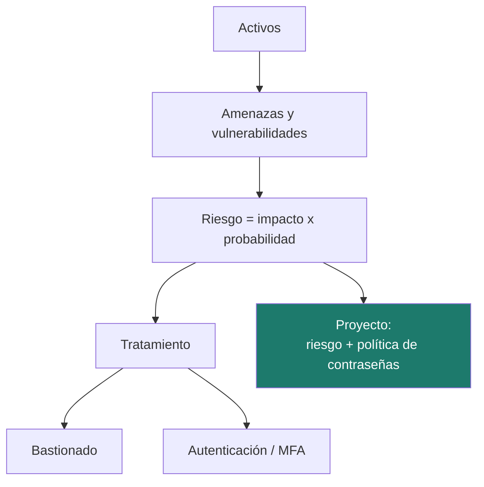

# Unidad 4 · Análisis de riesgos, bastionado y autenticación

> **Módulo:** CMO-314 · Ciberseguridad · **Resultado de aprendizaje:** RA4 · **Duración:** 12 h · **Peso:** 15 %
> **Herramienta principal:** Python 3 · **Nivel:** ciclo superior

Aquí pasas de reaccionar a **planificar**: identificar qué proteger, medir el **riesgo**, y aplicar **bastionado** y **autenticación multifactor (MFA)** para reducirlo. El proyecto reúne dos herramientas del analista: un **calculador de riesgo (ALE)** y un **verificador de políticas de contraseñas**.

---

!!! reto "El reto de la unidad"
    Pon **nota al riesgo** de una organización y obliga a usar contraseñas decentes. Los **ejercicios** y el **laboratorio** de más abajo son tu **entrenamiento**: cuando los domines, resuelve el reto (el proyecto) y demuéstralo en el examen.

## Mapa de la unidad



### Qué vas a saber hacer al terminar

- [ ] Inventariar y valorar **activos** en las dimensiones de seguridad.
- [ ] Calcular el **nivel de riesgo** y la **pérdida anual esperada (ALE)**.
- [ ] Elegir la **opción de tratamiento** adecuada (mitigar, transferir, evitar, aceptar).
- [ ] Aplicar principios de **bastionado** a sistemas.
- [ ] Distinguir los **factores de autenticación** y qué es MFA real.
- [ ] Evaluar la fortaleza de una **contraseña** contra una política, con Python.

---

## 1. Activos, amenazas, vulnerabilidades

- **Activo:** algo con valor (datos, servicios, equipos, personas).
- **Amenaza:** lo que puede dañarlo. **Vulnerabilidad:** la debilidad que lo permite.
- Cada activo se **valora** en C, I, D (y autenticidad, trazabilidad), normalmente de 0 a 10.

!!! analogia "Analogía"
    Antes de comprar alarmas, un buen dueño hace inventario de lo que tiene y de cuánto le dolería perderlo. Comprar sin ese inventario es gastar a ciegas.

!!! reto "Reto rápido 1"
    Para una tienda online, ¿qué activo valorarías más alto en disponibilidad: el logo o la pasarela de pago?

---

## 2. Medir el riesgo

### 2.1 Método cualitativo

Con escalas 1–5 en impacto y probabilidad, el riesgo se calcula como **Riesgo = Impacto × Probabilidad**, lo que da una **matriz de calor**. Umbrales típicos: BAJO ≤ 6, MEDIO 7–14, ALTO ≥ 15.

### 2.2 Método cuantitativo (ALE)

Cuando hay datos económicos:

- **SLE** (pérdida por incidente) = valor del activo × factor de exposición (0–1).
- **ARO** = número esperado de incidentes al año.
- **ALE** = SLE × ARO (pérdida anual esperada).

Una salvaguarda se justifica si **reduce el ALE más de lo que cuesta al año**.

!!! example "Ejemplo numérico"
    Servidor de 40 000 €, factor 0,6 → SLE = 24 000 €. Un incidente cada 4 años → ARO = 0,25. **ALE = 6 000 €/año**. Una copia inmutable que cuesta 1 400 €/año y baja el factor al 0,1 deja ALE ≈ 1 000 €. Ahorro neto: 6 000 − 1 000 − 1 400 = **3 600 €/año**. Se justifica.

!!! reto "Reto rápido 2"
    Calcula el ALE: activo 30 000 €, factor 0,4, un incidente cada 5 años.

### 2.3 Tratamiento del riesgo

| Opción | En qué consiste |
|---|---|
| **Mitigar** | Aplicar controles que bajan probabilidad o impacto |
| **Transferir** | Ciberseguro, cláusulas con el proveedor |
| **Evitar** | Eliminar la actividad que genera el riesgo |
| **Aceptar** | Asumirlo de forma consciente y documentada |

---

## 3. Bastionado (*hardening*)

Bastionar es dejar un sistema con **lo mínimo imprescindible**, bien configurado. Principios: mínimo privilegio, mínima superficie, defensa en profundidad, configuración segura por defecto, trazabilidad.

Se parte de una **línea base** (CCN-STIC, CIS Benchmarks) y se documenta cada desviación. Medidas típicas: actualizar, desactivar servicios que no se usan, cerrar puertos, política de contraseñas, cifrado de disco, registro de eventos.

!!! analogia "Analogía"
    Un sistema recién instalado es una casa con todas las ventanas abiertas "por comodidad". Bastionar es cerrar las que no usas y poner buenas cerraduras en las que sí.

!!! reto "Reto rápido 3"
    ¿Por qué deshabilitar un servicio que no se usa mejora la seguridad, aunque nadie lo esté atacando?

---

## 4. Autenticación y MFA

### 4.1 Los factores

| Factor | Base | Ejemplos |
|---|---|---|
| **Conocimiento** | Algo que sabes | Contraseña, PIN |
| **Posesión** | Algo que tienes | Token TOTP, llave FIDO2, tarjeta |
| **Inherencia** | Algo que eres | Huella, rostro |

**MFA** = dos o más factores **de categorías distintas**. Contraseña + PIN **no** es MFA (los dos son conocimiento).

### 4.2 Políticas de contraseñas modernas

Lo que hoy recomienda la evidencia (NIST SP 800-63B):

- Priorizar **longitud** (≥ 12; mejor frases de paso) sobre reglas rígidas.
- **No** forzar cambios periódicos sin indicio de compromiso.
- **Comprobar** contra listas de contraseñas filtradas.
- Usar **gestor de contraseñas** y MFA.

!!! warning "Atención"
    Los cambios forzados producen contraseñas predecibles (`Verano2026!` → `Otoño2026!`). Lo que protege es longitud, unicidad y MFA.

!!! reto "Reto rápido 4"
    ¿Cuál es más fuerte y más fácil de recordar: `P@ssw0rd!` o `caballo-grapa-batería-azul`? ¿Por qué?

---

## 5. Python: evaluar riesgo y contraseñas

```python title="De impacto y probabilidad a nivel de riesgo"
def nivel_riesgo(impacto: int, probabilidad: int) -> str:
    valor = impacto * probabilidad  # (1)!
    if valor >= 15:
        return "ALTO"   # (2)!
    if valor >= 7:
        return "MEDIO"
    return "BAJO"

def evaluar_contrasena(c: str) -> list[str]:
    problemas = []
    if len(c) < 12:
        problemas.append("muy corta")
    if not any(x.isdigit() for x in c):
        problemas.append("sin dígitos")
    return problemas
```

1.  El riesgo se estima como **impacto × probabilidad**: una matriz de calor en una línea.
2.  Umbrales claros convierten un número en una etiqueta accionable (ALTO/MEDIO/BAJO), que es lo que se lleva a un informe.

---

## 6. Errores frecuentes

| Error | Causa | Solución |
|---|---|---|
| Aceptar riesgo sin documentar | Confundir aceptar con ignorar | Escríbelo, con responsable y fecha |
| "MFA" con dos contraseñas | Mismo factor | Combina categorías distintas |
| Política que fuerza cambios | Práctica obsoleta | Longitud + comprobación de filtraciones |

---

## 7. Practica **con** solución a la vista

#### Actividad 1 — Nivel de riesgo
Escribe `nivel(impacto, prob)` según los umbrales.
<details class="sol"><summary>Solución</summary>

```python
def nivel(impacto: int, prob: int) -> str:
    v = impacto * prob
    return "ALTO" if v >= 15 else "MEDIO" if v >= 7 else "BAJO"
```
</details>

#### Actividad 2 — Calcular ALE
`ale(valor, factor, frecuencia)`.
<details class="sol"><summary>Solución</summary>

```python
def ale(valor: float, factor: float, frecuencia: float) -> float:
    return round(valor * factor * frecuencia, 2)
```
</details>

#### Actividad 3 — ¿Es MFA?
`es_mfa(factores: list[str]) -> bool` con categorías distintas.
<details class="sol"><summary>Solución</summary>

```python
def es_mfa(factores: list[str]) -> bool:
    cats = set(factores) & {"conocimiento", "posesion", "inherencia"}
    return len(cats) >= 2
```
</details>

#### Actividad 4 — Longitud mínima
`larga(c: str) -> bool` (≥ 12).
<details class="sol"><summary>Solución</summary>

```python
def larga(c: str) -> bool:
    return len(c) >= 12
```
</details>

---

## Proyecto de la unidad

Construyes el kit del analista: **nivel de riesgo**, **ALE**, decisión de **salvaguarda rentable**, **evaluación de contraseñas** contra política y lista de filtradas, y comprobación de **MFA**.

**[Proyecto Riesgo y contraseñas →](../proyectos/ud4/README.md)**

```bash
pip install -r requirements.txt
pytest
mypy src
```

---

## Retos de ampliación

- **R1.** Estima la **entropía** de una contraseña en bits.
- **R2.** Genera una **frase de paso** aleatoria a partir de una lista de palabras.
- **R3.** Construye la matriz de calor 5×5 y coloréala en texto.

---

## Más práctica

#### Actividad 5 — Entropía aproximada
Escribe `entropia(c: str) -> float`: bits ≈ longitud × log2(tamaño del alfabeto usado: 26/26/10/32 según haya minúscula, mayúscula, dígito, símbolo).
<details class="sol"><summary>Solución</summary>

```python
import math
def entropia(c: str) -> float:
    alf = 0
    if any(x.islower() for x in c): alf += 26
    if any(x.isupper() for x in c): alf += 26
    if any(x.isdigit() for x in c): alf += 10
    if any(not x.isalnum() for x in c): alf += 32
    return round(len(c) * math.log2(alf), 1) if alf else 0.0
```
</details>

#### Actividad 6 — Matriz de calor
Escribe `celda(impacto, prob)` que devuelva `"<span class="tg tg-a">aula</span>"`, `"🟡"` o `"🔴"` según el nivel de riesgo.
<details class="sol"><summary>Solución</summary>

```python
def celda(impacto: int, prob: int) -> str:
    v = impacto * prob
    return "🔴" if v >= 15 else "🟡" if v >= 7 else "🟢"
```
</details>

---

## Laboratorio

> Auditamos un despliegue real en **Docker** y puntuamos su riesgo con Python.

### Laboratorio guiado (resuelto) — Auditar contraseñas de un contenedor

Un contenedor trae un fichero de usuarios con contraseñas de ejemplo; evaluamos cuáles cumplen la política.

**`docker-compose.yml`**

```yaml
services:
  seed:
    image: python:3.12-alpine
    volumes: ["./datos:/datos"]
    command: >
      sh -c "printf 'ana:Caballo-Verde7!\nluis:1234\nsara:verano\n' > /datos/users.txt;
             echo creado"
```

```bash
mkdir -p datos && docker compose run --rm seed
python3 - << 'PY'
def problemas(c):
    p = []
    if len(c) < 12: p.append("corta")
    if not any(x.isupper() for x in c): p.append("sin mayúscula")
    if not any(x.isdigit() for x in c): p.append("sin dígito")
    if all(x.isalnum() for x in c): p.append("sin símbolo")
    return p
for ln in open("datos/users.txt"):
    u, c = ln.strip().split(":", 1)
    pr = problemas(c)
    print(f"{u}: {'OK' if not pr else ', '.join(pr)}")
PY
```

<details class="sol"><summary>Qué debe salir</summary>

```
ana: OK
luis: corta, sin mayúscula, sin símbolo
sara: corta, sin mayúscula, sin dígito, sin símbolo
```
Solo `ana` cumple. Es el tipo de auditoría que hace un administrador antes de forzar el cambio de las débiles (y activar MFA).
</details>

### Laboratorio propuesto (entregable) — Semáforo de riesgo de un `docker-compose`

Te damos un `docker-compose.yml` con varios servicios (puertos expuestos, contraseñas por defecto, imágenes `:latest`). Escribe un script Python que lea el YAML y **puntúe el riesgo** de cada servicio (impacto × probabilidad) según reglas simples (puerto sensible expuesto, contraseña débil, imagen sin fijar versión) y saque un informe con <span class="tg tg-a">aula</span>🟡🔴 y el ALE estimado del conjunto.

**Criterios de aceptación**
- Valida entradas y usa excepciones donde proceda. Tipado y `mypy` limpio.
- Informe ordenado de más a menos riesgo, con una recomendación por servicio.

---

## Autoevaluación rápida

<details><summary>1. ¿Qué es el ALE?</summary>La pérdida anual esperada: SLE × ARO.</details>
<details><summary>2. Contraseña + PIN, ¿es MFA?</summary>No: ambos son factor de conocimiento.</details>
<details><summary>3. ¿Cuándo se justifica una salvaguarda?</summary>Cuando reduce el ALE más de lo que cuesta al año.</details>
<details><summary>4. ¿Qué prioriza hoy una buena política de contraseñas?</summary>La longitud y la comprobación contra filtraciones.</details>
<details><summary>5. ¿Qué es bastionar?</summary>Dejar el sistema con lo mínimo imprescindible, bien configurado.</details>
<details><summary>6. ¿Aceptar un riesgo es lo mismo que ignorarlo?</summary>No: aceptar exige documentarlo con responsable y fecha.</details>

---

## Glosario

| Término | Definición |
|---|---|
| **Activo** | Elemento con valor para la organización. |
| **Riesgo** | Impacto × probabilidad. |
| **ALE / SLE / ARO** | Pérdida anual / por incidente / frecuencia anual. |
| **Bastionado** | Reducir la superficie de ataque y configurar de forma segura. |
| **MFA** | Dos o más factores de categorías distintas. |
| **Frase de paso** | Contraseña larga formada por varias palabras. |

---

## Cómo se evalúa esta unidad (RA4)


Se evalúa con un **examen por retos 100 % práctico**: resuelves en Python un reto parecido al de clase y se corrige **solo con su batería de tests**.

!!! reto "La nota, sin sorpresas"
    **Nota = (tests superados ÷ total) × 10.** Se aprueba con 5. Es la misma mecánica del reto de esta unidad, así que llegas entrenado.

El informe además te marca, **sin puntuar**, tres buenas prácticas que conviene cuidar: usar la técnica del RA (aquí, validación con `try`/`raise`), pasar `mypy` y documentar el código.