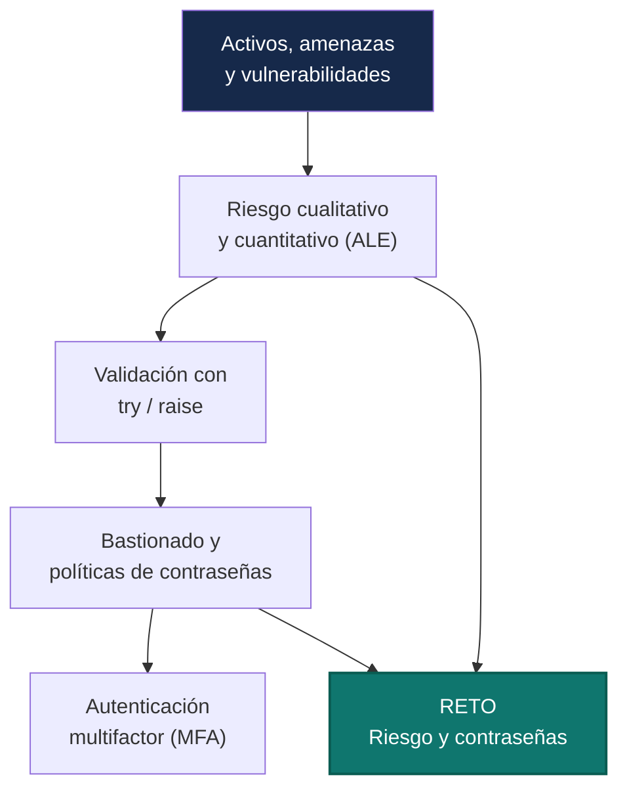
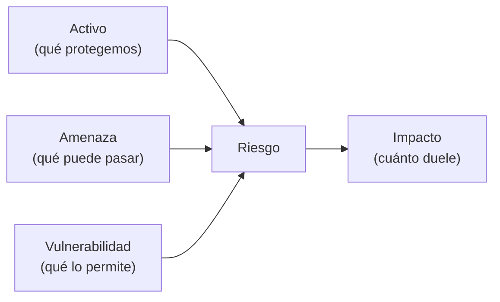
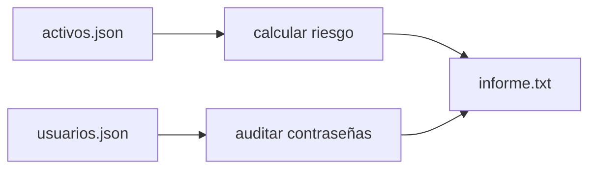
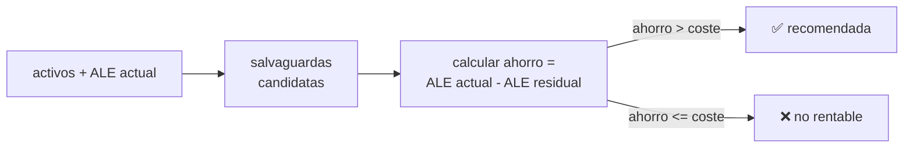

# Unidad 4 · Riesgos, bastionado y autenticación

> **Módulo:** CMO-314 · Ciberseguridad · **RA4** · **Duración:** 12 h · **Peso:** 15 % · **Herramienta:** Python 3 (tipado) + validación/excepciones

Después de proteger datos, detectar ataques y filtrar tráfico, toca dar un paso atrás: **¿cuánto riesgo corre realmente la organización, y dónde conviene invertir?** Esta unidad va de medir el riesgo con números, y de la primera línea de defensa contra el acceso indebido: contraseñas fuertes y autenticación multifactor. La técnica de Python que vas a dominar es **validar entradas con excepciones** — rechazar con criterio los datos que no tienen sentido, en vez de dejar que el programa falle de formas imprevisibles.

!!! reto "El reto de la unidad"
    **Pon nota al riesgo y exige contraseñas decentes.** Vas a construir una herramienta que calcula el riesgo de un activo y valida contraseñas contra una política real.



**Qué sabrás hacer al terminar:** distinguir activo, amenaza, vulnerabilidad e impacto · calcular riesgo cualitativo y cuantitativo (ALE) · **validar entradas** con `raise`/`try`/`except`, incluidas excepciones propias · diseñar una política de contraseñas y medir su fuerza · explicar los tres factores de autenticación y por qué el MFA los combina · construir una herramienta de auditoría de riesgo y contraseñas, tipada y probada.

**Cómo se trabaja (aula invertida):** lees la sección y ejecutas los ejemplos antes de clase → en clase resuelves las actividades y avanzas el reto en parejas.

---

## 1. Activos, amenazas, vulnerabilidades e impacto

Ya viste amenaza/vulnerabilidad/riesgo en la UT1 (§1.2). Aquí lo llevamos a números:

| Concepto | Pregunta que responde | Ejemplo |
|---|---|---|
| **Activo** | ¿Qué protegemos? | Base de datos de clientes |
| **Amenaza** | ¿Qué puede pasarle? | Robo, ransomware, fallo eléctrico |
| **Vulnerabilidad** | ¿Qué lo hace posible? | Servidor sin parchear |
| **Impacto** | ¿Cuánto duele si pasa? | Coste económico, legal, reputacional |



### 1.1 Riesgo cualitativo: una matriz simple

```python title="matriz_riesgo.py"
def nivel_riesgo(impacto: int, probabilidad: int) -> str:
    """impacto y probabilidad en escala 1-5. Devuelve BAJO, MEDIO o ALTO."""
    valor = impacto * probabilidad
    if valor >= 15:
        return "ALTO"
    if valor >= 7:
        return "MEDIO"
    return "BAJO"

print(nivel_riesgo(impacto=5, probabilidad=4))   # servidor crítico, exploit conocido
print(nivel_riesgo(impacto=3, probabilidad=3))   # riesgo moderado
print(nivel_riesgo(impacto=2, probabilidad=2))   # riesgo menor
```

```text title="Salida"
ALTO
MEDIO
BAJO
```

!!! reto "Reto rápido 1"
    Un activo con impacto 5 (crítico) pero probabilidad 1 (rarísimo que pase) da `5×1=5` → `BAJO`. ¿Te parece razonable tratarlo igual que un riesgo bajo de verdad? ¿Qué matiz se pierde al reducirlo a un solo número?

---

## 2. Riesgo cuantitativo: la pérdida anual esperada (ALE)

El riesgo cualitativo (ALTO/MEDIO/BAJO) es rápido pero subjetivo. El cuantitativo lo pone en **euros**:

| Sigla | Significado | Fórmula |
|---|---|---|
| **SLE** | Single Loss Expectancy — pérdida por un solo incidente | `valor_activo × factor_exposición` |
| **ARO** | Annualized Rate of Occurrence — veces al año que se espera que pase | (una estimación, p. ej. `0.5` = una vez cada 2 años) |
| **ALE** | Annualized Loss Expectancy — pérdida anual esperada | `SLE × ARO` |

```python title="ale.py"
def calcular_ale(valor_activo: float, factor_exposicion: float, aro: float) -> float:
    """factor_exposicion en [0,1]: qué % del valor se pierde si el riesgo se materializa."""
    sle = valor_activo * factor_exposicion
    return round(sle * aro, 2)

# Servidor de 100.000€, un incidente destruiría el 30% de su valor,
# y se espera que pase una vez cada 2 años (ARO = 0.5)
print(calcular_ale(valor_activo=100_000, factor_exposicion=0.3, aro=0.5))
```

```text title="Salida"
15000.0
```

> Con el ALE puedes comparar: si una salvaguarda cuesta 3.000 €/año y reduce el ALE de 15.000 € a 4.000 €, **ahorra** 8.000 €/año. Es matemática de decisión, no intuición.

!!! analogia "Analogía"
    El ALE es como calcular cuánto te compensa un seguro: si pagar la póliza te cuesta menos que la pérdida esperada, tiene sentido pagarla.

---

## 3. Validar entradas: `raise`, `try`/`except` y excepciones propias

Hasta ahora tus funciones asumían que los datos venían bien. En seguridad, **nunca** puedes asumir eso: un dato mal formado, negativo o fuera de rango debe **rechazarse explícitamente**, no colarse silenciosamente.

```python title="validar_basico.py"
def calcular_ale(valor_activo: float, factor_exposicion: float, aro: float) -> float:
    if valor_activo < 0:
        raise ValueError(f"el valor del activo no puede ser negativo: {valor_activo}")
    if not 0 <= factor_exposicion <= 1:
        raise ValueError(f"el factor de exposición debe estar en [0,1]: {factor_exposicion}")
    if aro < 0:
        raise ValueError(f"el ARO no puede ser negativo: {aro}")
    return round(valor_activo * factor_exposicion * aro, 2)

print(calcular_ale(100_000, 0.3, 0.5))   # válido

try:
    calcular_ale(100_000, 1.5, 0.5)       # factor_exposicion fuera de rango
except ValueError as e:
    print("Rechazado:", e)
```

```text title="Salida"
15000.0
Rechazado: el factor de exposición debe estar en [0,1]: 1.5
```

### 3.1 Excepciones propias: cuando `ValueError` se queda corto

Puedes crear **tu propio tipo de excepción**, heredando de una ya existente, para que quien use tu código pueda capturar justo *ese* error:

```python title="excepcion_propia.py"
class RiesgoInvalidoError(ValueError):
    """Se lanza cuando un parámetro de riesgo no tiene sentido."""
    pass

def valida_probabilidad(p: float) -> float:
    if not 0 <= p <= 1:
        raise RiesgoInvalidoError(f"probabilidad fuera de [0,1]: {p}")
    return p

try:
    valida_probabilidad(1.5)
except RiesgoInvalidoError as e:
    print("Riesgo mal formado:", e)
except ValueError:
    print("Esto no se ejecuta: RiesgoInvalidoError ya lo capturó antes")
```

```text title="Salida"
Riesgo mal formado: probabilidad fuera de [0,1]: 1.5
```

> `RiesgoInvalidoError` **es** un `ValueError` (herencia, como en la UT3), así que quien no quiera ser tan específico puede seguir capturando `ValueError` a secas. Y quien quiera distinguir tus errores de riesgo de cualquier otro `ValueError`, ya puede.

| Patrón | Cuándo usarlo |
|---|---|
| `raise ValueError(...)` | Un valor no tiene sentido (fuera de rango, formato incorrecto) |
| `raise TypeError(...)` | El tipo de dato no es el esperado |
| Excepción propia (`class MiError(ValueError)`) | Quieres que quien llame pueda distinguir **tu** error de otros |
| `try` / `except` | Vas a intentar algo que **puede** fallar, y sabes cómo reaccionar |

!!! warning "Atención"
    No captures `except Exception:` a secas "por si acaso": eso oculta errores de programación reales (una variable mal escrita, por ejemplo) junto con los que sí esperabas. Captura el tipo **concreto** de error.

!!! reto "Reto rápido 2"
    Escribe `valida_impacto(i: int) -> int` que lance `RiesgoInvalidoError` si `i` no está entre 1 y 5. Pruébala con `i=10`.

---

## 4. Bastionado y política de contraseñas

**Bastionar** un sistema es reducir su superficie de ataque: cerrar puertos que no se usan, desactivar servicios innecesarios, aplicar el principio de mínimo privilegio. La contraseña sigue siendo el primer muro.

```python title="politica_contrasenas.py"
def cumple_politica(contrasena: str) -> tuple[bool, list[str]]:
    """Política mínima: 12+ caracteres, mayúscula, dígito, símbolo."""
    fallos = []
    if len(contrasena) < 12:
        fallos.append("menos de 12 caracteres")
    if not any(c.isupper() for c in contrasena):
        fallos.append("sin mayúscula")
    if not any(c.isdigit() for c in contrasena):
        fallos.append("sin dígito")
    if all(c.isalnum() for c in contrasena):
        fallos.append("sin símbolo")
    return (not fallos, fallos)

print(cumple_politica("Caballo-Verde7x"))
print(cumple_politica("1234"))
```

```text title="Salida"
(True, [])
(False, ['menos de 12 caracteres', 'sin mayúscula', 'sin símbolo'])
```

### 4.1 Generar contraseñas fuertes: `secrets`, no `random`

```python title="generar_contrasena.py"
import secrets, string

def genera(n: int = 16) -> str:
    alfabeto = string.ascii_letters + string.digits + "!@#$%*-_"
    return "".join(secrets.choice(alfabeto) for _ in range(n))

print(len(genera()))
print(genera())
```

```text title="Salida"
16
xQ4!mZ9-vB2@pL6#   (varía cada vez que lo ejecutas)
```

!!! warning "`random` no es seguro para contraseñas"
    `random` está diseñado para simulaciones y juegos, **no** para criptografía: es predecible si alguien conoce el estado interno. `secrets` usa el generador aleatorio del sistema operativo, pensado justo para esto. La UT1 ya te lo enseñó para sales de hash — misma razón.

### 4.2 Medir la fuerza: entropía aproximada

```python title="entropia.py"
import math

def entropia(pwd: str) -> float:
    """Bits de entropía aproximados, según el alfabeto usado."""
    alfabeto = 0
    if any(c.islower() for c in pwd): alfabeto += 26
    if any(c.isupper() for c in pwd): alfabeto += 26
    if any(c.isdigit() for c in pwd): alfabeto += 10
    if any(not c.isalnum() for c in pwd): alfabeto += 32
    return round(len(pwd) * math.log2(alfabeto), 1) if alfabeto else 0.0

print(entropia("Abcdef1!"))     # 8 caracteres, alfabeto amplio
print(entropia("abcdefgh"))     # 8 caracteres, solo minúsculas
```

```text title="Salida"
52.4
37.6
```

> Más longitud y más variedad de caracteres = más bits de entropía = más intentos necesarios para adivinarla por fuerza bruta. 80 bits o más se considera robusto hoy.

---

## 5. Autenticación multifactor (MFA)

Hay tres **factores** de autenticación, y cada uno responde a una pregunta distinta:

| Factor | Pregunta | Ejemplo |
|---|---|---|
| **Algo que sabes** | ¿Qué conoces? | Contraseña, PIN |
| **Algo que tienes** | ¿Qué posees? | Móvil, token físico, tarjeta |
| **Algo que eres** | ¿Qué eres? | Huella, cara, iris |

**MFA** exige **al menos dos categorías distintas** — no dos contraseñas, que siguen siendo "algo que sabes".

```python title="es_mfa.py"
def es_mfa(factores: list[str]) -> bool:
    categorias: set[str] = set()
    for f in factores:
        if f in ("contrasena", "pin"):
            categorias.add("saber")
        elif f in ("movil", "token", "tarjeta"):
            categorias.add("tener")
        elif f in ("huella", "cara"):
            categorias.add("ser")
    return len(categorias) >= 2

print(es_mfa(["contrasena", "movil"]))   # saber + tener -> MFA de verdad
print(es_mfa(["contrasena", "pin"]))     # saber + saber -> NO es MFA
```

```text title="Salida"
True
False
```

!!! reto "Reto rápido 3"
    Un sistema pide contraseña **y** pregunta de seguridad ("¿nombre de tu mascota?"). ¿Es MFA de verdad? ¿Por qué las preguntas de seguridad se consideran una mala práctica hoy?

---

## 6. Errores frecuentes (ten esto a mano)

| Error | Causa | Solución |
|---|---|---|
| El programa acepta un riesgo con probabilidad `1.5` | Falta validar el rango | `raise ValueError` si está fuera de `[0,1]` |
| `except Exception:` que oculta bugs | Capturar "todo por si acaso" | Captura el tipo concreto de error |
| Contraseñas generadas con `random` | No es criptográficamente seguro | Usa `secrets.choice` |
| ALE negativo o absurdo | No se validaron los parámetros de entrada | Valida **antes** de calcular, no después |
| "2FA" que en realidad no lo es | Dos factores de la misma categoría (dos contraseñas) | Comprueba que son **categorías** distintas |

---

## 7. Actividades: de lo más sencillo a preguntas tipo examen

**1 · 🟢 Nivel de riesgo** — `nivel(impacto: int, prob: int) -> str`.
<details class="sol"><summary>Solución</summary>

```python
def nivel(impacto: int, prob: int) -> str:
    v = impacto * prob
    return "ALTO" if v >= 15 else "MEDIO" if v >= 7 else "BAJO"
```
</details>

**2 · 🟢 ALE simple** — `ale(sle: float, aro: float) -> float`.
<details class="sol"><summary>Solución</summary>

```python
def ale(sle: float, aro: float) -> float:
    return round(sle * aro, 2)
```
</details>

**3 · 🟢 ¿Cumple longitud mínima?** — `longitud_ok(pwd: str, minimo: int = 12) -> bool`.
<details class="sol"><summary>Solución</summary>

```python
def longitud_ok(pwd: str, minimo: int = 12) -> bool:
    return len(pwd) >= minimo
```
</details>

**4 · 🟢 ¿Tiene símbolo?** — `tiene_simbolo(pwd: str) -> bool`.
<details class="sol"><summary>Solución</summary>

```python
def tiene_simbolo(pwd: str) -> bool:
    return any(not c.isalnum() for c in pwd)
```
</details>

**5 · 🟡 Validar con excepción** — `ale_validado(sle, aro) -> float`, lanza `ValueError` si alguno es negativo.
<details class="sol"><summary>Solución</summary>

```python
def ale_validado(sle: float, aro: float) -> float:
    if sle < 0 or aro < 0:
        raise ValueError("sle y aro no pueden ser negativos")
    return round(sle * aro, 2)
```
</details>

**6 · 🟡 Excepción propia** — `class PoliticaError(ValueError)` y `valida_longitud(pwd, minimo=12)` que la lanza si es corta.
<details class="sol"><summary>Solución</summary>

```python
class PoliticaError(ValueError):
    pass

def valida_longitud(pwd: str, minimo: int = 12) -> None:
    if len(pwd) < minimo:
        raise PoliticaError(f"contraseña de {len(pwd)} caracteres, mínimo {minimo}")
```
</details>

**7 · 🟡 Contraseña segura** — `genera(n=16) -> str` con `secrets`.
<details class="sol"><summary>Solución</summary>

```python
import secrets, string
def genera(n: int = 16) -> str:
    alfabeto = string.ascii_letters + string.digits + "!@#$%*-_"
    return "".join(secrets.choice(alfabeto) for _ in range(n))
```
</details>

**8 · 🟡 Política completa** — `cumple_politica(pwd) -> tuple[bool, list[str]]`.
<details class="sol"><summary>Solución</summary>

```python
def cumple_politica(pwd: str) -> tuple[bool, list[str]]:
    fallos = []
    if len(pwd) < 12: fallos.append("corta")
    if not any(c.isupper() for c in pwd): fallos.append("sin mayúscula")
    if not any(c.isdigit() for c in pwd): fallos.append("sin dígito")
    if all(c.isalnum() for c in pwd): fallos.append("sin símbolo")
    return (not fallos, fallos)
```
</details>

**9 · 🟠 Entropía** — `entropia(pwd: str) -> float` (bits, según alfabeto usado).
<details class="sol"><summary>Solución</summary>

```python
import math
def entropia(pwd: str) -> float:
    alf = 0
    if any(c.islower() for c in pwd): alf += 26
    if any(c.isupper() for c in pwd): alf += 26
    if any(c.isdigit() for c in pwd): alf += 10
    if any(not c.isalnum() for c in pwd): alf += 32
    return round(len(pwd) * math.log2(alf), 1) if alf else 0.0
```
</details>

**10 · 🟠 ¿Es MFA de verdad?** — `es_mfa(factores: list[str]) -> bool` (al menos dos categorías distintas).
<details class="sol"><summary>Solución</summary>

```python
def es_mfa(factores: list[str]) -> bool:
    cat: set[str] = set()
    for f in factores:
        if f in ("contrasena", "pin"): cat.add("saber")
        elif f in ("movil", "token", "tarjeta"): cat.add("tener")
        elif f in ("huella", "cara"): cat.add("ser")
    return len(cat) >= 2
```
</details>

**11 · 🟠 Riesgo medio de un inventario** — `riesgo_medio(valores: list[float]) -> float`, lanza `ValueError` si la lista está vacía.
<details class="sol"><summary>Solución</summary>

```python
def riesgo_medio(valores: list[float]) -> float:
    if not valores:
        raise ValueError("lista de riesgos vacía")
    return round(sum(valores) / len(valores), 2)
```
</details>

**12 · 🟠 Priorizar activos** — `prioriza(activos: list[dict]) -> list[dict]` ordenados por `impacto*probabilidad` descendente.
<details class="sol"><summary>Solución</summary>

```python
def prioriza(activos: list[dict]) -> list[dict]:
    return sorted(activos, key=lambda a: a["impacto"] * a["probabilidad"], reverse=True)
```
</details>

**13 · 🔴 Salvaguarda rentable** — `merece_la_pena(ale_actual, ale_residual, coste_anual) -> bool`: ¿el ahorro supera el coste?
<details class="sol"><summary>Solución</summary>

```python
def merece_la_pena(ale_actual: float, ale_residual: float, coste_anual: float) -> bool:
    ahorro = ale_actual - ale_residual
    return ahorro > coste_anual
```
</details>

**14 · 🔴 Auditoría de un lote de contraseñas** — `audita(usuarios: dict[str,str]) -> dict[str, list[str]]`: usuario → lista de fallos (vacía si cumple).
<details class="sol"><summary>Solución</summary>

```python
def audita(usuarios: dict[str, str]) -> dict[str, list[str]]:
    resultado = {}
    for u, pwd in usuarios.items():
        _, fallos = cumple_politica(pwd)
        resultado[u] = fallos
    return resultado
```
</details>

**15 · 🔴 Cadena de validaciones** — `valida_activo(nombre, valor, prob) -> None`: valida los tres campos y, si todo es correcto, no devuelve nada; si algo falla, lanza la excepción con **el primer** problema encontrado.
<details class="sol"><summary>Solución</summary>

```python
class ActivoInvalidoError(ValueError):
    pass

def valida_activo(nombre: str, valor: float, prob: float) -> None:
    if not nombre.strip():
        raise ActivoInvalidoError("el activo necesita un nombre")
    if valor < 0:
        raise ActivoInvalidoError(f"valor negativo: {valor}")
    if not 0 <= prob <= 1:
        raise ActivoInvalidoError(f"probabilidad fuera de [0,1]: {prob}")
```
</details>

### Preguntas tipo test práctico

**P1.** ¿Qué diferencia hay entre `raise ValueError(...)` y `raise TypeError(...)`?
<details class="sol"><summary>Respuesta</summary><code>ValueError</code> es para un valor que no tiene sentido (fuera de rango, formato incorrecto); <code>TypeError</code> es para cuando el <b>tipo</b> de dato no es el esperado.</details>

**P2.** ¿Por qué `class PoliticaError(ValueError)` sigue siendo capturable con `except ValueError:`?
<details class="sol"><summary>Respuesta</summary>Porque hereda de <code>ValueError</code> (como <code>ReglaHoraria</code> heredaba de <code>Regla</code> en la UT3): un <code>PoliticaError</code> <b>es</b> un <code>ValueError</code>.</details>

**P3.** ¿Qué imprime esto?
```python
try:
    if 1.5 > 1:
        raise ValueError("fuera de rango")
except ValueError as e:
    print("capturado:", e)
print("sigue")
```
<details class="sol"><summary>Respuesta</summary><code>capturado: fuera de rango</code> y luego <code>sigue</code> — el <code>except</code> maneja el error y el programa continúa con normalidad después del bloque.</details>

**P4.** ¿Por qué `secrets.choice` y no `random.choice` para generar contraseñas?
<details class="sol"><summary>Respuesta</summary><code>random</code> es predecible si se conoce su estado interno (no es criptográficamente seguro); <code>secrets</code> usa el generador aleatorio del sistema operativo, pensado para uso criptográfico.</details>

**P5.** Dos factores: "contraseña" y "PIN". ¿Es MFA?
<details class="sol"><summary>Respuesta</summary>No: ambos son "algo que sabes" — la misma categoría. MFA exige categorías <b>distintas</b>.</details>

**P6.** En el ejercicio 15, si `nombre` está vacío **y** `valor` es negativo, ¿qué excepción se lanza?
<details class="sol"><summary>Respuesta</summary>Solo la del nombre vacío: la función comprueba en orden y <code>raise</code> detiene la ejecución en el primer fallo, sin llegar a comprobar <code>valor</code>.</details>

**P7.** ¿Por qué `merece_la_pena` compara `ahorro > coste_anual` y no `ale_actual > coste_anual`?
<details class="sol"><summary>Respuesta</summary>Porque lo relevante es cuánto <b>reduce</b> la salvaguarda el riesgo (la diferencia entre el ALE actual y el residual), no el ALE total: una salvaguarda puede ser cara pero seguir mereciendo la pena si reduce mucho el riesgo.</details>

---

## 8. Reto resuelto, paso a paso — Auditor de riesgo y contraseñas

El cliente de la consultora te pasa una lista de activos y una lista de usuarios con sus contraseñas. Te piden un informe: qué activos son de riesgo alto, y qué contraseñas incumplen la política.



**Paso 1 — Riesgo por activo, validado.**

```python title="auditor.py"
class RiesgoInvalidoError(ValueError):
    pass

def nivel_riesgo(impacto: int, probabilidad: int) -> str:
    if not 1 <= impacto <= 5:
        raise RiesgoInvalidoError(f"impacto fuera de [1,5]: {impacto}")
    if not 1 <= probabilidad <= 5:
        raise RiesgoInvalidoError(f"probabilidad fuera de [1,5]: {probabilidad}")
    v = impacto * probabilidad
    return "ALTO" if v >= 15 else "MEDIO" if v >= 7 else "BAJO"
```

**Paso 2 — Cargar activos desde JSON y priorizarlos.**

```python title="auditor.py (continúa)"
import json
from pathlib import Path

def cargar_activos(ruta: Path) -> list[dict]:
    return json.loads(ruta.read_text(encoding="utf-8"))

def priorizar(activos: list[dict]) -> list[dict]:
    return sorted(activos, key=lambda a: a["impacto"] * a["probabilidad"], reverse=True)
```

**Paso 3 — Política de contraseñas y auditoría del lote.**

```python title="auditor.py (continúa)"
def cumple_politica(pwd: str) -> tuple[bool, list[str]]:
    fallos = []
    if len(pwd) < 12: fallos.append("menos de 12 caracteres")
    if not any(c.isupper() for c in pwd): fallos.append("sin mayúscula")
    if not any(c.isdigit() for c in pwd): fallos.append("sin dígito")
    if all(c.isalnum() for c in pwd): fallos.append("sin símbolo")
    return (not fallos, fallos)

def auditar_usuarios(usuarios: dict[str, str]) -> dict[str, list[str]]:
    return {u: cumple_politica(pwd)[1] for u, pwd in usuarios.items()}
```

**Paso 4 — Generar el informe.**

```python title="auditor.py (continúa)"
def generar_informe(activos: list[dict], usuarios: dict[str, str]) -> list[str]:
    lineas = ["=== RIESGO DE ACTIVOS ==="]
    for a in priorizar(activos):
        nivel = nivel_riesgo(a["impacto"], a["probabilidad"])
        lineas.append(f"[{nivel:6}] {a['nombre']}")
    lineas.append("")
    lineas.append("=== CONTRASEÑAS ===")
    for usuario, fallos in auditar_usuarios(usuarios).items():
        estado = "OK" if not fallos else ", ".join(fallos)
        lineas.append(f"{usuario:12} {estado}")
    return lineas
```

**Paso 5 — CLI con `argparse`.**

```python title="auditor.py (continúa)"
import argparse

def main() -> None:
    ap = argparse.ArgumentParser(prog="auditor", description="Auditoría de riesgo y contraseñas")
    ap.add_argument("activos", type=Path)
    ap.add_argument("usuarios", type=Path)
    args = ap.parse_args()
    activos = cargar_activos(args.activos)
    usuarios = json.loads(args.usuarios.read_text(encoding="utf-8"))
    for linea in generar_informe(activos, usuarios):
        print(linea)

if __name__ == "__main__":
    main()
```

**Paso 6 — Pruébalo con Docker, sin `sudo`.**

```yaml title="docker-compose.yml"
services:
  demo:
    image: python:3.12-alpine
    volumes: ["./auditor.py:/auditor.py"]
    working_dir: /app
    command: >
      sh -c "mkdir -p /app; cd /app;
      echo '[{\"nombre\":\"Servidor BD\",\"impacto\":5,\"probabilidad\":4},{\"nombre\":\"Web pública\",\"impacto\":2,\"probabilidad\":2}]' > activos.json;
      echo '{\"ana\":\"Caballo-Verde7!\",\"luis\":\"1234\"}' > usuarios.json;
      python /auditor.py activos.json usuarios.json"
```

```bash title="Ejecutar"
docker compose run --rm demo
```

```text title="Salida esperada"
=== RIESGO DE ACTIVOS ===
[ALTO  ] Servidor BD
[BAJO  ] Web pública

=== CONTRASEÑAS ===
ana          OK
luis         menos de 12 caracteres, sin mayúscula, sin símbolo
```

<details class="sol"><summary>📄 auditor.py completo</summary>

```python
import argparse, json
from pathlib import Path

class RiesgoInvalidoError(ValueError):
    pass

def nivel_riesgo(impacto: int, probabilidad: int) -> str:
    if not 1 <= impacto <= 5:
        raise RiesgoInvalidoError(f"impacto fuera de [1,5]: {impacto}")
    if not 1 <= probabilidad <= 5:
        raise RiesgoInvalidoError(f"probabilidad fuera de [1,5]: {probabilidad}")
    v = impacto * probabilidad
    return "ALTO" if v >= 15 else "MEDIO" if v >= 7 else "BAJO"

def cargar_activos(ruta: Path) -> list[dict]:
    return json.loads(ruta.read_text(encoding="utf-8"))

def priorizar(activos: list[dict]) -> list[dict]:
    return sorted(activos, key=lambda a: a["impacto"] * a["probabilidad"], reverse=True)

def cumple_politica(pwd: str) -> tuple[bool, list[str]]:
    fallos = []
    if len(pwd) < 12: fallos.append("menos de 12 caracteres")
    if not any(c.isupper() for c in pwd): fallos.append("sin mayúscula")
    if not any(c.isdigit() for c in pwd): fallos.append("sin dígito")
    if all(c.isalnum() for c in pwd): fallos.append("sin símbolo")
    return (not fallos, fallos)

def auditar_usuarios(usuarios: dict[str, str]) -> dict[str, list[str]]:
    return {u: cumple_politica(pwd)[1] for u, pwd in usuarios.items()}

def generar_informe(activos: list[dict], usuarios: dict[str, str]) -> list[str]:
    lineas = ["=== RIESGO DE ACTIVOS ==="]
    for a in priorizar(activos):
        lineas.append(f"[{nivel_riesgo(a['impacto'], a['probabilidad']):6}] {a['nombre']}")
    lineas += ["", "=== CONTRASEÑAS ==="]
    for usuario, fallos in auditar_usuarios(usuarios).items():
        estado = "OK" if not fallos else ", ".join(fallos)
        lineas.append(f"{usuario:12} {estado}")
    return lineas

def main() -> None:
    ap = argparse.ArgumentParser(prog="auditor", description="Auditoría de riesgo y contraseñas")
    ap.add_argument("activos", type=Path)
    ap.add_argument("usuarios", type=Path)
    args = ap.parse_args()
    activos = cargar_activos(args.activos)
    usuarios = json.loads(args.usuarios.read_text(encoding="utf-8"))
    for linea in generar_informe(activos, usuarios):
        print(linea)

if __name__ == "__main__":
    main()
```
</details>

---

## 9. Reto para ti (propuesto, sin solución)

### 💰 Calculadora de ALE y salvaguardas rentables

Amplía tu auditor con la parte **cuantitativa**: dado un conjunto de activos con su ALE actual, y una lista de salvaguardas posibles (con su coste anual y el ALE residual que dejarían), decide **cuáles merece la pena implantar**.



**Objetivo.** CLI `python salvaguardas.py activos.json salvaguardas.json` que, para cada salvaguarda, calcule si **ahorro > coste_anual** y saque un informe ordenado por ahorro neto (`ahorro - coste`) de mayor a menor.

**Requisitos**

- Reutiliza `RiesgoInvalidoError` y el patrón de validación del reto resuelto.
- Cada salvaguarda del JSON tiene: `nombre`, `activo` (a qué activo protege), `coste_anual`, `ale_residual`.
- Valida que `ale_residual >= 0` y `coste_anual >= 0`; lanza tu excepción si no.
- Código tipado, `mypy` limpio.
- Demuéstralo con Docker.

**Criterios de aceptación**

1. Una salvaguarda con `ahorro <= coste` aparece marcada como no rentable, no se omite del informe.
2. El informe está ordenado por ahorro neto descendente.
3. Si el `activo` de una salvaguarda no existe en la lista de activos, se informa el error sin tumbar el programa entero.

**Pistas** (no solución): reutiliza `merece_la_pena` (ejercicio 13) como base · para "no tumbar el programa entero" ante un activo inexistente, captura la excepción **por salvaguarda** dentro del bucle, no alrededor de todo el programa.

**Si te sobra tiempo:** añade una opción `--top N` que solo muestre las N salvaguardas más rentables · exporta el informe a CSV con el módulo `csv`.

> Esto es justo el tipo de reto que resolverás en el **test práctico**.

---

## Autoevaluación rápida (conceptos)

<details><summary>1. ¿Qué es el ALE?</summary>La pérdida anual esperada: SLE × ARO.</details>
<details><summary>2. ¿Cuándo conviene lanzar una excepción propia en vez de <code>ValueError</code>?</summary>Cuando quieres que quien use tu código pueda distinguir tu tipo de error de otros <code>ValueError</code> genéricos.</details>
<details><summary>3. ¿Por qué <code>secrets</code> y no <code>random</code> para contraseñas?</summary><code>random</code> es predecible; <code>secrets</code> es criptográficamente seguro.</details>
<details><summary>4. ¿Qué hace falta para que algo sea MFA de verdad?</summary>Al menos dos factores de <b>categorías distintas</b> (saber, tener, ser).</details>
<details><summary>5. ¿Qué es bastionar un sistema?</summary>Reducir su superficie de ataque: cerrar puertos y servicios innecesarios.</details>

## Glosario

| Término | Definición |
|---|---|
| **SLE / ARO / ALE** | Pérdida por incidente / frecuencia anual / pérdida anual esperada. |
| **Bastionado** | Reducir la superficie de ataque de un sistema. |
| **Excepción propia** | Clase que hereda de una excepción existente para errores específicos del dominio. |
| **`secrets`** | Módulo de Python para aleatoriedad criptográficamente segura. |
| **Entropía (contraseñas)** | Medida en bits de lo difícil que es adivinar una contraseña. |
| **MFA** | Autenticación con al menos dos factores de categorías distintas. |

## Cómo se evalúa esta unidad (RA4)

El instrumento principal es un **test práctico**: resuelves en Python un reto parecido al de esta unidad y se corrige **solo con su batería de tests** (queda abierto, como complemento, algún ejercicio práctico).

!!! reto "La nota, sin sorpresas"
    **Nota = (tests superados ÷ total) × 10.** Se aprueba con 5.

El informe además te marca, **sin puntuar**, tres buenas prácticas: usar la técnica del RA (aquí, **validar** con `try`/`raise`), pasar `mypy` y documentar el código.
