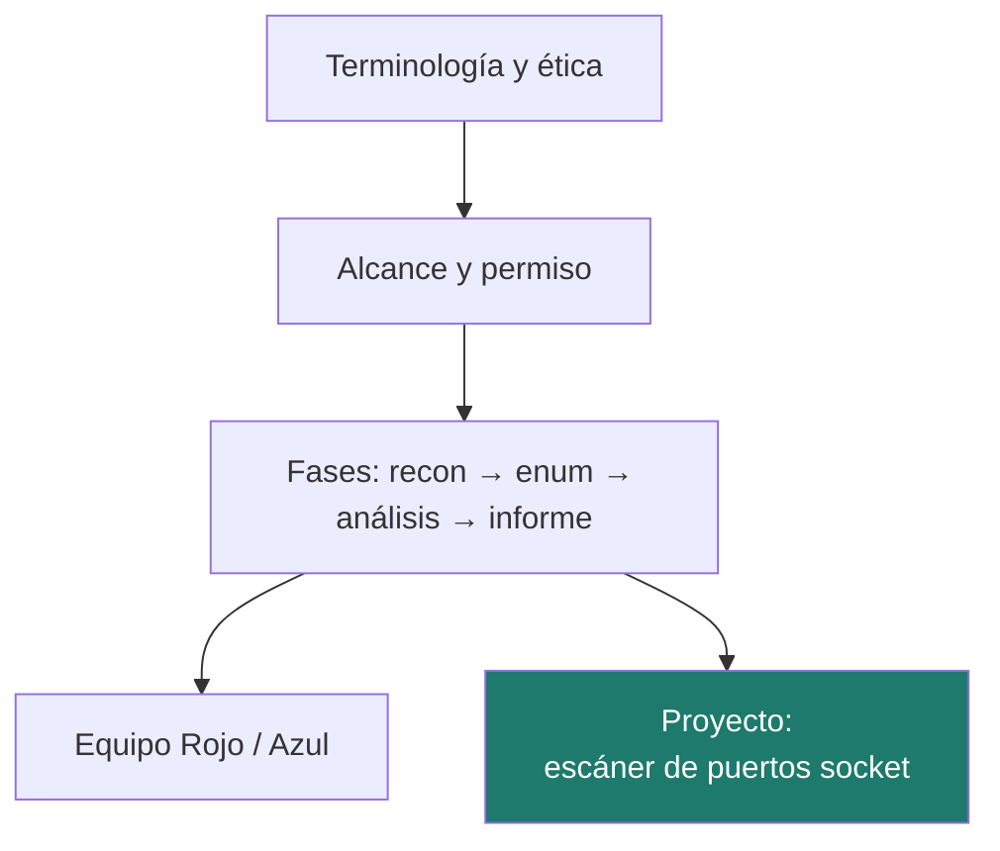
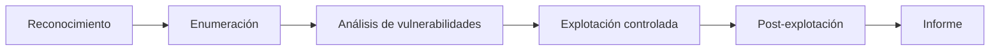

# Unidad 5 · Hacking ético en laboratorio

> **Módulo:** CMO-314 · Ciberseguridad · **Resultado de aprendizaje:** RA5 · **Duración:** 20 h · **Peso:** 25 %
> **Herramienta principal:** Python 3 (`socket`) · **Nivel:** ciclo superior

La unidad con más peso del módulo. Aprendes a pensar como un atacante **para defender mejor**: terminología, fases de una prueba de intrusión, y técnicas de Equipo Rojo y Azul, todo en un **laboratorio aislado**. El proyecto es un **escáner de puertos con sockets**, la base de herramientas como Nmap, que ejecutas **solo contra tu propia máquina**.

!!! danger "Esto es lo más importante de la unidad"
    Escanear, acceder o atacar sistemas ajenos sin **autorización escrita y con alcance definido** es delito (arts. 197 bis y 264 del Código Penal), con penas de prisión. La autorización es lo único que separa una prueba de intrusión de un delito. Todo el trabajo de esta unidad es **exclusivamente** sobre el laboratorio o `localhost`. Lee [Uso ético y legal](../recursos/uso-etico.md).

---

!!! reto "El reto de la unidad"
    Descubre, **con permiso y en el laboratorio**, qué puertos abiertos esconde un objetivo. Los **ejercicios** y el **laboratorio** de más abajo son tu **entrenamiento**: cuando los domines, resuelve el reto (el proyecto) y demuéstralo en el examen.

## Mapa de la unidad



### Qué vas a saber hacer al terminar

- [ ] Usar la **terminología** del hacking ético y definir el **alcance** de una prueba.
- [ ] Enumerar las **fases** de una prueba de intrusión.
- [ ] Reconocer tipos de vulnerabilidades y de ataques y sus vectores.
- [ ] Diferenciar **Equipo Rojo, Azul y Púrpura**.
- [ ] Programar un **escáner de puertos con sockets** en Python.
- [ ] Redactar un **informe de vulnerabilidades** con hallazgos priorizados.

---

## 1. Terminología y ética

| Término | Significado |
|---|---|
| **Hacking ético** | Uso **autorizado** de técnicas ofensivas para mejorar la seguridad |
| **Pentest** | Prueba de intrusión acotada |
| **Red Team / Blue Team** | Ataque sigiloso realista / defensa (detección y respuesta) |
| **Purple Team** | Colaboración de ambos para mejorar |
| **Vulnerabilidad / exploit / carga** | Debilidad / técnica que la aprovecha / acción posterior |
| **CVE / CVSS** | Identificador de vulnerabilidad / puntuación de severidad (0–10) |

!!! analogia "Analogía"
    Un pentester es como un cerrajero que la empresa contrata para intentar entrar y decirle por dónde falla. Sin contrato, ese mismo cerrajero forzando la puerta es un ladrón.

!!! reto "Reto rápido 1"
    ¿Qué diferencia a un sombrero gris de uno blanco, y por qué el gris sigue siendo ilegal?

---

## 2. El alcance: lo que se firma antes de empezar

Ninguna prueba legítima empieza sin un documento de **alcance** y **reglas de enfrentamiento**: sistemas incluidos y excluidos, tipo de prueba (caja negra/gris/blanca), ventana temporal, técnicas permitidas, tratamiento de datos, contactos de emergencia y **autorización firmada**.

!!! warning "Atención"
    Tocar un sistema fuera del alcance, aunque sea de la misma empresa, deja de estar autorizado. El alcance es tu cobertura legal.

---

## 3. Fases de una prueba de intrusión



| Fase | En el laboratorio |
|---|---|
| Reconocimiento | Descubrir hosts activos |
| Enumeración | Puertos, servicios y versiones |
| Análisis | Cruzar con la base de vulnerabilidades (NVD) |
| Explotación | Solo sobre máquinas deliberadamente vulnerables |
| Informe | Hallazgos priorizados y remediación |

!!! reto "Reto rápido 2"
    ¿En qué fase encaja un escáner de puertos: reconocimiento, enumeración o explotación?

---

## 4. Escaneo de puertos con Python y sockets

Un puerto abierto significa que hay un servicio escuchando. Con la librería `socket` compruebas si un puerto acepta conexión:

```python title="¿Hay un servicio escuchando en ese puerto?"
import socket

def puerto_abierto(host: str, puerto: int, timeout: float = 0.5) -> bool:
    with socket.socket(socket.AF_INET, socket.SOCK_STREAM) as s:  # (1)!
        s.settimeout(timeout)  # (2)!
        return s.connect_ex((host, puerto)) == 0  # (3)!

print(puerto_abierto("127.0.0.1", 22))  # (4)!
```

1.  El `with` garantiza que el socket **se cierra** aunque haya error. `AF_INET` = IPv4, `SOCK_STREAM` = TCP.
2.  Sin `timeout`, un puerto filtrado dejaría el escaneo colgado. Medio segundo es suficiente en red local.
3.  `connect_ex` devuelve `0` si conecta (abierto) y un código de error si no, **sin lanzar excepción**: por eso es cómodo para escanear.
4.  **Solo** contra `127.0.0.1` o los contenedores de tu laboratorio. Escanear fuera de ahí es delito.

`connect_ex` devuelve `0` si conecta (puerto abierto) y un código de error si no. El `timeout` evita que el escaneo se cuelgue.

!!! warning "Atención"
    El destino por defecto de tu proyecto es `127.0.0.1`. **No** cambies eso para apuntar a máquinas que no sean tuyas o del laboratorio.

!!! reto "Reto rápido 3"
    ¿Por qué conviene un `timeout` corto al escanear muchos puertos?

### 4.1 Interpretar el resultado

Un puerto abierto no es malo en sí; depende del servicio. Puertos como Telnet (23) o SMB (445) expuestos son señales de riesgo. Clasificar los hallazgos por severidad es parte del trabajo.

---

## 5. Vulnerabilidades y ataques (visión defensiva)

Ya conoces muchos de unidades anteriores: inyección (UD6), fuerza bruta (UD2), MITM (UD2), servicios sin parche (UD4). Aquí los integras en la perspectiva del atacante para entender **qué rastro dejan** y cómo los ve el Blue Team.

Aplicaciones web (OWASP Top 10, resumen): inyección, XSS, control de acceso roto, configuración insegura, componentes vulnerables. Se practican en entornos preparados como **DVWA** o **OWASP Juice Shop** dentro del laboratorio.

---

## 6. Equipo Rojo, Azul y Púrpura

| Rojo | Azul |
|---|---|
| Reconocimiento y OSINT | Reducción de superficie |
| Acceso y evasión | Detección (IDS/EDR) |
| Movimiento lateral | Segmentación y mínimo privilegio |
| Exfiltración | Caza de amenazas |

El **Púrpura** une a ambos: el Rojo demuestra que un ataque es posible; el Azul comprueba si lo detecta y qué puntos ciegos tiene. **MITRE ATT&CK** es el catálogo común de técnicas.

!!! reto "Reto rápido 4"
    ¿Qué aporta el Equipo Azul que un pentest del Rojo por sí solo no da?

---

## 7. El informe de vulnerabilidades

El producto real de un pentest. Cada hallazgo lleva: título, clasificación, **severidad (CVSS)** justificada, prueba de concepto reproducible, evidencia, **impacto en el negocio** y **remediación** priorizada.

| Severidad | Actuación |
|---|---|
| Crítica (9–10) | Inmediata |
| Alta (7–8,9) | Días |
| Media (4–6,9) | Semanas |
| Baja (0,1–3,9) | Cuando sea razonable |

!!! warning "Atención"
    La severidad técnica no es el riesgo del negocio: un CVSS alto en un sistema sin datos puede importar menos que uno medio en el servidor de clientes.

---

## 8. Practica **con** solución a la vista

#### Actividad 1 — Servicio de un puerto
`servicio(puerto)` → `"SSH"` para 22, `"HTTPS"` para 443, `"desconocido"` en otro caso.
<details class="sol"><summary>Solución</summary>

```python
def servicio(puerto: int) -> str:
    return {22: "SSH", 80: "HTTP", 443: "HTTPS"}.get(puerto, "desconocido")
```
</details>

#### Actividad 2 — ¿Puerto inseguro?
`inseguro(puerto)` → True para 23, 21, 445.
<details class="sol"><summary>Solución</summary>

```python
def inseguro(puerto: int) -> bool:
    return puerto in {21, 23, 25, 110, 143, 445, 3389}
```
</details>

#### Actividad 3 — Clasificar severidad
`severidad(cvss)` → "CRÍTICA/ALTA/MEDIA/BAJA".
<details class="sol"><summary>Solución</summary>

```python
def severidad(cvss: float) -> str:
    if cvss >= 9: return "CRÍTICA"
    if cvss >= 7: return "ALTA"
    if cvss >= 4: return "MEDIA"
    return "BAJA"
```
</details>

#### Actividad 4 — Formatear hallazgo
`linea(puerto, estado)` → `"22/tcp SSH OK"`.
<details class="sol"><summary>Solución</summary>

```python
def linea(puerto: int, estado: str) -> str:
    return f"{puerto}/tcp {servicio(puerto)} {estado}"
```
</details>

---

## Proyecto de la unidad

Construyes un **escáner de puertos** con `socket` que sondea `localhost`, más las funciones puras que **clasifican** los puertos abiertos por severidad y generan el informe. Es un ejercicio de programación de red seguro y legal.

**[Proyecto Escáner de puertos →](../proyectos/ud5/README.md)**

```bash
pip install -r requirements.txt
pytest
mypy src
```

!!! danger "Solo localhost / laboratorio"
    El escáner apunta a `127.0.0.1` por defecto. Úsalo solo contra tus máquinas.

---

## Retos de ampliación

- **R1.** Escanea un **rango** de puertos y muestra una barra de progreso.
- **R2.** Acelera el escaneo con hilos (`concurrent.futures`).
- **R3.** Intenta leer el *banner* del servicio de un puerto abierto (solo en el lab).

---

## Más práctica

#### Actividad 5 — Rango de puertos
Escribe `rango(inicio, fin) -> list[int]` (ambos incluidos) validando que `inicio <= fin`.
<details class="sol"><summary>Solución</summary>

```python
def rango(inicio: int, fin: int) -> list[int]:
    if inicio > fin:
        raise ValueError("inicio > fin")
    return list(range(inicio, fin + 1))
```
</details>

#### Actividad 6 — Informe ordenado
Dado `dict[int,str]` puerto→estado, devuelve las líneas ordenadas poniendo primero los `INSEGURO`.
<details class="sol"><summary>Solución</summary>

```python
def informe(estados: dict[int, str]) -> list[str]:
    orden = {"INSEGURO": 0, "REVISAR": 1, "OK": 2}
    return [f"{p}: {e}" for p, e in sorted(estados.items(),
            key=lambda kv: (orden.get(kv[1], 9), kv[0]))]
```
</details>

---

## Laboratorio

!!! danger "Solo dentro del laboratorio Docker"
    El escaneo se hace **exclusivamente** contra contenedores de tu propio `docker-compose`, en una red con `internal: true` (sin salida a Internet). Escanear fuera de ahí es delito. Ver [Uso ético y legal](../recursos/uso-etico.md).

### Laboratorio guiado (resuelto) — Escanear un objetivo del laboratorio

Levantamos un "objetivo" con un par de puertos abiertos y lo escaneamos con sockets desde otro contenedor, todo en una red Docker aislada.

**`docker-compose.yml`**

```yaml
services:
  objetivo:
    image: nginx:alpine          # abre el puerto 80
  atacante:
    image: python:3.12-alpine
    depends_on: [objetivo]
    command: sleep infinity
networks:
  default: { internal: true }    # red aislada, sin Internet
```

```bash
docker compose up -d
docker compose exec atacante python3 - << 'PY'
import socket
def abierto(host, puerto, t=0.5):
    with socket.socket() as s:
        s.settimeout(t)
        try: return s.connect_ex((host, puerto)) == 0
        except OSError: return False
for p in (22, 80, 443, 5432):
    print(f"objetivo:{p} -> {'ABIERTO' if abierto('objetivo', p) else 'cerrado'}")
PY
docker compose down
```

<details class="sol"><summary>Qué debe salir</summary>

```
objetivo:22 -> cerrado
objetivo:80 -> ABIERTO
objetivo:443 -> cerrado
objetivo:5432 -> cerrado
```
Solo el 80 está abierto (nginx). Es lo mismo que hace Nmap, pero escrito por ti y **contra tu propio contenedor**. Cambia la imagen del objetivo (por ejemplo `postgres`) y verás abrirse el 5432.
</details>

### Laboratorio propuesto (entregable) — Escáner con informe y severidad

Amplía el laboratorio: en el mismo `docker-compose` añade **dos objetivos** (uno con un servicio "inseguro" como telnet/ftp y otro con web) y escribe un escáner en Python que recorra un **rango** de puertos de ambos, clasifique cada puerto abierto por **severidad** (INSEGURO/REVISAR/OK) y genere un **informe** ordenado por gravedad.

**Criterios de aceptación**
- Usa `socket`, destino solo dentro de la red del lab, `timeout` corto.
- Informe con host, puerto, servicio y severidad. Tipado y `mypy` limpio.
- Acompaña un breve **informe de vulnerabilidades** (2–3 hallazgos con remediación).

---

## Autoevaluación rápida

<details><summary>1. ¿Qué separa legalmente un pentest de un delito?</summary>La autorización previa, por escrito y con alcance definido.</details>
<details><summary>2. ¿En qué fase encaja el escaneo de puertos?</summary>Enumeración (tras el reconocimiento).</details>
<details><summary>3. ¿Qué devuelve <code>connect_ex</code> si el puerto está abierto?</summary><code>0</code>.</details>
<details><summary>4. ¿Qué es el Equipo Púrpura?</summary>La colaboración de Rojo y Azul para mejorar la detección.</details>
<details><summary>5. ¿La severidad CVSS es el riesgo del negocio?</summary>No: hay que cruzarla con el valor del activo.</details>
<details><summary>6. ¿Sobre qué máquinas puedes practicar?</summary>Solo el laboratorio, localhost o plataformas que lo autorizan.</details>

---

## Glosario

| Término | Definición |
|---|---|
| **Pentest** | Prueba de intrusión autorizada y acotada. |
| **Alcance** | Sistemas y condiciones autorizadas de la prueba. |
| **CVSS** | Puntuación de severidad de una vulnerabilidad. |
| **Socket** | Punto final de comunicación de red en programación. |
| **Red/Blue/Purple Team** | Ataque / defensa / colaboración. |
| **ATT&CK** | Catálogo de técnicas de adversario de MITRE. |

---

## Cómo se evalúa esta unidad (RA5)


Se evalúa con un **examen por retos 100 % práctico**: resuelves en Python un reto parecido al de clase y se corrige **solo con su batería de tests**.

!!! reto "La nota, sin sorpresas"
    **Nota = (tests superados ÷ total) × 10.** Se aprueba con 5. Es la misma mecánica del reto de esta unidad, así que llegas entrenado.

El informe además te marca, **sin puntuar**, tres buenas prácticas que conviene cuidar: usar la técnica del RA (aquí, `socket`), pasar `mypy` y documentar el código.