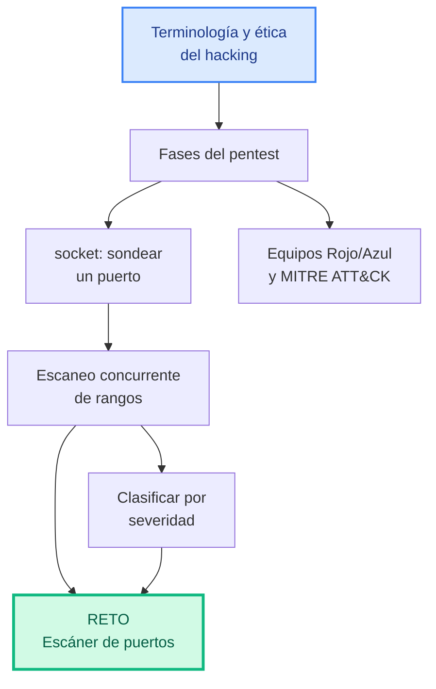
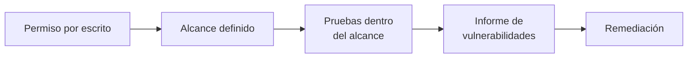
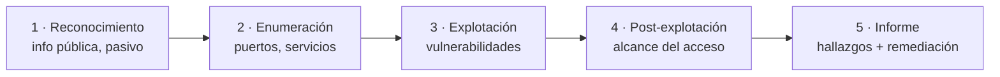
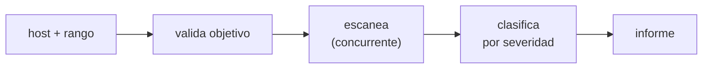
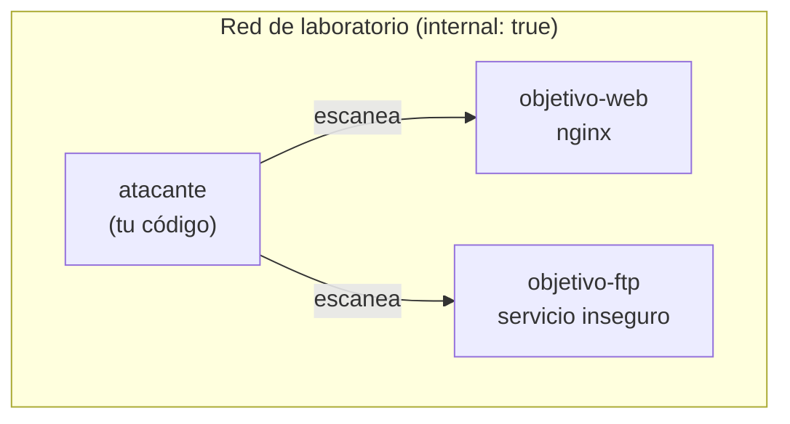

# Unidad 5 · Hacking ético en laboratorio

> **Módulo:** CMO-314 · Ciberseguridad · **RA5** · **Duración:** 20 h · **Peso:** 25 % · **Herramienta:** Python 3 (tipado) + `socket`

Esta es la unidad de **síntesis**: reúne integridad (UT1), detección (UT2), filtrado (UT3) y riesgo (UT4) desde el otro lado — el de quien pone a prueba las defensas, **con permiso**, para encontrar el fallo antes que un atacante real. La herramienta de Python es `socket`, la base sobre la que están construidos Nmap y cualquier escáner de red. Es también, con diferencia, la unidad donde el uso ético importa más.

!!! danger "Esta unidad se trabaja EXCLUSIVAMENTE en el laboratorio"
    Todo lo que vas a programar aquí — escaneo de puertos, reconocimiento — se ejecuta **solo** contra `127.0.0.1`, contenedores de tu propio `docker-compose`, o el laboratorio autorizado del centro. Hacerlo contra cualquier sistema que no sea tuyo, sin permiso explícito por escrito, es un delito (arts. 197 y 264 del Código Penal), aunque el escaneo en sí "no dañe nada". Ver [Uso ético y legal](../recursos/uso-etico.md).

!!! reto "El reto de la unidad"
    **Descubre, en tu laboratorio, qué puertos abiertos esconde un objetivo.** Vas a construir un escáner con severidad e informe.



**Qué sabrás hacer al terminar:** distinguir hacking ético de delito informático, y las fases de un pentest · usar `socket` para sondear si un puerto está abierto · escanear rangos de puertos de forma concurrente con `concurrent.futures` · clasificar hallazgos por severidad y redactar un informe · situar el marco MITRE ATT&CK y los equipos Rojo/Azul/Púrpura · construir un escáner de puertos con CLI, tipado y probado.

**Cómo se trabaja (aula invertida):** lees la sección y ejecutas los ejemplos antes de clase, **siempre contra `127.0.0.1`** → en clase practicas en el laboratorio, en parejas, con el profesorado supervisando.

---

## 1. Hacking ético: terminología y marco legal

| Término | Qué significa |
|---|---|
| **Hacking ético / pentest** | Poner a prueba la seguridad de un sistema **con autorización explícita** |
| **Alcance (scope)** | Qué sistemas están autorizados a probarse, y cuáles no |
| **Reglas de enfrentamiento** | Cuándo, cómo y con qué límites se hace la prueba |
| **Black hat** | Ataca sin autorización, con intención maliciosa |
| **White hat** | Es lo que vas a practicar: autorizado, documentado, con permiso |
| **Grey hat** | Sin autorización pero sin intención maliciosa — **sigue siendo ilegal** |



!!! warning "Sin autorización por escrito, no hay pentest: hay delito"
    La diferencia entre un profesional de la ciberseguridad y un delincuente **no es la técnica** — es exactamente la misma. La diferencia es el **permiso**. Ni "solo estaba mirando" ni "no hice daño" son defensa legal.

---

## 2. Fases de un pentest



Esta unidad se centra en la **fase 2: enumeración** — descubrir qué servicios están escuchando, que es el paso previo (y el más programable) antes de cualquier otra cosa.

---

## 3. `socket`: la herramienta de esta unidad

Un **socket** es el punto de conexión entre dos programas en red. Sondear si un puerto está abierto es, en esencia, intentar conectar y ver qué pasa.

```python title="socket_basico.py"
import socket

def puerto_abierto(host: str, puerto: int, timeout: float = 0.5) -> bool:
    """True si hay algo escuchando en host:puerto. SOLO contra tu laboratorio."""
    with socket.socket(socket.AF_INET, socket.SOCK_STREAM) as s:   # (1)!
        s.settimeout(timeout)                                       # (2)!
        return s.connect_ex((host, puerto)) == 0                    # (3)!

print(puerto_abierto("127.0.0.1", 80))
print(puerto_abierto("127.0.0.1", 65432))
```

1.  El `with` garantiza que el socket **se cierra** aunque haya error. `AF_INET` = IPv4, `SOCK_STREAM` = TCP.
2.  Sin `timeout`, un puerto filtrado dejaría el escaneo colgado indefinidamente. Medio segundo basta en red local.
3.  `connect_ex` devuelve `0` si conecta (abierto) y un código de error si no, **sin lanzar excepción** — por eso es cómodo para escanear muchos puertos seguidos.

```text title="Salida"
False
False
```

> En tu equipo, casi ningún puerto está abierto por defecto — por eso ambas salen `False`. Vamos a comprobarlo con un puerto que **sí** está abierto de verdad.

### 3.1 Comprobación con un servidor real

```python title="socket_con_servidor.py"
import socket, threading, time

def servidor_de_prueba() -> None:
    """Levanta un servidor TCP mínimo en el puerto 8765, solo para esta demo."""
    s = socket.socket(socket.AF_INET, socket.SOCK_STREAM)
    s.setsockopt(socket.SOL_SOCKET, socket.SO_REUSEADDR, 1)
    s.bind(("127.0.0.1", 8765))
    s.listen(1)
    s.settimeout(3)
    try:
        conn, _ = s.accept()
        conn.close()
    except socket.timeout:
        pass

def puerto_abierto(host: str, puerto: int, timeout: float = 0.5) -> bool:
    with socket.socket(socket.AF_INET, socket.SOCK_STREAM) as s:
        s.settimeout(timeout)
        return s.connect_ex((host, puerto)) == 0

hilo = threading.Thread(target=servidor_de_prueba, daemon=True)
hilo.start()
time.sleep(0.3)   # da tiempo a que el servidor arranque

print("puerto 8765 (con servidor):", puerto_abierto("127.0.0.1", 8765))
print("puerto 8766 (sin nada):    ", puerto_abierto("127.0.0.1", 8766))
```

```text title="Salida"
puerto 8765 (con servidor): True
puerto 8766 (sin nada):     False
```

!!! analogia "Analogía"
    Sondear un puerto es como llamar a una puerta: si alguien responde, hay "algo" detrás (abierto); si nadie contesta en un tiempo razonable, asumes que no hay nadie (cerrado). No sabes **qué** hay detrás todavía — solo que la puerta responde.

!!! reto "Reto rápido 1"
    ¿Por qué el ejemplo usa `SO_REUSEADDR`? Pista: intenta ejecutar dos veces seguidas un servidor en el mismo puerto sin cerrar bien el anterior y verás el error que evita.

---

## 4. Escanear un rango: hazlo rápido con concurrencia

Sondear puertos **uno a uno**, en secuencia, es lento: 1000 puertos × 0.5 s de timeout = más de 8 minutos. La solución: sondearlos **en paralelo**.

```python title="escaneo_concurrente.py"
from concurrent.futures import ThreadPoolExecutor
import socket, time

def puerto_abierto(host: str, puerto: int, timeout: float = 0.3) -> bool:
    with socket.socket(socket.AF_INET, socket.SOCK_STREAM) as s:
        s.settimeout(timeout)
        return s.connect_ex((host, puerto)) == 0

def escanea(host: str, puertos: list[int]) -> list[int]:
    with ThreadPoolExecutor(max_workers=50) as ex:
        resultados = ex.map(lambda p: (p, puerto_abierto(host, p)), puertos)
    return sorted(p for p, abierto in resultados if abierto)

t0 = time.time()
abiertos = escanea("127.0.0.1", list(range(20, 100)))
print("Puertos abiertos:", abiertos)
print(f"Tiempo: {time.time() - t0:.2f}s para {100-20} puertos")
```

```text title="Salida"
Puertos abiertos: []
Tiempo: 0.05s para 80 puertos
```

> Como es I/O (esperar respuestas de red, no cálculo), los hilos (`ThreadPoolExecutor`) sirven perfectamente aunque Python tenga el GIL — mientras un hilo espera respuesta, otro puede seguir. Con 50 hilos en paralelo, 80 puertos tardan **milisegundos**, no 24 segundos.

---

## 5. Clasificar por severidad

No todos los puertos abiertos son igual de preocupantes. Un puerto 443 (HTTPS) abierto es normal; un 23 (Telnet, sin cifrar) es una alarma.

```python title="severidad.py"
INSEGUROS = {21, 23, 25, 135, 445, 3389}   # FTP, Telnet, SMTP abierto, RPC, SMB, RDP
REVISAR = {80, 8080, 110, 143}              # HTTP sin TLS, IMAP/POP3 sin cifrar

def severidad(puerto: int) -> str:
    if puerto in INSEGUROS:
        return "INSEGURO"
    if puerto in REVISAR:
        return "REVISAR"
    return "OK"

for p in (23, 80, 443, 3389):
    print(f"{p:5} -> {severidad(p)}")
```

```text title="Salida"
   23 -> INSEGURO
   80 -> REVISAR
  443 -> OK
 3389 -> INSEGURO
```

### 5.1 Del listado al informe

```python title="informe_severidad.py"
def clasificar(abiertos: list[int]) -> dict[int, str]:
    return {p: severidad(p) for p in abiertos}

def informe(clasificado: dict[int, str]) -> list[str]:
    orden = {"INSEGURO": 0, "REVISAR": 1, "OK": 2}
    return [f"{p}: {sev}" for p, sev in
            sorted(clasificado.items(), key=lambda kv: (orden[kv[1]], kv[0]))]

for linea in informe(clasificar([443, 23, 80, 3389])):
    print(linea)
```

```text title="Salida"
23: INSEGURO
3389: INSEGURO
80: REVISAR
443: OK
```

!!! reto "Reto rápido 2"
    Un cliente tiene el puerto 3389 (RDP, escritorio remoto) abierto **a Internet**. ¿Por qué es especialmente peligroso? Pista: piensa en fuerza bruta (UT2) combinada con este hallazgo.

---

## 6. Equipos Rojo, Azul, Púrpura y MITRE ATT&CK

| Equipo | Rol |
|---|---|
| **Rojo (Red Team)** | Ataca (simulado) para encontrar fallos — lo que has practicado aquí |
| **Azul (Blue Team)** | Defiende y detecta — lo que practicaste en la UT2 |
| **Púrpura (Purple Team)** | Ambos colaboran para mejorar juntos |

**MITRE ATT&CK** es un catálogo público de técnicas de ataque reales, organizado por fases (reconocimiento, acceso inicial, persistencia…). Un escaneo de puertos se clasifica dentro de la técnica de **Reconocimiento activo** (T1595). Sirve como vocabulario común entre atacantes (simulados) y defensores.

---

## 7. Errores frecuentes (ten esto a mano)

| Error | Causa | Solución |
|---|---|---|
| El escaneo se queda colgado | Sin `timeout` en el socket | `s.settimeout(...)` siempre |
| `OSError: Address already in use` | Reiniciar un servidor de prueba sin `SO_REUSEADDR` | `s.setsockopt(socket.SOL_SOCKET, socket.SO_REUSEADDR, 1)` |
| El escaneo tarda una eternidad | Sondear uno a uno, en secuencia | `ThreadPoolExecutor` para paralelizar |
| Falsos "cerrados" | `timeout` demasiado corto en red lenta | Ajusta el timeout al contexto (más alto en redes reales, más bajo en local) |
| Escanear algo que no es tuyo | — | **Nunca.** Solo `127.0.0.1` o tu laboratorio |

---

## 8. Actividades: de lo más sencillo a preguntas tipo examen

> Todo contra `127.0.0.1` o tu laboratorio Docker. Librerías reales: `socket`, `concurrent.futures`, `ssl`.

**1 · 🟢 Severidad de un puerto** — `severidad(p: int) -> str`.
<details class="sol"><summary>Solución</summary>

```python
def severidad(p: int) -> str:
    if p in {21, 23, 25, 135, 445, 3389}: return "INSEGURO"
    if p in {80, 8080, 110, 143}: return "REVISAR"
    return "OK"
```
</details>

**2 · 🟢 Rango de puertos válido** — `rango(ini: int, fin: int) -> list[int]`, lanza `ValueError` si `ini > fin`.
<details class="sol"><summary>Solución</summary>

```python
def rango(ini: int, fin: int) -> list[int]:
    if ini > fin:
        raise ValueError("ini > fin")
    return list(range(ini, fin + 1))
```
</details>

**3 · 🟢 Nombre de servicio conocido** — `servicio_de(puerto: int) -> str` para 22/80/443/3389, `"desconocido"` si no.
<details class="sol"><summary>Solución</summary>

```python
def servicio_de(puerto: int) -> str:
    return {22: "SSH", 80: "HTTP", 443: "HTTPS", 3389: "RDP"}.get(puerto, "desconocido")
```
</details>

**4 · 🟢 ¿Puerto abierto?** — `puerto_abierto(host, puerto, timeout=0.5) -> bool` con `socket`.
<details class="sol"><summary>Solución</summary>

```python
import socket
def puerto_abierto(host: str, puerto: int, timeout: float = 0.5) -> bool:
    with socket.socket(socket.AF_INET, socket.SOCK_STREAM) as s:
        s.settimeout(timeout)
        return s.connect_ex((host, puerto)) == 0
```
</details>

**5 · 🟡 Escaneo secuencial** — `escanea_secuencial(host, puertos) -> list[int]`.
<details class="sol"><summary>Solución</summary>

```python
def escanea_secuencial(host: str, puertos: list[int]) -> list[int]:
    return sorted(p for p in puertos if puerto_abierto(host, p, 0.2))
```
</details>

**6 · 🟡 Escaneo concurrente** — `escanea(host, puertos) -> list[int]` con `ThreadPoolExecutor`.
<details class="sol"><summary>Solución</summary>

```python
from concurrent.futures import ThreadPoolExecutor
def escanea(host: str, puertos: list[int]) -> list[int]:
    with ThreadPoolExecutor(max_workers=50) as ex:
        res = ex.map(lambda p: (p, puerto_abierto(host, p, 0.2)), puertos)
    return sorted(p for p, ok in res if ok)
```
</details>

**7 · 🟡 Clasificar abiertos** — `clasificar(abiertos: list[int]) -> dict[int,str]`.
<details class="sol"><summary>Solución</summary>

```python
def clasificar(abiertos: list[int]) -> dict[int, str]:
    return {p: severidad(p) for p in abiertos}
```
</details>

**8 · 🟡 Contar por severidad** — `resumen(clasificado: dict[int,str]) -> dict[str,int]`.
<details class="sol"><summary>Solución</summary>

```python
from collections import Counter
def resumen(clasificado: dict[int, str]) -> dict[str, int]:
    return dict(Counter(clasificado.values()))
```
</details>

**9 · 🟠 Informe ordenado por gravedad** — `informe(clasificado) -> list[str]`, INSEGURO primero.
<details class="sol"><summary>Solución</summary>

```python
def informe(clasificado: dict[int, str]) -> list[str]:
    orden = {"INSEGURO": 0, "REVISAR": 1, "OK": 2}
    return [f"{p}: {s}" for p, s in sorted(clasificado.items(), key=lambda kv: (orden[kv[1]], kv[0]))]
```
</details>

**10 · 🟠 Solo los graves** — `solo_inseguros(clasificado: dict[int,str]) -> list[int]`.
<details class="sol"><summary>Solución</summary>

```python
def solo_inseguros(clasificado: dict[int, str]) -> list[int]:
    return sorted(p for p, s in clasificado.items() if s == "INSEGURO")
```
</details>

**11 · 🟠 Comparar dos escaneos** — `nuevos_puertos(anterior: list[int], actual: list[int]) -> list[int]`: puertos que se han abierto desde el último escaneo (detección de cambios, como el HIDS de la UT1).
<details class="sol"><summary>Solución</summary>

```python
def nuevos_puertos(anterior: list[int], actual: list[int]) -> list[int]:
    return sorted(set(actual) - set(anterior))
```
</details>

**12 · 🔴 Tiempo estimado de un escaneo** — `tiempo_estimado(n_puertos: int, hilos: int, timeout: float) -> float`: cuánto tardaría en el peor caso (todo cerrado).
<details class="sol"><summary>Solución</summary>

```python
import math
def tiempo_estimado(n_puertos: int, hilos: int, timeout: float) -> float:
    tandas = math.ceil(n_puertos / hilos)
    return round(tandas * timeout, 2)
```
</details>

**13 · 🔴 Banner grabbing simplificado** — `intenta_leer_banner(host, puerto, timeout=1.0) -> str`: conecta y lee hasta 100 bytes que el servicio pueda enviar al conectar (sin enviar nada), o `""` si no hay nada.
<details class="sol"><summary>Solución</summary>

```python
import socket
def intenta_leer_banner(host: str, puerto: int, timeout: float = 1.0) -> str:
    try:
        with socket.socket(socket.AF_INET, socket.SOCK_STREAM) as s:
            s.settimeout(timeout)
            s.connect((host, puerto))
            datos = s.recv(100)
            return datos.decode(errors="replace")
    except (socket.timeout, OSError):
        return ""
```
</details>

**14 · 🔴 Validar un objetivo de laboratorio** — `es_objetivo_valido(host: str) -> bool`: solo permite `127.0.0.1`, `localhost` o direcciones que empiecen por `10.0.20.` (tu red de laboratorio).
<details class="sol"><summary>Solución</summary>

```python
def es_objetivo_valido(host: str) -> bool:
    return host in ("127.0.0.1", "localhost") or host.startswith("10.0.20.")
```
</details>

**15 · 🔴 Escaneo con guardarraíl ético** — `escaneo_seguro(host, puertos) -> list[int]`: usa `es_objetivo_valido`; si el host no es válido, lanza `ValueError` en vez de escanear.
<details class="sol"><summary>Solución</summary>

```python
def escaneo_seguro(host: str, puertos: list[int]) -> list[int]:
    if not es_objetivo_valido(host):
        raise ValueError(f"objetivo no autorizado: {host}")
    return escanea(host, puertos)
```
</details>

### Preguntas tipo test práctico

**P1.** ¿Qué devuelve `connect_ex` si el puerto está cerrado, y por qué es más cómodo que usar `connect` a secas para escanear?
<details class="sol"><summary>Respuesta</summary>Devuelve un código de error distinto de <code>0</code> (no lanza excepción), así que puedes comprobar <code>== 0</code> directamente sin envolver cada intento en un <code>try/except</code>.</details>

**P2.** ¿Por qué el escaneo secuencial de 1000 puertos es mucho más lento que el concurrente?
<details class="sol"><summary>Respuesta</summary>Porque cada sondeo espera su propio <code>timeout</code> antes de pasar al siguiente; en paralelo, muchos sondeos esperan <b>a la vez</b>, así que el tiempo total es el de una sola espera, no la suma de todas.</details>

**P3.** ¿Qué pasa si olvidas `s.settimeout(...)` antes de `connect_ex` a un puerto filtrado (que no responde ni sí ni no)?
<details class="sol"><summary>Respuesta</summary>El programa puede quedarse colgado indefinidamente esperando una respuesta que nunca llega.</details>

**P4.** ¿Por qué un puerto 3389 (RDP) abierto a Internet es más grave si además hay contraseñas débiles en el sistema?
<details class="sol"><summary>Respuesta</summary>Porque combina dos hallazgos: un servicio de acceso remoto expuesto (UT5) y credenciales vulnerables a fuerza bruta (UT2/UT4) — el escaneo encuentra la puerta, la contraseña débil es la llave fácil.</details>

**P5.** ¿Qué diferencia hay entre un `grey hat` y un `white hat`?
<details class="sol"><summary>Respuesta</summary>Ambos actúan sin intención maliciosa, pero el <code>grey hat</code> lo hace <b>sin autorización</b> — lo que sigue siendo ilegal — mientras que el <code>white hat</code> siempre tiene permiso explícito.</details>

**P6.** En el ejercicio 11 (`nuevos_puertos`), ¿qué operación de conjuntos detecta lo que ha aparecido nuevo?
<details class="sol"><summary>Respuesta</summary>La diferencia de conjuntos <code>set(actual) - set(anterior)</code>: lo que está en el escaneo nuevo pero no estaba en el anterior.</details>

**P7.** ¿Por qué `escaneo_seguro` valida el host **antes** de escanear, en vez de simplemente documentar "úsalo solo en el laboratorio"?
<details class="sol"><summary>Respuesta</summary>Porque un guardarraíl en el código previene errores humanos (escanear por accidente la IP equivocada); una nota en la documentación es fácil de pasar por alto bajo presión.</details>

---

## 9. Reto resuelto, paso a paso — Escáner de puertos con informe

Te piden auditar (en tu propio laboratorio) qué servicios expone un servidor de pruebas, y entregar un informe priorizado por gravedad.



**Paso 1 — Sondeo de un puerto, con validación del objetivo.**

```python title="escaner.py"
import socket

def es_objetivo_valido(host: str) -> bool:
    """Solo laboratorio: localhost o la red 10.0.20.0/24."""
    return host in ("127.0.0.1", "localhost") or host.startswith("10.0.20.")

def puerto_abierto(host: str, puerto: int, timeout: float = 0.5) -> bool:
    with socket.socket(socket.AF_INET, socket.SOCK_STREAM) as s:
        s.settimeout(timeout)
        return s.connect_ex((host, puerto)) == 0
```

**Paso 2 — Escaneo concurrente, con el guardarraíl ético incorporado.**

```python title="escaner.py (continúa)"
from concurrent.futures import ThreadPoolExecutor

def escanear(host: str, puertos: list[int], timeout: float = 0.3) -> list[int]:
    if not es_objetivo_valido(host):
        raise ValueError(f"objetivo no autorizado: {host} (solo laboratorio)")
    with ThreadPoolExecutor(max_workers=50) as ex:
        resultados = ex.map(lambda p: (p, puerto_abierto(host, p, timeout)), puertos)
    return sorted(p for p, abierto in resultados if abierto)
```

**Paso 3 — Clasificar por severidad.**

```python title="escaner.py (continúa)"
INSEGUROS = {21, 23, 25, 135, 445, 3389}
REVISAR = {80, 8080, 110, 143}

def severidad(puerto: int) -> str:
    if puerto in INSEGUROS: return "INSEGURO"
    if puerto in REVISAR: return "REVISAR"
    return "OK"

def clasificar(abiertos: list[int]) -> dict[int, str]:
    return {p: severidad(p) for p in abiertos}
```

**Paso 4 — Generar el informe.**

```python title="escaner.py (continúa)"
def generar_informe(host: str, clasificado: dict[int, str]) -> list[str]:
    orden = {"INSEGURO": 0, "REVISAR": 1, "OK": 2}
    lineas = [f"Informe de {host}", "=" * 40]
    for p, s in sorted(clasificado.items(), key=lambda kv: (orden[kv[1]], kv[0])):
        lineas.append(f"[{s:9}] puerto {p}")
    if not clasificado:
        lineas.append("(ningún puerto abierto en el rango escaneado)")
    return lineas
```

**Paso 5 — CLI con `argparse`.**

```python title="escaner.py (continúa)"
import argparse

def main() -> None:
    ap = argparse.ArgumentParser(prog="escaner", description="Escáner de puertos de laboratorio")
    ap.add_argument("host")
    ap.add_argument("--desde", type=int, default=1)
    ap.add_argument("--hasta", type=int, default=1024)
    args = ap.parse_args()

    puertos = list(range(args.desde, args.hasta + 1))
    abiertos = escanear(args.host, puertos)
    for linea in generar_informe(args.host, clasificar(abiertos)):
        print(linea)

if __name__ == "__main__":
    main()
```

**Paso 6 — Pruébalo en Docker: escanea un contenedor objetivo, en red aislada, sin `sudo`.**

```yaml title="docker-compose.yml"
services:
  objetivo:
    image: nginx:alpine          # abre el puerto 80
  atacante:
    image: python:3.12-alpine
    depends_on: [objetivo]
    volumes: ["./escaner.py:/escaner.py"]
    command: sleep infinity
networks:
  default:
    internal: true               # red aislada, sin salida a Internet
```

```bash title="Ejecutar"
docker compose up -d
docker compose exec atacante python3 /escaner.py objetivo --desde 1 --hasta 200
docker compose down
```

```text title="Salida esperada"
Informe de objetivo
========================================
[OK       ] puerto 80
```

<details class="sol"><summary>📄 escaner.py completo</summary>

```python
import argparse, socket
from concurrent.futures import ThreadPoolExecutor

INSEGUROS = {21, 23, 25, 135, 445, 3389}
REVISAR = {80, 8080, 110, 143}

def es_objetivo_valido(host: str) -> bool:
    return host in ("127.0.0.1", "localhost") or host.startswith("10.0.20.") or host == "objetivo"

def puerto_abierto(host: str, puerto: int, timeout: float = 0.5) -> bool:
    with socket.socket(socket.AF_INET, socket.SOCK_STREAM) as s:
        s.settimeout(timeout)
        return s.connect_ex((host, puerto)) == 0

def escanear(host: str, puertos: list[int], timeout: float = 0.3) -> list[int]:
    if not es_objetivo_valido(host):
        raise ValueError(f"objetivo no autorizado: {host} (solo laboratorio)")
    with ThreadPoolExecutor(max_workers=50) as ex:
        resultados = ex.map(lambda p: (p, puerto_abierto(host, p, timeout)), puertos)
    return sorted(p for p, abierto in resultados if abierto)

def severidad(puerto: int) -> str:
    if puerto in INSEGUROS: return "INSEGURO"
    if puerto in REVISAR: return "REVISAR"
    return "OK"

def clasificar(abiertos: list[int]) -> dict[int, str]:
    return {p: severidad(p) for p in abiertos}

def generar_informe(host: str, clasificado: dict[int, str]) -> list[str]:
    orden = {"INSEGURO": 0, "REVISAR": 1, "OK": 2}
    lineas = [f"Informe de {host}", "=" * 40]
    for p, s in sorted(clasificado.items(), key=lambda kv: (orden[kv[1]], kv[0])):
        lineas.append(f"[{s:9}] puerto {p}")
    if not clasificado:
        lineas.append("(ningún puerto abierto en el rango escaneado)")
    return lineas

def main() -> None:
    ap = argparse.ArgumentParser(prog="escaner", description="Escáner de puertos de laboratorio")
    ap.add_argument("host")
    ap.add_argument("--desde", type=int, default=1)
    ap.add_argument("--hasta", type=int, default=1024)
    args = ap.parse_args()
    abiertos = escanear(args.host, list(range(args.desde, args.hasta + 1)))
    for linea in generar_informe(args.host, clasificar(abiertos)):
        print(linea)

if __name__ == "__main__":
    main()
```
</details>

---

## 10. Reto para ti (propuesto, sin solución)

### 🎯 Escáner multi-objetivo con banner grabbing

Amplía tu escáner para auditar **varios contenedores del laboratorio a la vez**, e identifica qué servicio hay detrás de cada puerto abierto leyendo su *banner* (lo que el servicio dice al conectar, cuando lo dice).



**Objetivo.** Un `docker-compose.yml` con **al menos dos** objetivos distintos (por ejemplo `nginx` y algún servicio que hable al conectar, como un `redis` o un pequeño servidor de eco) en una red `internal: true`. Tu escáner recorre una lista de hosts, escanea cada uno, y para cada puerto abierto intenta leer el banner (ejercicio 13) para enriquecer el informe.

**Requisitos**

- CLI: `python escaner_multi.py objetivo1 objetivo2 --desde 1 --hasta 1024`.
- Reutiliza `escanear`, `clasificar`, `generar_informe` y `intenta_leer_banner` de la sección anterior y del ejercicio 13.
- El informe final agrupa por host, y dentro de cada host ordena por severidad.
- Código tipado, `mypy` limpio.
- Nada de `sudo`: todo en `docker compose up`, red `internal: true`.

**Criterios de aceptación**

1. Escanea correctamente **más de un** host en la misma ejecución.
2. Si un banner no se puede leer (timeout), el informe lo indica como `(sin banner)` en vez de fallar.
3. El objetivo no válido (fuera del laboratorio) sigue lanzando `ValueError` como en el reto resuelto.

**Pistas** (no solución): itera la lista de hosts y reutiliza `escanear` una vez por host · para el banner, recuerda que muchos servicios (como nginx) **no** envían nada hasta que tú hablas primero — está bien que la mayoría de banners salgan vacíos, es información real.

**Si te sobra tiempo:** añade una opción `--formato json` que exporte el informe completo como JSON · investiga cómo un escáner real (Nmap) infiere el sistema operativo por las peculiaridades de la pila TCP/IP (esto no lo vas a programar, solo investigar y explicar en una frase).

> Esto es justo el tipo de reto que resolverás en el **test práctico**.

---

## Autoevaluación rápida (conceptos)

<details><summary>1. ¿Qué diferencia legal hay entre un pentest y un ataque?</summary>La autorización explícita por escrito.</details>
<details><summary>2. ¿Qué fase del pentest cubre esta unidad?</summary>Enumeración: descubrir qué servicios están escuchando.</details>
<details><summary>3. ¿Por qué el escaneo concurrente es tanto más rápido que el secuencial?</summary>Porque muchas esperas de red se solapan en vez de sumarse una tras otra.</details>
<details><summary>4. ¿Qué hace el equipo Rojo, y qué hace el Azul?</summary>Rojo ataca (simulado) para encontrar fallos; Azul defiende y detecta.</details>
<details><summary>5. ¿Qué es MITRE ATT&CK?</summary>Un catálogo público de técnicas de ataque reales, organizado por fases.</details>

## Glosario

| Término | Definición |
|---|---|
| **Pentest** | Prueba de penetración: ataque simulado y autorizado para encontrar fallos. |
| **Alcance (scope)** | Qué sistemas están autorizados a probarse. |
| **Enumeración** | Fase de descubrir qué servicios/puertos expone un sistema. |
| **Banner grabbing** | Leer lo que un servicio "dice" al conectar, para identificarlo. |
| **MITRE ATT&CK** | Catálogo público de técnicas de ataque, organizado por fases. |
| **Equipo Rojo / Azul / Púrpura** | Ataca (simulado) / defiende / colabora entre ambos. |

## Cómo se evalúa esta unidad (RA5)

El instrumento principal es un **test práctico**: resuelves en Python un reto parecido al de esta unidad y se corrige **solo con su batería de tests**, siempre contra un objetivo de laboratorio (queda abierto, como complemento, algún ejercicio práctico e informe de vulnerabilidades).

!!! reto "La nota, sin sorpresas"
    **Nota = (tests superados ÷ total) × 10.** Se aprueba con 5.

El informe además te marca, **sin puntuar**, tres buenas prácticas: usar la técnica del RA (aquí, `socket`), pasar `mypy` y documentar el código.
