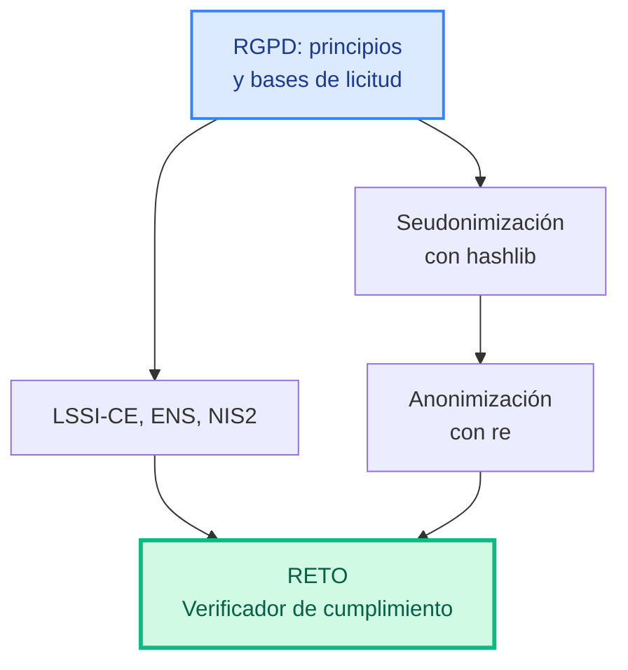
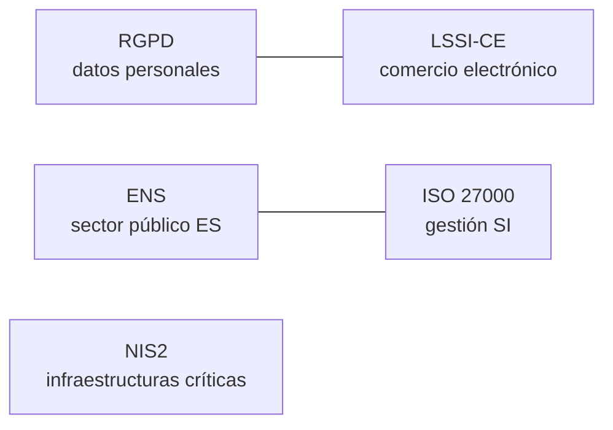
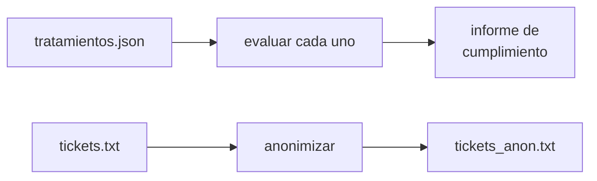
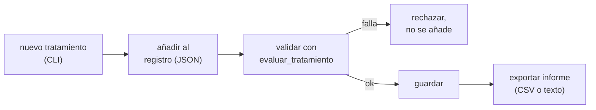

# Unidad 6 · Normativa y protección de datos

> **Módulo:** CMO-314 · Ciberseguridad · **RA6** · **Duración:** 8 h · **Peso:** 10 % · **Herramienta:** Python 3 (tipado) + `hashlib` / `re`

La técnica ya la dominas: hash (UT1) y expresiones regulares (UT2). Esta última unidad las reutiliza para un problema distinto: **la seguridad técnica no basta si no cumple la ley**. El RGPD, la LSSI-CE y normativas como el ENS o NIS2 marcan qué puedes hacer con datos personales y cómo debes protegerlos. Vas a construir una herramienta que evalúa si un tratamiento de datos cumple, y que **anonimiza** información sensible — la misma técnica que usan las empresas para trabajar con datos reales sin exponer identidades.

!!! reto "El reto de la unidad"
    **Comprueba si un tratamiento de datos cumple el RGPD, y anonimiza lo que no debería ser identificable.** Todo lo de abajo es tu entrenamiento.



**Qué sabrás hacer al terminar:** explicar los principios del RGPD y sus bases de licitud · diferenciar seudonimización de anonimización · seudonimizar un identificador con `hashlib` de forma estable e irreversible · anonimizar texto libre con `re` (DNI, emails) · situar la LSSI-CE, el ENS y NIS2 · construir un verificador de cumplimiento y anonimizador, tipado y probado.

**Cómo se trabaja (aula invertida):** lees la sección y ejecutas los ejemplos antes de clase → en clase resuelves las actividades y avanzas el reto en parejas.

---

## 1. RGPD: principios y bases de licitud

El **RGPD** (Reglamento General de Protección de Datos) regula cómo se tratan datos personales en la UE. Se apoya en principios y en la exigencia de que **todo** tratamiento tenga una base legal.

| Principio | Qué exige |
|---|---|
| **Licitud, lealtad y transparencia** | Tratar datos con base legal, informando claramente |
| **Limitación de la finalidad** | Solo para el fin declarado, no para cualquier otro |
| **Minimización de datos** | Recoger solo lo estrictamente necesario |
| **Exactitud** | Mantener los datos correctos y actualizados |
| **Limitación del plazo** | No conservar más tiempo del necesario |
| **Integridad y confidencialidad** | Protegerlos técnicamente (aquí entra todo lo que ya sabes) |

**Seis bases de licitud** — un tratamiento necesita **al menos una**:

```python title="base_licitud.py"
BASES_VALIDAS = {
    "consentimiento", "contrato", "obligacion_legal",
    "interes_vital", "interes_publico", "interes_legitimo",
}

def base_valida(base: str) -> bool:
    return base.strip().lower() in BASES_VALIDAS

print(base_valida("Consentimiento"))
print(base_valida("porque_nos_apetece"))
```

```text title="Salida"
True
False
```

!!! reto "Reto rápido 1"
    Una tienda online guarda el email para enviarte la factura de tu compra (necesario para el contrato) **y también** para mandarte publicidad sin que lo hayas pedido. ¿Necesita la misma base de licitud para ambos usos? ¿Cuál falta para el segundo?

---

## 2. Seudonimización con `hashlib`

**Seudonimizar** sustituye un identificador (DNI, email) por otro valor que no permite identificar a la persona **sin información adicional** — pero sigue siendo la misma técnica de hash que aprendiste en la UT1.

```python title="seudonimo.py"
import hashlib

def seudonimo(dni: str, sal: str = "cmo314") -> str:
    """Determinista: el mismo DNI siempre da el mismo seudónimo (permite análisis
    estadístico sin exponer la identidad). Irreversible: no se puede volver al DNI."""
    return hashlib.sha256((sal + dni.upper()).encode()).hexdigest()[:12]

a = seudonimo("12345678Z")
b = seudonimo("12345678Z")
print(a)
print(a == b)     # mismo DNI -> mismo seudónimo, siempre
```

```text title="Salida"
1026effd234a
True
```

!!! analogia "Analogía"
    Es exactamente el mismo principio que el hash de un fichero en la UT1: **determinista** (mismo DNI, mismo resultado) y **unidireccional** (no puedes recuperar el DNI desde el seudónimo). La diferencia es el propósito: allí verificabas integridad, aquí ocultas identidad conservando la posibilidad de agrupar registros del mismo individuo.

### 2.1 Seudonimización ≠ anonimización

| | **Seudonimización** | **Anonimización** |
|---|---|---|
| ¿Reversible? | No directamente, pero **con la sal/clave** podrías re-identificar en teoría | No, de ningún modo |
| ¿Sigue siendo dato personal (RGPD)? | **Sí** — sigue protegido por el reglamento | No, queda fuera del RGPD |
| Para qué sirve | Análisis que necesita agrupar por persona sin ver quién es | Publicar o compartir datos sin ningún riesgo de identificación |

!!! warning "Atención"
    Si reutilizas la **misma sal** para seudonimizar el mismo DNI en dos sistemas distintos, alguien que cruce ambos podría re-identificar a la persona por coincidencia de seudónimos. La sal debe protegerse como un secreto, igual que en la UT1.

---

## 3. Anonimización de texto libre con `re`

A diferencia de un campo estructurado (un DNI en su propia columna), un texto libre —un ticket de soporte, un email— puede contener datos personales **mezclados** con el resto. Aquí reutilizas `re` de la UT2.

```python title="enmascarar_email.py"
def enmascarar_email(email: str) -> str:
    usuario, _, dominio = email.partition("@")
    if len(usuario) <= 2:
        return usuario[0] + "*@" + dominio
    return usuario[0] + "*" * (len(usuario) - 2) + usuario[-1] + "@" + dominio

print(enmascarar_email("ana.perez@iesx.es"))
```

```text title="Salida"
a*******z@iesx.es
```

### 3.1 Anonimizar un texto completo

```python title="anonimizar_texto.py"
import re

PATRON_DNI = re.compile(r"\b\d{8}[A-Za-z]\b")
PATRON_EMAIL = re.compile(r"\b[\w.+-]+@[\w-]+\.[\w.-]+\b")

def anonimizar_texto(texto: str) -> str:
    texto = PATRON_DNI.sub("[DNI]", texto)
    texto = PATRON_EMAIL.sub("[EMAIL]", texto)
    return texto

ticket = "El usuario con DNI 12345678Z (contacto: ana.perez@iesx.es) reporta un fallo de login."
print(anonimizar_texto(ticket))
```

```text title="Salida"
El usuario con DNI [DNI] (contacto: [EMAIL]) reporta un fallo de login.
```

!!! reto "Reto rápido 2"
    Un ticket de soporte también podría contener un **teléfono** (`\b\d{9}\b` en España, simplificando). Añade un tercer patrón a `anonimizar_texto` para sustituirlo por `[TEL]`.

---

## 4. Plazos de conservación y validación

El principio de "limitación del plazo" exige que los datos no se guarden indefinidamente. En código, esto es **validar** un número, exactamente como en la UT4.

```python title="plazo_conservacion.py"
def plazo_ok(meses: int) -> bool:
    """Un plazo de conservación razonable: entre 1 y 60 meses (5 años)."""
    if meses < 0:
        raise ValueError(f"el plazo no puede ser negativo: {meses}")
    return 1 <= meses <= 60

print(plazo_ok(12))     # un año, razonable
print(plazo_ok(120))    # 10 años, fuera del rango típico sin justificación
try:
    plazo_ok(-5)
except ValueError as e:
    print("Rechazado:", e)
```

```text title="Salida"
True
False
Rechazado: el plazo no puede ser negativo: -5
```

---

## 5. LSSI-CE, ENS y NIS2: el resto del mapa normativo

| Normativa | Ámbito |
|---|---|
| **RGPD** | Protección de datos personales (toda la UE) |
| **LSSI-CE** | Comercio electrónico y comunicaciones comerciales por vía electrónica en España |
| **ENS** (Esquema Nacional de Seguridad) | Seguridad de sistemas del sector público español |
| **ISO/IEC 27000** | Familia de normas internacionales de gestión de la seguridad de la información |
| **NIS2** | Ciberseguridad de infraestructuras y servicios esenciales/importantes en la UE |



!!! reto "Reto rápido 3"
    Una empresa española envía comunicaciones comerciales por email sin que el destinatario lo haya solicitado. ¿Qué normativa española, además del RGPD, entra en juego?

---

## 6. Errores frecuentes (ten esto a mano)

| Error | Causa | Solución |
|---|---|---|
| Confundir seudonimización con anonimización | Pensar que el hash ya es "anónimo" y deja de ser dato personal | La seudonimización **sigue** bajo el RGPD; solo la anonimización real queda fuera |
| Reutilizar la misma sal entre sistemas | Facilita la re-identificación cruzada | Sal distinta y secreta por sistema/propósito |
| Regex de DNI que captura de más | Patrón demasiado laxo (`\d+` sin límites) | Ancla la longitud exacta y usa `\b` (límites de palabra) |
| Guardar datos "por si acaso" sin plazo | Viola el principio de limitación del plazo | Define y valida un plazo de conservación |
| Tratar datos sin base de licitud clara | Se asume que "si el usuario está registrado, vale para todo" | Cada finalidad distinta necesita su propia base |

---

## 7. Actividades: de lo más sencillo a preguntas tipo examen

> Librerías reales: `hashlib`, `re`, `csv`, `json`.

**1 · 🟢 ¿Base de licitud válida?** — `base_valida(base: str) -> bool`.
<details class="sol"><summary>Solución</summary>

```python
BASES = {"consentimiento", "contrato", "obligacion_legal", "interes_vital", "interes_publico", "interes_legitimo"}
def base_valida(base: str) -> bool:
    return base.strip().lower() in BASES
```
</details>

**2 · 🟢 Seudonimizar un DNI** — `seudonimo(dni: str, sal: str = "cmo314") -> str`.
<details class="sol"><summary>Solución</summary>

```python
import hashlib
def seudonimo(dni: str, sal: str = "cmo314") -> str:
    return hashlib.sha256((sal + dni.upper()).encode()).hexdigest()[:12]
```
</details>

**3 · 🟢 Enmascarar un email** — `enmascarar_email(email: str) -> str`.
<details class="sol"><summary>Solución</summary>

```python
def enmascarar_email(email: str) -> str:
    u, _, d = email.partition("@")
    if len(u) <= 2:
        return u[0] + "*@" + d
    return u[0] + "*"*(len(u)-2) + u[-1] + "@" + d
```
</details>

**4 · 🟢 ¿Plazo razonable?** — `plazo_ok(meses: int) -> bool`, lanza `ValueError` si es negativo.
<details class="sol"><summary>Solución</summary>

```python
def plazo_ok(meses: int) -> bool:
    if meses < 0:
        raise ValueError("plazo negativo")
    return 1 <= meses <= 60
```
</details>

**5 · 🟡 Detectar un DNI en texto** — `contiene_dni(texto: str) -> bool` con `re`.
<details class="sol"><summary>Solución</summary>

```python
import re
def contiene_dni(texto: str) -> bool:
    return bool(re.search(r"\b\d{8}[A-Za-z]\b", texto))
```
</details>

**6 · 🟡 Anonimizar DNIs de un texto** — `anonimizar_dni(texto: str) -> str`.
<details class="sol"><summary>Solución</summary>

```python
import re
def anonimizar_dni(texto: str) -> str:
    return re.sub(r"\b\d{8}[A-Za-z]\b", "[DNI]", texto)
```
</details>

**7 · 🟡 Anonimizar emails de un texto** — `anonimizar_email(texto: str) -> str`.
<details class="sol"><summary>Solución</summary>

```python
import re
def anonimizar_email(texto: str) -> str:
    return re.sub(r"\b[\w.+-]+@[\w-]+\.[\w.-]+\b", "[EMAIL]", texto)
```
</details>

**8 · 🟡 Anonimización completa** — `anonimizar_texto(texto: str) -> str`, DNI y email a la vez.
<details class="sol"><summary>Solución</summary>

```python
import re
def anonimizar_texto(texto: str) -> str:
    texto = re.sub(r"\b\d{8}[A-Za-z]\b", "[DNI]", texto)
    texto = re.sub(r"\b[\w.+-]+@[\w-]+\.[\w.-]+\b", "[EMAIL]", texto)
    return texto
```
</details>

**9 · 🟠 Evaluar un tratamiento** — `evaluar_tratamiento(t: dict) -> list[str]`: lista de incumplimientos (base inválida, plazo fuera de rango, sin finalidad declarada).
<details class="sol"><summary>Solución</summary>

```python
def evaluar_tratamiento(t: dict) -> list[str]:
    fallos = []
    if not base_valida(t.get("base", "")):
        fallos.append("base de licitud no válida")
    if not t.get("finalidad", "").strip():
        fallos.append("sin finalidad declarada")
    plazo = t.get("plazo_meses", -1)
    if plazo < 0 or plazo > 60:
        fallos.append("plazo de conservación fuera de rango")
    return fallos
```
</details>

**10 · 🟠 ¿Cumple?** — `cumple(t: dict) -> bool` (usa el ejercicio 9).
<details class="sol"><summary>Solución</summary>

```python
def cumple(t: dict) -> bool:
    return not evaluar_tratamiento(t)
```
</details>

**11 · 🟠 Seudonimizar un lote** — `seudonimizar_lote(dnis: list[str], sal: str) -> dict[str,str]`: DNI original → seudónimo.
<details class="sol"><summary>Solución</summary>

```python
def seudonimizar_lote(dnis: list[str], sal: str) -> dict[str, str]:
    return {dni: seudonimo(dni, sal) for dni in dnis}
```
</details>

**12 · 🔴 Detectar re-identificación por sal repetida** — `sal_reutilizada(mapa1: dict[str,str], mapa2: dict[str,str]) -> list[str]`: seudónimos que coinciden entre dos sistemas (indicio de sal compartida).
<details class="sol"><summary>Solución</summary>

```python
def sal_reutilizada(mapa1: dict[str, str], mapa2: dict[str, str]) -> list[str]:
    return sorted(set(mapa1.values()) & set(mapa2.values()))
```
</details>

**13 · 🔴 Anonimizar un CSV completo** — `anonimizar_csv(texto_csv: str, columnas: list[str]) -> str`: sustituye el valor de esas columnas por `seudonimo(valor)`, conservando el resto (usa `csv.DictReader`/`DictWriter`).
<details class="sol"><summary>Solución</summary>

```python
import csv, io
def anonimizar_csv(texto_csv: str, columnas: list[str]) -> str:
    lector = csv.DictReader(io.StringIO(texto_csv))
    filas = []
    for fila in lector:
        for col in columnas:
            if col in fila:
                fila[col] = seudonimo(fila[col])
        filas.append(fila)
    salida = io.StringIO()
    escritor = csv.DictWriter(salida, fieldnames=lector.fieldnames or [])
    escritor.writeheader()
    escritor.writerows(filas)
    return salida.getvalue()
```
</details>

**14 · 🔴 Auditoría de un lote de tratamientos** — `auditar_tratamientos(tratamientos: list[dict]) -> dict[str, list[str]]`: nombre del tratamiento → sus incumplimientos.
<details class="sol"><summary>Solución</summary>

```python
def auditar_tratamientos(tratamientos: list[dict]) -> dict[str, list[str]]:
    return {t["nombre"]: evaluar_tratamiento(t) for t in tratamientos}
```
</details>

**15 · 🔴 Informe final** — `informe_cumplimiento(tratamientos: list[dict]) -> list[str]`: una línea por tratamiento, `"OK"` o los fallos, ordenado con los incumplidos primero.
<details class="sol"><summary>Solución</summary>

```python
def informe_cumplimiento(tratamientos: list[dict]) -> list[str]:
    aud = auditar_tratamientos(tratamientos)
    lineas = [f"{n}: {'OK' if not f else ', '.join(f)}" for n, f in aud.items()]
    return sorted(lineas, key=lambda l: ": OK" in l)
```
</details>

### Preguntas tipo test práctico

**P1.** ¿Por qué `seudonimo("12345678Z")` debe dar siempre el mismo resultado?
<details class="sol"><summary>Respuesta</summary>Porque hay que poder agrupar registros de la misma persona en análisis posteriores sin conocer su identidad — si cambiara cada vez, perdería esa utilidad. Es la propiedad determinista del hash, igual que en la UT1.</details>

**P2.** ¿Sigue siendo un dato personal, a efectos del RGPD, un DNI seudonimizado?
<details class="sol"><summary>Respuesta</summary>Sí: la seudonimización no saca el dato del ámbito del RGPD, porque en teoría —con la sal— se podría revertir. Solo la anonimización real lo hace.</details>

**P3.** ¿Qué imprime esto?
```python
import re
print(re.sub(r"\b\d{8}[A-Za-z]\b", "[DNI]", "contacta con 12345678Z o con ana@x.es"))
```
<details class="sol"><summary>Respuesta</summary><code>contacta con [DNI] o con ana@x.es</code> — el patrón solo sustituye el DNI; el email no encaja con ese patrón y queda igual.</details>

**P4.** En el ejercicio 9, si un tratamiento tiene base válida y finalidad declarada, pero un plazo de `-3` meses, ¿qué lanza `plazo_ok(-3)` si lo llamas directamente?
<details class="sol"><summary>Respuesta</summary>Lanza <code>ValueError</code>. Por eso <code>evaluar_tratamiento</code> compara directamente el número (<code>plazo &lt; 0</code>) en vez de llamar a <code>plazo_ok</code>, para poder añadirlo a la lista de fallos sin que el programa se detenga.</details>

**P5.** ¿Por qué reutilizar la misma sal en dos sistemas distintos es un riesgo, aunque cada uno seudonimice por separado?
<details class="sol"><summary>Respuesta</summary>Porque si el mismo DNI produce el mismo seudónimo en ambos sistemas, alguien que tenga acceso a los dos conjuntos de datos puede cruzarlos por coincidencia de seudónimo y re-identificar a la persona.</details>

**P6.** ¿Qué normativa española regula el envío de comunicaciones comerciales por email no solicitadas?
<details class="sol"><summary>Respuesta</summary>La LSSI-CE (Ley de Servicios de la Sociedad de la Información y Comercio Electrónico), además del RGPD en cuanto al tratamiento del dato del email en sí.</details>

---

## 8. Reto resuelto, paso a paso — Verificador de cumplimiento y anonimizador

Un cliente te pasa su inventario de tratamientos de datos y un lote de tickets de soporte con datos personales sin anonimizar. Te piden dos cosas: un informe de cumplimiento, y los tickets anonimizados listos para compartir con un equipo externo.



**Paso 1 — Bases de licitud y validación de un tratamiento.**

```python title="cumplimiento.py"
BASES_VALIDAS = {
    "consentimiento", "contrato", "obligacion_legal",
    "interes_vital", "interes_publico", "interes_legitimo",
}

def base_valida(base: str) -> bool:
    return base.strip().lower() in BASES_VALIDAS

def evaluar_tratamiento(t: dict) -> list[str]:
    fallos = []
    if not base_valida(t.get("base", "")):
        fallos.append("base de licitud no válida")
    if not t.get("finalidad", "").strip():
        fallos.append("sin finalidad declarada")
    plazo = t.get("plazo_meses", -1)
    if plazo < 0 or plazo > 60:
        fallos.append("plazo de conservación fuera de rango")
    return fallos
```

**Paso 2 — Informe de cumplimiento para todo el inventario.**

```python title="cumplimiento.py (continúa)"
def informe_cumplimiento(tratamientos: list[dict]) -> list[str]:
    lineas = []
    for t in tratamientos:
        fallos = evaluar_tratamiento(t)
        estado = "OK" if not fallos else "; ".join(fallos)
        lineas.append(f"{t['nombre']}: {estado}")
    return sorted(lineas, key=lambda l: ": OK" in l)
```

**Paso 3 — Seudonimización y anonimización de texto.**

```python title="cumplimiento.py (continúa)"
import hashlib, re

def seudonimo(dni: str, sal: str = "cmo314") -> str:
    return hashlib.sha256((sal + dni.upper()).encode()).hexdigest()[:12]

PATRON_DNI = re.compile(r"\b\d{8}[A-Za-z]\b")
PATRON_EMAIL = re.compile(r"\b[\w.+-]+@[\w-]+\.[\w.-]+\b")

def anonimizar_texto(texto: str) -> str:
    texto = PATRON_DNI.sub("[DNI]", texto)
    texto = PATRON_EMAIL.sub("[EMAIL]", texto)
    return texto
```

**Paso 4 — Anonimizar un fichero de tickets, línea a línea.**

```python title="cumplimiento.py (continúa)"
def anonimizar_fichero(texto: str) -> str:
    return "\n".join(anonimizar_texto(linea) for linea in texto.splitlines())
```

**Paso 5 — CLI con `argparse`.**

```python title="cumplimiento.py (continúa)"
import argparse, json
from pathlib import Path

def main() -> None:
    ap = argparse.ArgumentParser(prog="cumplimiento", description="Verificador RGPD y anonimizador")
    sub = ap.add_subparsers(dest="accion", required=True)

    p1 = sub.add_parser("auditar", help="evalúa un inventario de tratamientos")
    p1.add_argument("tratamientos", type=Path)

    p2 = sub.add_parser("anonimizar", help="anonimiza un fichero de texto")
    p2.add_argument("entrada", type=Path)
    p2.add_argument("salida", type=Path)

    args = ap.parse_args()
    if args.accion == "auditar":
        tratamientos = json.loads(args.tratamientos.read_text(encoding="utf-8"))
        for linea in informe_cumplimiento(tratamientos):
            print(linea)
    else:
        anonimizado = anonimizar_fichero(args.entrada.read_text(encoding="utf-8"))
        args.salida.write_text(anonimizado, encoding="utf-8")
        print(f"Anonimizado en {args.salida}")

if __name__ == "__main__":
    main()
```

**Paso 6 — Pruébalo con Docker, sin `sudo`.**

```yaml title="docker-compose.yml"
services:
  demo:
    image: python:3.12-alpine
    volumes: ["./cumplimiento.py:/cumplimiento.py"]
    working_dir: /app
    command: >
      sh -c "mkdir -p /app; cd /app;
      echo '[{\"nombre\":\"Newsletter\",\"base\":\"consentimiento\",\"finalidad\":\"marketing\",\"plazo_meses\":24},{\"nombre\":\"Logs acceso\",\"base\":\"porque_si\",\"finalidad\":\"\",\"plazo_meses\":-1}]' > tratamientos.json;
      echo 'Usuario 12345678Z (ana.perez@iesx.es) reporta un fallo' > tickets.txt;
      echo '--- auditoria ---'; python /cumplimiento.py auditar tratamientos.json;
      echo '--- anonimizar ---'; python /cumplimiento.py anonimizar tickets.txt tickets_anon.txt;
      cat tickets_anon.txt"
```

```bash title="Ejecutar"
docker compose run --rm demo
```

```text title="Salida esperada"
--- auditoria ---
Logs acceso: base de licitud no válida; sin finalidad declarada; plazo de conservación fuera de rango
Newsletter: OK
--- anonimizar ---
Anonimizado en tickets_anon.txt
Usuario [DNI] ([EMAIL]) reporta un fallo
```

<details class="sol"><summary>📄 cumplimiento.py completo</summary>

```python
import argparse, hashlib, json, re
from pathlib import Path

BASES_VALIDAS = {
    "consentimiento", "contrato", "obligacion_legal",
    "interes_vital", "interes_publico", "interes_legitimo",
}

def base_valida(base: str) -> bool:
    return base.strip().lower() in BASES_VALIDAS

def evaluar_tratamiento(t: dict) -> list[str]:
    fallos = []
    if not base_valida(t.get("base", "")):
        fallos.append("base de licitud no válida")
    if not t.get("finalidad", "").strip():
        fallos.append("sin finalidad declarada")
    plazo = t.get("plazo_meses", -1)
    if plazo < 0 or plazo > 60:
        fallos.append("plazo de conservación fuera de rango")
    return fallos

def informe_cumplimiento(tratamientos: list[dict]) -> list[str]:
    lineas = []
    for t in tratamientos:
        fallos = evaluar_tratamiento(t)
        lineas.append(f"{t['nombre']}: {'OK' if not fallos else '; '.join(fallos)}")
    return sorted(lineas, key=lambda l: ": OK" in l)

def seudonimo(dni: str, sal: str = "cmo314") -> str:
    return hashlib.sha256((sal + dni.upper()).encode()).hexdigest()[:12]

PATRON_DNI = re.compile(r"\b\d{8}[A-Za-z]\b")
PATRON_EMAIL = re.compile(r"\b[\w.+-]+@[\w-]+\.[\w.-]+\b")

def anonimizar_texto(texto: str) -> str:
    texto = PATRON_DNI.sub("[DNI]", texto)
    texto = PATRON_EMAIL.sub("[EMAIL]", texto)
    return texto

def anonimizar_fichero(texto: str) -> str:
    return "\n".join(anonimizar_texto(linea) for linea in texto.splitlines())

def main() -> None:
    ap = argparse.ArgumentParser(prog="cumplimiento", description="Verificador RGPD y anonimizador")
    sub = ap.add_subparsers(dest="accion", required=True)
    p1 = sub.add_parser("auditar")
    p1.add_argument("tratamientos", type=Path)
    p2 = sub.add_parser("anonimizar")
    p2.add_argument("entrada", type=Path)
    p2.add_argument("salida", type=Path)
    args = ap.parse_args()
    if args.accion == "auditar":
        tratamientos = json.loads(args.tratamientos.read_text(encoding="utf-8"))
        for linea in informe_cumplimiento(tratamientos):
            print(linea)
    else:
        anonimizado = anonimizar_fichero(args.entrada.read_text(encoding="utf-8"))
        args.salida.write_text(anonimizado, encoding="utf-8")
        print(f"Anonimizado en {args.salida}")

if __name__ == "__main__":
    main()
```
</details>

---

## 9. Reto para ti (propuesto, sin solución)

### 📋 Registro de actividades de tratamiento (RAT) exportable

El RGPD exige que muchas organizaciones mantengan un **Registro de Actividades de Tratamiento** (RAT). Vas a construir la herramienta que lo genera y lo mantiene al día.



**Objetivo.** Una CLI que permita **añadir** tratamientos a un registro persistente (un fichero JSON que actúa de base de datos), **rechazando** los que no cumplan (reutilizando `evaluar_tratamiento`), y **exportar** el registro completo a CSV para auditoría externa.

**Requisitos**

- `python rat.py anadir --nombre "..." --base consentimiento --finalidad "..." --plazo 12 registro.json`
- `python rat.py exportar registro.json informe.csv`
- Si el tratamiento no cumple, `anadir` debe **rechazarlo** (no se guarda) y mostrar por qué, con un código de salida distinto de 0 (`sys.exit(1)`).
- El registro es una lista JSON que se lee, se modifica y se vuelve a guardar (como el manifiesto de la UT1, pero para tratamientos).
- Código tipado, `mypy` limpio.
- Demuéstralo con Docker.

**Criterios de aceptación**

1. Añadir un tratamiento válido lo persiste en el JSON y una segunda ejecución de `exportar` lo incluye.
2. Añadir un tratamiento inválido **no** modifica el fichero de registro.
3. `exportar` genera un CSV válido (compruébalo con `csv.DictReader` sobre tu propia salida).

**Pistas** (no solución): reutiliza `evaluar_tratamiento` tal cual · para el registro persistente, el patrón es idéntico al manifiesto de la UT1: cargar JSON (o lista vacía si no existe el fichero), modificar en memoria, volver a guardar · `csv.DictWriter` para exportar.

**Si te sobra tiempo:** añade `rat.py listar registro.json` que muestre solo los tratamientos que **no** cumplen · añade una fecha de alta a cada tratamiento (`datetime.now().isoformat()`) para poder auditar antigüedad.

> Esto es justo el tipo de reto que resolverás en el **test práctico**.

---

## Autoevaluación rápida (conceptos)

<details><summary>1. ¿Qué exige el principio de minimización de datos?</summary>Recoger solo los datos estrictamente necesarios para la finalidad declarada.</details>
<details><summary>2. ¿Cuántas bases de licitud reconoce el RGPD?</summary>Seis: consentimiento, contrato, obligación legal, interés vital, interés público, interés legítimo.</details>
<details><summary>3. ¿Sigue bajo el RGPD un dato seudonimizado?</summary>Sí; solo la anonimización real queda fuera de su ámbito.</details>
<details><summary>4. ¿Qué regula la LSSI-CE?</summary>El comercio electrónico y las comunicaciones comerciales por vía electrónica en España.</details>
<details><summary>5. ¿Por qué la sal de la seudonimización debe protegerse?</summary>Porque reutilizarla o filtrarla facilita la re-identificación por cruce de datos.</details>

## Glosario

| Término | Definición |
|---|---|
| **RGPD** | Reglamento General de Protección de Datos (UE). |
| **Base de licitud** | Fundamento legal que exige el RGPD para tratar datos personales. |
| **Seudonimización** | Sustituir un identificador por otro; sigue bajo el RGPD. |
| **Anonimización** | Eliminar toda posibilidad de identificación; queda fuera del RGPD. |
| **LSSI-CE** | Ley española de comercio electrónico y comunicaciones comerciales. |
| **ENS** | Esquema Nacional de Seguridad (sector público español). |
| **NIS2** | Directiva UE de ciberseguridad para infraestructuras esenciales. |

## Cómo se evalúa esta unidad (RA6)

El instrumento principal es un **test práctico**: resuelves en Python un reto parecido al de esta unidad y se corrige **solo con su batería de tests** (queda abierto, como complemento, algún ejercicio práctico).

!!! reto "La nota, sin sorpresas"
    **Nota = (tests superados ÷ total) × 10.** Se aprueba con 5. Esta unidad además incluye la nota de **FFE** (Formación y Fomento del Emprendimiento), que aporta un 10 % adicional al módulo completo — ver [Cómo se evalúa el módulo](../el-curso.md).

El informe además te marca, **sin puntuar**, tres buenas prácticas: usar la técnica del RA (aquí, `hashlib`/`re`), pasar `mypy` y documentar el código.
