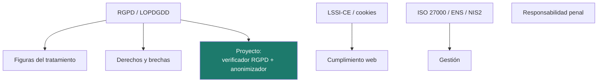

# Unidad 6 · Normativa y protección de datos

> **Módulo:** CMO-314 · Ciberseguridad · **Resultado de aprendizaje:** RA6 · **Duración:** 8 h · **Peso:** 10 %
> **Herramienta principal:** Python 3 (`re`, `hashlib`) · **Nivel:** ciclo superior

La técnica no basta: hay que cumplir la ley. En esta unidad conoces el **RGPD/LOPDGDD**, las figuras del tratamiento, la **LSSI-CE**, los estándares (**ISO 27000**, ENS) y la responsabilidad penal. El proyecto es un **verificador de cumplimiento RGPD** y un **anonimizador** de datos personales en Python.

!!! note "Aviso"
    Esta unidad es una panorámica formativa; no sustituye al asesoramiento jurídico. Verifica siempre la versión consolidada de las normas en el BOE o EUR-Lex.

---

!!! reto "El reto de la unidad"
    Haz que un **volcado de datos** cumpla el RGPD sin exponer a nadie. Los **ejercicios** y el **laboratorio** de más abajo son tu **entrenamiento**: cuando los domines, resuelve el reto (el proyecto) y demuéstralo en el examen.

## Mapa de la unidad



### Qué vas a saber hacer al terminar

- [ ] Explicar los **principios** del RGPD y las **bases de licitud**.
- [ ] Distinguir las **figuras** del tratamiento (responsable, encargado, DPD…).
- [ ] Conocer el plazo y el procedimiento de **notificación de brechas**.
- [ ] Situar **LSSI-CE**, **ISO 27000**, **ENS** y **NIS2**.
- [ ] Reconocer la **responsabilidad penal** por delitos informáticos.
- [ ] **Anonimizar** datos personales con Python.

---

## 1. RGPD y LOPDGDD

El **RGPD** (Reglamento UE 2016/679) y la **LOPDGDD** (Ley Orgánica 3/2018) protegen los datos personales. **Dato personal** es cualquier información sobre una persona identificada o identificable. Las **categorías especiales** (salud, biometría, ideología…) tienen protección reforzada.

**Principios (art. 5):** licitud, lealtad y transparencia · limitación de la finalidad · **minimización** · exactitud · limitación del plazo · integridad y confidencialidad · responsabilidad proactiva.

!!! analogia "Analogía"
    Minimización = no pedir el DNI "por si acaso". Recoges solo lo que necesitas y lo guardas solo el tiempo que lo necesitas; cada dato de más es un riesgo de más.

**Bases de licitud (art. 6):** consentimiento, contrato, obligación legal, interés vital, interés público, interés legítimo. Cada tratamiento necesita una.

!!! reto "Reto rápido 1"
    Para pagar la nómina de un empleado, ¿la base es el consentimiento o el contrato/obligación legal?

---

## 2. Figuras del tratamiento y brechas

| Figura | Papel |
|---|---|
| **Responsable** | Decide el qué y el para qué (la empresa) |
| **Encargado** | Trata datos por cuenta del responsable (hosting, gestoría) |
| **DPD/DPO** | Delegado de Protección de Datos |
| **Interesado** | La persona cuyos datos se tratan |
| **AEPD** | Autoridad de control en España |

Cuando un proveedor accede a datos, hace falta un **contrato de encargado** (art. 28). Ante una **brecha**, se notifica a la AEPD en **72 horas** y, si hay alto riesgo, a los afectados.

!!! reto "Reto rápido 2"
    El proveedor que aloja tu tienda online, ¿es responsable o encargado del tratamiento?

---

## 3. LSSI-CE, estándares y normativa

- **LSSI-CE** (Ley 34/2002): aviso legal, contratación electrónica, **cookies** (consentimiento previo para las no imprescindibles).
- **ISO/IEC 27001/27002**: sistema de gestión de seguridad (SGSI) certificable y catálogo de controles.
- **ENS** (RD 311/2022): obligatorio para el sector público; categorías BÁSICA/MEDIA/ALTA.
- **NIS2** y **Ley PIC**: ciberseguridad de servicios esenciales e infraestructuras críticas.

---

## 4. Responsabilidad penal

El Código Penal tipifica los delitos informáticos: acceso ilícito e interceptación (**arts. 197 bis/ter**), daños a datos y sistemas (**art. 264**), estafa informática (248–249). Desde 2010, las **personas jurídicas** también responden penalmente; un programa de cumplimiento puede atenuar.

!!! warning "Atención"
    Es el otro lado de la UD5: las técnicas ofensivas fuera de un marco autorizado son exactamente lo que estos artículos castigan.

---

## 5. Python para el cumplimiento: anonimizar

Antes de compartir datos fuera de su finalidad, hay que **anonimizar** o **seudonimizar**. Con Python:

```python title="Seudonimizar y anonimizar datos personales"
import hashlib, re

def seudonimo(dni: str, sal: str = "cmo314") -> str:
    return hashlib.sha256((sal + dni.upper()).encode()).hexdigest()[:12]  # (1)!

def anonimizar(texto: str) -> str:
    texto = re.sub(r"\b\d{8}[A-Za-z]\b", "[DNI]", texto)      # (2)!
    texto = re.sub(r"\b[\w.+-]+@[\w-]+\.[\w.-]+\b", "[EMAIL]", texto)  # (3)!
    return texto
```

1.  **Seudónimo estable e irreversible**: el mismo DNI da siempre el mismo código (permite cruzar registros), pero con la `sal` secreta no se puede volver al original.
2.  `re.sub` sustituye **todos** los DNI (8 dígitos + letra) por la etiqueta `[DNI]`.
3.  Igual con los correos. Tras esto, el texto ya se puede compartir para soporte o estadística: es la **minimización** del RGPD en la práctica.

!!! analogia "Analogía"
    El seudónimo es como un mote estable: permite seguir a "la misma persona" entre registros sin saber quién es, y sin la sal no se puede deshacer.

!!! reto "Reto rápido 3"
    ¿Por qué el seudónimo del mismo DNI debe ser siempre igual, pero no reversible?

---

## 6. Errores frecuentes

| Error | Causa | Solución |
|---|---|---|
| Guardar datos "para siempre" | Ignorar el plazo | Fijar y aplicar plazo de conservación |
| Proveedor sin contrato | Olvidar el art. 28 | Contrato de encargado por escrito |
| "Anonimizar" y poder revertir | Seudonimizar creyendo que anonimizas | Anonimizar = irreversible |

---

## 7. Practica **con** solución a la vista

#### Actividad 1 — Base válida
`base_valida(b)` → True si está entre las del art. 6.
<details class="sol"><summary>Solución</summary>

```python
def base_valida(b: str) -> bool:
    return b.lower() in {"consentimiento", "contrato", "obligacion_legal",
                         "interes_vital", "interes_publico", "interes_legitimo"}
```
</details>

#### Actividad 2 — Enmascarar email
`enmascarar("ana@x.es")` → `"a**@x.es"` (aprox.).
<details class="sol"><summary>Solución</summary>

```python
def enmascarar(email: str) -> str:
    u, d = email.split("@", 1)
    return u[0] + "*" * (len(u) - 1) + "@" + d
```
</details>

#### Actividad 3 — Detectar DNI
`tiene_dni(texto)` → True si hay un DNI (8 cifras + letra).
<details class="sol"><summary>Solución</summary>

```python
import re
def tiene_dni(texto: str) -> bool:
    return re.search(r"\b\d{8}[A-Za-z]\b", texto) is not None
```
</details>

#### Actividad 4 — ¿Notificable?
`notificable(riesgo_alto: bool) -> str` → a quién notificar.
<details class="sol"><summary>Solución</summary>

```python
def notificable(riesgo_alto: bool) -> str:
    return "AEPD y afectados" if riesgo_alto else "AEPD"
```
</details>

---

## Proyecto de la unidad

Construyes un **verificador de cumplimiento RGPD** (comprueba base de licitud, plazo y minimización de cada tratamiento) y un **anonimizador** (enmascara correos, seudonimiza DNIs y limpia textos).

**[Proyecto Cumplimiento y anonimización →](../proyectos/ud6/README.md)**

```bash
pip install -r requirements.txt
pytest
mypy src
```

---

## Retos de ampliación

- **R1.** Anonimiza también números de teléfono y matrículas.
- **R2.** Genera un pequeño **registro de actividades de tratamiento (RAT)** en JSON.
- **R3.** Valida un DNI comprobando su letra de control.

---

## Más práctica

#### Actividad 5 — Validar DNI
Escribe `dni_valido(dni: str) -> bool` que compruebe 8 cifras + letra de control correcta (`"TRWAGMYFPDXBNJZSQVHLCKE"[num % 23]`).
<details class="sol"><summary>Solución</summary>

```python
def dni_valido(dni: str) -> bool:
    dni = dni.strip().upper()
    if len(dni) != 9 or not dni[:8].isdigit(): return False
    return dni[8] == "TRWAGMYFPDXBNJZSQVHLCKE"[int(dni[:8]) % 23]
```
</details>

#### Actividad 6 — Anonimizar teléfono
Amplía el anonimizador para sustituir teléfonos españoles (9 dígitos que empiezan por 6/7/8/9) por `[TEL]`.
<details class="sol"><summary>Solución</summary>

```python
import re
def anon_tel(texto: str) -> str:
    return re.sub(r"\b[6789]\d{8}\b", "[TEL]", texto)
```
</details>

---

## Laboratorio

> Trabajamos sobre datos **ficticios** en un contenedor. Nunca uses datos reales de personas.

### Laboratorio guiado (resuelto) — Anonimizar un volcado antes de compartirlo

Un contenedor genera un CSV con datos personales de prueba; lo anonimizamos antes de "compartirlo" con soporte.

**`docker-compose.yml`**

```yaml
services:
  seed:
    image: python:3.12-alpine
    volumes: ["./datos:/datos"]
    command: >
      sh -c "printf 'cliente,dni,email\n1,12345678Z,ana.perez@iesx.es\n2,87654321X,luis@correo.es\n' > /datos/clientes.csv; echo ok"
```

```bash
mkdir -p datos && docker compose run --rm seed
python3 - << 'PY'
import re, hashlib
def seudo(dni): return hashlib.sha256(("cmo314"+dni.upper()).encode()).hexdigest()[:12]
def mask(e):
    u, d = e.split("@", 1)
    return (u[0] + "*"*(len(u)-2) + u[-1] if len(u) > 2 else u[0]+"*") + "@" + d
for i, ln in enumerate(open("datos/clientes.csv")):
    if i == 0:  # cabecera
        print(ln.strip()); continue
    c, dni, email = ln.strip().split(",")
    print(f"{c},{seudo(dni)},{mask(email)}")
PY
```

<details class="sol"><summary>Qué debe salir</summary>

```
cliente,dni,email
1,<seudónimo de 12 hex>,a******z@iesx.es
2,<seudónimo de 12 hex>,l**s@correo.es
```
El DNI se sustituye por un **seudónimo estable** (el mismo DNI da siempre el mismo, pero no se puede revertir sin la sal) y el correo se enmascara. Ya puedes compartir el CSV sin exponer datos personales: es la minimización del RGPD en la práctica.
</details>

### Laboratorio propuesto (entregable) — Verificador de cumplimiento desde JSON

Un contenedor te da un `tratamientos.json` con varios tratamientos de datos (nombre, base de licitud, plazo en meses, campos). Escribe un script Python que **valide cada uno** contra el RGPD (base válida, plazo ≤ 60 meses, categoría especial solo con consentimiento) y saque un informe de cumplimiento, y que además **anonimice** un `registros.csv` asociado.

**Criterios de aceptación**
- Usa `hashlib` y `re`, no deja datos personales en claro. Tipado y `mypy` limpio.
- Informe claro: qué tratamiento cumple y, si no, por qué.

---

## Autoevaluación rápida

<details><summary>1. ¿Qué es la minimización?</summary>Recoger solo los datos necesarios y por el tiempo imprescindible.</details>
<details><summary>2. Diferencia responsable / encargado.</summary>El responsable decide; el encargado trata por su cuenta.</details>
<details><summary>3. ¿Plazo para notificar una brecha a la AEPD?</summary>72 horas desde que se tiene constancia.</details>
<details><summary>4. ¿Anonimizar es reversible?</summary>No; seudonimizar sí lo es con información adicional.</details>
<details><summary>5. ¿Qué regula la LSSI-CE?</summary>Servicios de la sociedad de la información: aviso legal, contratación, cookies.</details>
<details><summary>6. ¿Responden penalmente las empresas?</summary>Sí, desde 2010; el cumplimiento puede atenuar.</details>

---

## Glosario

| Término | Definición |
|---|---|
| **RGPD / LOPDGDD** | Normativa de protección de datos. |
| **Responsable / encargado** | Quien decide / quien trata por cuenta de otro. |
| **Brecha** | Incidente que compromete datos personales. |
| **Seudonimización / anonimización** | Dificultar / impedir la reidentificación. |
| **ISO 27001 / ENS** | Estándar de SGSI / esquema nacional obligatorio. |
| **NIS2 / Ley PIC** | Ciberseguridad de servicios esenciales e infraestructuras críticas. |

---

## Cómo se evalúa esta unidad (RA6)


Se evalúa con un **examen por retos 100 % práctico**: resuelves en Python un reto parecido al de clase y se corrige **solo con su batería de tests**.

!!! reto "La nota, sin sorpresas"
    **Nota = (tests superados ÷ total) × 10.** Se aprueba con 5. Es la misma mecánica del reto de esta unidad, así que llegas entrenado.

El informe además te marca, **sin puntuar**, tres buenas prácticas que conviene cuidar: usar la técnica del RA (aquí, `hashlib`/`re`), pasar `mypy` y documentar el código.